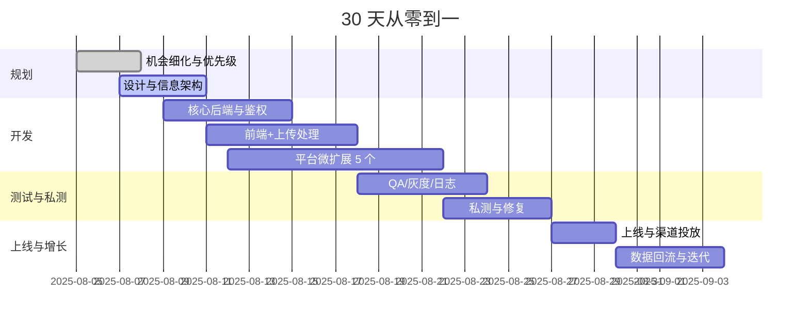

## 商业目标（30 天）

- 上线 5 个 MVP（含对应平台微扩展 Beta）
- 总计 USD 10,000 预算内完成：开发 60%，市场 30%，运营 10%
- 目标：首月合计 MRR ≥ USD 3,000；30 天内达到 5× 行动转化提升场景的可验证证据

## 定价与分层

| 机会 | 个人版 | 家庭/小组 | 额外计费 | 备注 |
|---|---|---|---|---|
| QuietInbox | USD 4.99/月 | USD 11.99/3 人 | 超额邮件 USD 0.50/100 封 | 年付 2 个月优惠 |
| PhotoSculpt | USD 6.99/月 | USD 14.99/3 人 | 重建 USD 0.5/次 | 教育折扣 30% |
| PodcastNote | USD 3.99/月 | USD 9.99/3 人 | 转写 USD 0.08/分钟 | 长音频包月 600 分钟 |
| TaxTidy | USD 5.99/月 | USD 12.99/3 人 | OCR USD 0.005/页 | 报税季礼包 |
| CodeSnap | USD 7.99/月 | USD 17.99/3 人 | 大模型补点 USD 1/1000 tok | 学生邮箱 40% off |

## 单位经济（估算）

| 项 | QuietInbox | PhotoSculpt | PodcastNote | TaxTidy | CodeSnap |
|---|---:|---:|---:|---:|---:|
| COGS/月（模型+存储+带宽） | USD 0.8/用户 | USD 1.2/用户 | USD 1.0/用户 | USD 0.9/用户 | USD 1.4/用户 |
| 毛利率 | 84% | 83% | 75% | 85% | 82% |
| 目标 CAC | USD 3–5 | USD 4–6 | USD 2–4 | USD 3–5 | USD 4–7 |
| 回本周期 | ≤ 1.5 月 | ≤ 2 月 | ≤ 1 月 | ≤ 1.5 月 | ≤ 2 月 |

## 渠道与转化假设

- Product Hunt：发布主产品 + 平台微扩展演示，目标 upvotes 500+，注册转化 12–18%
- Reddit（r/SideProject, r/SaaS, r/ productivity 等）：演示 GIF + 用例复盘，点击→注册 8–12%
- Hacker News（Show HN）：技术实现/数据集透明，点击→注册 10–15%
- Indie Hackers/Dev.to/BuildInPublic：周更里程碑，提高口碑与搜索可见度

## 首月预算分配（USD 10,000）

| 类别 | 金额 | 明细 |
|---|---:|---|
| 开发 | 6,000 | 外包 UI/图标、音频转写额度、3D 处理服务、CI/CD |
| 市场 | 3,000 | 视频演示、PH 推广素材、Reddit 广告实验、Newsletter 赞助 |
| 运营 | 1,000 | 法务模板、隐私/条款生成、客服工具、监控 |

## 里程碑（甘特）

## 渠道素材与转化资产

- 着陆页：每机会 1 页，含 20 秒演示、常见问答、退款保证
- 可复制工作流库：公开示例（邮件、票据、音频、截图→结果）
- 口碑与创作者：联系 20 位细分领域博主/主播提供试用码

## 风险与对策

| 风险 | 影响 | 缓解 |
|---|---|---|
| 平台审核延迟 | 上线排期 | 同步提供独立 Web 入口，先行验证付费 |
| 生成质量波动 | 退款/口碑 | 设定置信阈值、二次确认、人工校正入口 |
| 合规与隐私 | 法务风险 | 明示数据用途、最小化存储、地区化保留 |

## 退出标准（30 天）

- 每机会 ≥ 200 付费用户 或 明显强信号（留存/口碑/收入）
- 若 < 阀值：冻结投入，集中资源到头部 2 个机会
