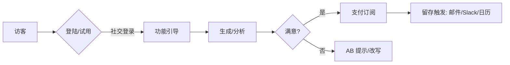

## 机会总览

| 编号 | 产品名 | 一句话 | 目标用户 | 定价（USD） | 功能优化版（平台/形式） | 目标效率/转化提升 | 平台接入（API/SDK / 审核 / 分成） |
|---|---|---|---|---|---|---|---|
| A1 | VisaShot Pro | 护照/签证证件照一键合规生成与排版 | 全球用户（留学/出差/移民） | $4.99/月 或 $1.99/次 | Microsoft Word Add-in「FormPhoto AI」 | 证件照合规与表单填充效率 10× | Office JS / 3-5 天 / 0% |
| A2 | DeductMate | 个人与自由职业者税务抵扣识别与分类 | 个体户/自由职业者 | $4.99/月 | Excel Add-in「Deductible Finder」 | 记账分类效率 10×，可抵扣识别率↑ | Office JS / 3-5 天 / 0% |
| A3 | MacroMeal Planner | 一键生成 7 天「卡路里+蛋白质」配餐与购物清单 | 健身/减脂用户 | $3.49/月 | Google Sheets Add-on「MacroSheet AI」 | 配餐规划效率 10×，坚持率↑ | Apps Script + Workspace 商店 / 3-7 天 / 0% |
| A4 | LeaseShield Lite | 租房合同条款红黄灯体检与风险解释 | 全球租客 | $5.99/月 | Word Add-in「LeaseShield for Lawyers」 | 审阅效率 10×，纠纷前置预防 | Office JS / 3-5 天 / 0% |
| A5 | StudyCardify | PDF/网页/视频转间隔记忆卡片与音频训练 | 学生/自学者 | $2.99/月 | Slack App「QuizSprint Bot」 | 学习产出效率 10×，D7 留存↑ | Slack Bolt / 1 天 / 0% |

## 共同假设与约束

- 2C 微垂直：单点价值强、决策链短、可全球化交付。
- 目标：30 天 MVP 上线；首月每款 ≥ 1k 试用、≥ 8%-15% 付费转化。
- 技术栈：Next.js 14（前端）+ .NET 8 Minimal API + EF Core + PostgreSQL（后端）+ OpenAI GPT-4-turbo（AI）+ Stripe/Paddle（支付）。
- 部署：Railway（API/DB）+ Cloudflare Pages（前端），总预算 ≤ $10,000。

## A1 · VisaShot Pro（证件照合规生成）

### 用户与痛点

- 留学/签证/求职等场景证件照规格复杂：尺寸、背景、头部占比、色温、无影、无眼镜反光。

### 关键功能（MVP）

- [ ] 国家/使馆规格库（自动匹配尺寸与头像占比栅格）
- [ ] 智能抠图与背景替换（白/蓝/灰）
- [ ] 面部几何与光比检测（合规评分与修复建议）
- [ ] 多版面排版（1×2/2×2/4×6）与本地打印指引
- [ ] 导出 JPG/PDF + 元数据（DPI/尺寸）

### 功能优化版（Microsoft Word Add-in「FormPhoto AI」）

- UI/UX：Word 任务窗格 + 内容控件；沿用主题与按钮样式，0 学习成本。
- 接入：Word JavaScript API；提交 Office 商店，审核 3-5 天；分成 0%。
- 目标角色：律师/HR/驾校/移民中介；在合同/申请模版内一键嵌入合规证件照。

### 验收与指标

- 验收：10 个国家规格样张，合规通过率 ≥ 95%；导出尺寸偏差 ≤ 1%。
- 指标：试用→付费 ≥ 12%；退款率 < 3%。

## A2 · DeductMate（抵扣识别与自动记账）

### 用户与痛点

- 自由职业者海量账单难以分类与抵扣；漏抵扣=白交税。

### 关键功能（MVP）

- [ ] 发票/邮件/银行卡记录导入（CSV/OFX/邮箱解析）
- [ ] 抵扣识别规则（交通/设备/通信/家庭办公占比）
- [ ] 分类置信度与人工校正回路
- [ ] 年终报表与审计备查包（附件与凭证链）

### 功能优化版（Excel Add-in「Deductible Finder」）

- UI/UX：Excel 任务窗格 + 功能区按钮；结果写回当前工作簿。
- 接入：Office JS；商店审核 3-5 天；分成 0%。
- 目标角色：财务/会计/创始人；凭证→分类→汇总一步到位。

### 验收与指标

- 验收：样本账单 1,000 条，自动分类准确率 ≥ 90%。
- 指标：试用→付费 ≥ 10%；用户时长（导入到结果）< 60 秒。

## A3 · MacroMeal Planner（宏量营养配餐）

### 用户与痛点

- 健身/减脂用户难以兼顾口味、成本与宏量营养目标。

### 关键功能（MVP）

- [ ] 设定热量/蛋白/脂肪/碳水目标与忌口
- [ ] 一键生成 7 天菜单与购物清单（合并重复食材）
- [ ] 国家/地区食材替代表与价格估算
- [ ] 营养标签与过敏原预警

### 功能优化版（Google Sheets Add-on「MacroSheet AI」）

- UI/UX：侧栏参数→表内写回菜谱与采购表，遵循 Material 3。
- 接入：Apps Script + Sheets API；Workspace 商店审核 3-7 天；分成 0%。
- 目标角色：营养师/健身教练/运营；团课菜单与成本核算自动化。

### 验收与指标

- 验收：100 条食谱生成 < 30 秒；购物清单去重率 ≥ 90%。
- 指标：试用→付费 ≥ 9%；D7 留存 ≥ 35%。

## A4 · LeaseShield Lite（租约体检）

### 用户与痛点

- 普通租客看不懂法律术语；押金/维修/涨租条款风险大。

### 关键功能（MVP）

- [ ] 条款分段红/黄/绿灯与简明解释
- [ ] 本地法规/案例映射（非法律意见，信息参考）
- [ ] 邮件模板：和房东/中介沟通建议
- [ ] 签前检查清单与签后提醒

### 功能优化版（Word Add-in「LeaseShield for Lawyers」）

- UI/UX：选择段落→侧栏显示风险与建议，内联批注风格一致。
- 接入：Office JS；审核 3-5 天；分成 0%。
- 目标角色：律师/地产经纪/运营；提高合同审阅吞吐量与一致性。

### 验收与指标

- 验收：10 份不同地区租约，关键风险覆盖率 ≥ 90%。
- 指标：试用→付费 ≥ 12%；NPS ≥ 50。

## A5 · StudyCardify（多源资料 → 间隔记忆卡片）

### 用户与痛点

- 学习资料分散（PDF/网页/视频），难以形成复习卡片与测试。

### 关键功能（MVP）

- [ ] PDF/URL/字幕提取要点与术语表
- [ ] 自动生成 Q&A/完形填空/多选卡片
- [ ] 音频复诵与间隔记忆节奏（手机小程序可选）
- [ ] 导出 Anki/CSV

### 功能优化版（Slack App「QuizSprint Bot」）

- UI/UX：/quiz 命令生成每日 5 题；私聊推送错题本。
- 接入：Slack Bolt + Events API；审核 1 天；分成 0%。
- 目标角色：工程师/销售/支持团队；内部知识点巩固与新员工训练。

### 验收与指标

- 验收：单资料 30 页→卡片 ≥ 80 张，误判率 ≤ 5%。
- 指标：试用→付费 ≥ 10%；团队 D7 留存 ≥ 40%。

## 产品流（通用）

## 里程碑（30 天）

- 第 1 周：需求冻结、IA、设计与各平台插件骨架创建
- 第 2 周：核心算法能力 + 前后端串联 + 基础遥测
- 第 3 周：支付/许可/配额 + 商店提审（Word/Excel/Sheets/Slack）
- 第 4 周：灰度上线 + 增长实验（LP/价格/首购优惠）+ 复盘

## 成功指标（总体）

- 所有产品响应 P95 < 3s（实时音频除外）；崩溃率 < 0.5%。
- 首月总收入目标 ≥ $3,000；退款率 < 5%。