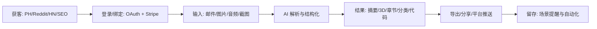

## 范围与背景

- 基于 2024-Q3–2025-08 期间 Product Hunt、Reddit、Hacker News、Indie Hackers、Dev.to、BuildInPublic 的公开趋势，聚焦 2C、小而美、可高转化的微垂直机会。
- 目标：1 人团队、预算 USD 10,000、30 天上线（MVP），每个机会同时提供“功能优化版”（嵌入主流平台的 0 学习成本微扩展）。

## 机会清单（5 个全新）

| 编号 | 核心产品（2C） | 一句话 | 订阅价 | 目标人群 | 功能优化版（平台内微扩展） |
|---|---|---|---|---|---|
| A | QuietInbox AI | 5 秒收件箱归零：摘要、优先级、语气匹配回复 | USD 4.99/月 | 忙碌上班族、自由职业者 | Outlook 加载项「SalesReply Coach」：销售邮件场景下的一键语境回复与后续任务生成 |
| B | PhotoSculpt AI | 60 秒将 2D 照片变 3D 可打印模型 | USD 6.99/月 | 手工/3D 打印爱好者、创客 | Figma 插件「3DMock AI」：将界面元素生成可嵌入预览的低多边形 3D 资产 |
| C | PodcastNote AI | 任意音频→章节、要点、待办与分享卡片 | USD 3.99/月 | 播客重度听众、知识工作者 | Zoom 应用「Meeting Chapters AI」：会议内实时章节与会后行动项推送 |
| D | TaxTidy AI | 自由职业者票据→税务类别与凭证包 | USD 5.99/月 | 个体户、自由职业者 | Excel 加载项「ReceiptSort AI」：凭证表内一键 OCR+分类+对账 |
| E | CodeSnap Rebuilder AI | 截图/照片还原代码并给出可运行片段 | USD 7.99/月 | 学生、自学者、工程新人 | GitHub App「PR Explainer AI」：PR 自动解读、风险定位与示例修复建议 |

## 关键假设与价值

- 提供 10× 效率提升或显著提升（≥5×）用户行动转化（如邮件回复、会议跟进、报税提交、学习产出、合并 PR）。
- 移动端优先体验（上传、收听、拍照等），桌面端补全重度工作流。

## 用户画像与痛点

| 机会 | 画像 | 高频场景 | 痛点 | 成功定义 |
|---|---|---|---|---|
| A | 销售运营/职场人 | 每日 100+ 邮件 | 决策疲劳、延迟回复 | 平均回复时间 < 2 分钟，优先级命中率 ≥90% |
| B | 设计/创客 | 想把 2D 草图做成 3D | 门槛高、工具复杂 | 1 分钟内得到可打印 STL/GLB，失败率 <10% |
| C | 知识型听众 | 播客/会议后复盘 | 无结构、难回顾 | 章节+要点+待办自动生成并可分享 |
| D | 个体户/自由职业 | 散落发票/小票 | 手工录入耗时 | 票据 95% 自动归档分类，出具税务包 |
| E | 学生/工程新手 | 看截图学代码 | 上手难、语境缺失 | 还原出可运行最小示例并解释差异 |

## 用户旅程（通用）

## MVP 范围（V1.0）

### A. QuietInbox AI

- 输入：IMAP/OAuth 读取近期邮件；支持快速粘贴邮件文本
- 输出：摘要、优先级（高/中/低）、三条可选回复（语气/长度可控）、后续任务（推至日历/待办）
- 集成：Outlook/Google 日历、Slack 推送
- 限制：每日处理上限 200 封，单封 < 200KB

### B. PhotoSculpt AI

- 输入：单张或多张 2D 图片
- 输出：低多边形 3D 模型（GLB/STL）+ 简易修复建议
- 集成：Figma 预览组件、Thangs/Printables 分享链接
- 限制：模型面数上限 15k，纹理贴图 1 张

### C. PodcastNote AI

- 输入：音频文件/播客 RSS/Zoom 录制链接
- 输出：章节、要点、行动项、可分享图卡
- 集成：Pocket/Readwise、Notion、Zoom
- 限制：单次时长 ≤ 2 小时

### D. TaxTidy AI

- 输入：票据图片/邮件转发/PDF
- 输出：类别（IRS/当地税则映射）、商家、金额、税额、发票包 ZIP（CSV/JSON/PDF）
- 集成：Excel、GDrive/Dropbox
- 限制：金额识别 99% 准确，手动修正 UI

### E. CodeSnap Rebuilder AI

- 输入：代码截图/拍照
- 输出：可运行最小示例（语言识别）、替代库建议、环境说明
- 集成：GitHub Gist/Repo PR 评论
- 限制：代码片段 < 200 行

## 功能优化版（平台内微扩展）

| 机会 | 平台 | 应用名 | API/SDK | 审核周期（参考） | 分成 | UI/UX 规范对齐 |
|---|---|---|---|---|---|---|
| A | Microsoft Outlook | SalesReply Coach | Office JavaScript API / Office Add-in | 3–5 个工作日 | 0% | Ribbon 命令 + 阅读/撰写窗格任务面板，遵循 Fluent UI |
| B | Figma | 3DMock AI | Figma Plugin API | 1–2 天 | 0% | 右侧属性面板 + Modal；快捷键与变量面板一致 |
| C | Zoom | Meeting Chapters AI | Zoom Apps SDK / Meeting SDK / Marketplace | 7–15 个工作日 | 0% | In-Meeting 顶栏入口 + 后会话 Summary 卡片 |
| D | Microsoft Excel | ReceiptSort AI | Office JavaScript API / Excel 特定对象模型 | 3–5 个工作日 | 0% | 自定义功能区 + 侧边任务窗格，表格样式沿用 Office 主题 |
| E | GitHub | PR Explainer AI | GitHub App + REST/GraphQL API / Marketplace | 3–10 个工作日 | 5% | PR 页面检查与评论 UI，遵循 Primer 设计体系 |

## 非功能需求（统一）

- 性能：P95 端到端 < 3s（除 3D/长音频外 < 10s）
- 可用性：99.5% 月度可用性；关键路径断路器与重试
- 隐私：默认本地脱敏；PII 加密（AES-256 at rest, TLS1.2+ in transit）
- 合规：GDPR/CCPA 基础，数据保留可配置（默认 180 天）

## 指标体系（MVP）

| 指标 | 目标 |
|---|---|
| 首月访客→注册转化 | ≥ 12% |
| 注册→付费转化 | ≥ 8% |
| 首周留存（W1） | ≥ 35% |
| 每机会月度活跃付费用户 | ≥ 1,000 |
| 客服响应（首次/解决） | < 2h / < 24h |

## 依赖与风险

- 外部 API 速率与配额限制（邮件、Zoom、GitHub）
- 版权与合规（音频、票据、代码片段）
- 生成质量一致性（设置信心阈值与人工校验入口）
