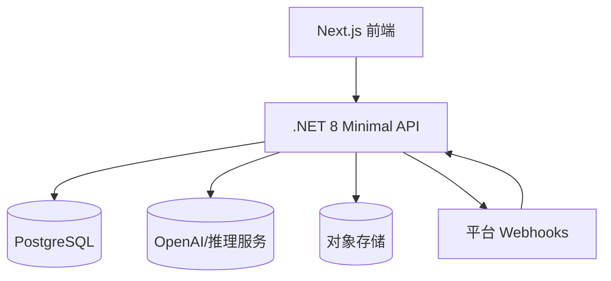

## 技术栈（统一）

- 前端：Next.js 14（App Router，SSR/ISR），Tailwind
- 后端：.NET 8 Minimal API + EF Core + PostgreSQL
- AI：OpenAI GPT-4-turbo（文本/结构化），Whisper/自带转写（音频），3D 重建（外部服务或自训练轻量模型）
- 支付：Stripe + Paddle（冗余）
- 部署：Railway（API/DB）+ Cloudflare Pages（静态）+ Cloudflare Turnstile（防刷）
- 监控：OpenTelemetry + Sentry + UptimeRobot

## 系统架构

## 领域模型（核心表）

| 表 | 关键字段 | 备注 |
|---|---|---|
| users | id, email, plan, locale, created_at | 多租户、RBAC 简化 |
| jobs | id, user_id, type, status, input_uri, output_uri, cost_cents | 异步任务队列 |
| subscriptions | id, user_id, provider, status, current_period_end | Stripe/Paddle 对齐 |
| artifacts | id, job_id, kind, meta_json, size | 3D/音频/截图产物 |
| platform_links | id, user_id, platform, oauth_token, scopes | 平台授权 |

## 统一 API（示例）

| 方法 | 路径 | 描述 |
|---|---|---|
| POST | /api/v1/jobs | 提交任务（类型：email/3d/audio/receipt/codesnap） |
| GET | /api/v1/jobs/{id} | 任务状态与结果 |
| POST | /api/v1/webhooks/stripe | Stripe Webhook |
| POST | /api/v1/webhooks/platform | 平台通用 Webhook |

## 各机会特定需求

### QuietInbox

- 集成：Gmail/Outlook OAuth，IMAP 回退；日历写入（Google/Microsoft Graph）
- 模型：邮件分类、摘要、语气模仿（小样本适配）
- 安全：不保留登录凭据明文；最小权限

### PhotoSculpt

- 管线：图像预处理 → 轮廓/深度估计 → 网格重建 → 简化 → 导出 GLB/STL
- 资源：GPU 队列；结果缓存与复用

### PodcastNote

- 管线：转写 → 分段主题 → 章节 → 要点/待办 → 分享卡片渲染
- 集成：Zoom OAuth、录制拉取 API、速率控制

### TaxTidy

- 管线：OCR → 关键信息抽取 → 税目映射（地区配置）→ Excel 写回 → 压缩包
- 法务：票据/税务地区映射可配置化

### CodeSnap

- 管线：OCR+代码语言检测 → 依赖/框架识别 → 可运行最小示例生成 → 解释差异
- 集成：GitHub Gist/PR 评论 API；速率与签名

## 平台微扩展接入方式

| 平台 | 接入 | 审核周期 | 分成 |
|---|---|---|---|
| Microsoft Office（Word/Excel/Outlook） | Office JavaScript API + Office Add-in，Partner Center 提交 | 3–5 个工作日 | 0% |
| Figma | Figma Plugin API，开发者后台提交 | 1–2 天 | 0% |
| Zoom | Zoom Apps / Meeting SDK + Marketplace 提交 | 7–15 个工作日 | 0% |
| GitHub | GitHub App + Marketplace | 3–10 个工作日 | 5% |

## 非功能与合规

- 性能：端到端 P95 < 3s（重构类 < 10s）
- 安全：OAuth PKCE、JWT 短时令牌、RBAC；审计日志
- 隐私：数据保留策略（默认 180 天，可一键清除/导出）
- 可观测：TraceId 贯穿；任务队列指标；AI 成本与延迟分桶

## 验收标准（样例）

- 注册到首次价值 ≤ 60 秒
- QuietInbox：10 封混合邮件场景，优先级准确率 ≥ 90%，回复被采纳率 ≥ 50%
- PhotoSculpt：100 张测试集，成功导出比例 ≥ 90%
- PodcastNote：1 小时音频，章节边界准确率 ≥ 80%
- TaxTidy：100 张票据，金额识别误差 ≤ 1%
- CodeSnap：20 个截图还原，代码可运行比例 ≥ 70%
