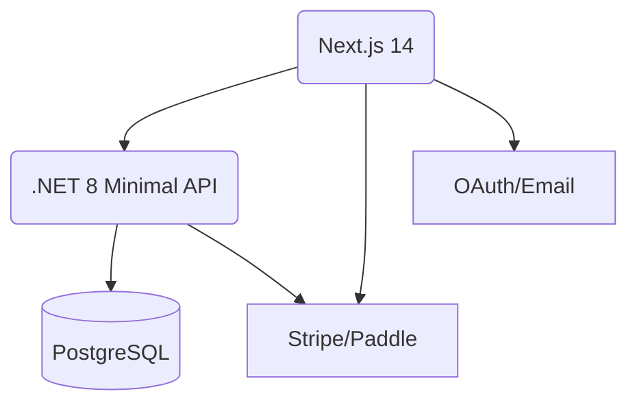

## 架构总览

## 通用模块

- Auth：Email Magic Link + OAuth（Google/Microsoft/Slack）。
- Billing：Stripe Checkout + Customer Portal；Paddle 备选（含税务合规）。
- Rate Limit：用户/产品/端点维度；令牌桶。
- 观测：PostHog 事件、Sentry 错误、OpenTelemetry Trace。

## 数据模型（核心表）

| 表 | 字段要点 |
|---|---|
| users | id, email, auth_provider, created_at |
| products | id, code(A1-A5), name, plan_monthly, plan_oneoff |
| subscriptions | id, user_id, product_code, status, provider, renew_at |
| files | id, user_id, product_code, type, url, ttl_expire_at |
| jobs | id, user_id, product_code, status, input_meta, output_meta |
| telemetry | id, user_id, product_code, event, payload, ts |

## API（示例）

- POST /api/auth/login
- POST /api/billing/checkout
- POST /api/jobs (body: product_code, input)
- GET /api/jobs/{id}

## 各产品特定实现

### A1 VisaShot Pro

- 第三方：rembg/自研抠图服务（容器化）+ 面部几何检测（mediapipe/face landmarks）。
- 合规库：各国规格 JSON（尺寸、头像占比、留白、背景色）。
- Word Add-in：任务窗格 + 插入图片到内容控件；权限：读取/写入文档。

### A2 DeductMate

- 解析：邮箱 IMAP（可选）/CSV/OFX 导入；商户→类别映射字典与 Few-shot。
- Excel Add-in：选择列→分类→结果写回；权限：工作簿读写。

### A3 MacroMeal Planner

- 数据：营养数据库（USDA/open food data）；过敏原与替代食材映射。
- Sheets Add-on：侧栏参数→生成表格；Scopes：spreadsheets.currentonly。

### A4 LeaseShield Lite

- 法规来源：公开法规/权威网站摘录做参考索引（不提供法律意见）。
- Word Add-in：选择文本→风险注释；权限：文档内容访问最小化。

### A5 StudyCardify

- 抽取：PDF 文本、网页正文提取、YouTube 字幕（用户提供），生成卡片集合。
- Slack App：/quiz 命令，events: message.channels, app_mention；Bot Token。

## 性能与成本

- 生成请求缓存（输入哈希）；大文件异步 Job 队列（队列重试与死信）。
- 成本上限：每用户每月模型成本 ≤ $0.50；超额弹窗与排队策略。

## 合规与法律

- 不存身份证件号码等敏感数据；证件照仅本地处理或短期存储；明确免责声明。