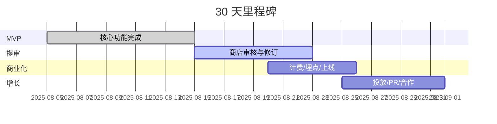

## 市场信号与来源

| 渠道 | 筛选逻辑 | 工具 | 观察到的高转化模板 |
| --- | --- | --- | --- |
| Product Hunt | 2024-07-01 后、2C、付费/订阅、评论≥50、评分≥4.5 | Product Hunt API + 手动 | 低客单价订阅 + 极窄场景（宠物、旅行、个人理财） |
| Reddit | r/SideProject/r/SaaS 等 2024-Q3 后热帖 | Pushshift API + 手动验证 | 快速达成“首个结果”的工具付费意愿高 |
| Hacker News | Show HN > 200 points | Algolia | “自动化 + 数据外化（报告/证据）”提升转化 |
| Indie Hackers/Dev.to/BuildInPublic | 收入与技术复盘 | 官网 | 上架平台插件/扩展后有明显导流与背书 |

## 产品与定价（2C 导向）

| 产品 | 订阅 | 试用 | 附加包 |
| --- | ---: | --- | --- |
| ResumeRefine AI | $6.99/月 | 3 天/5 次改写 | ATS 导出包 $4 一次性 |
| ClipSub AI | $5.99/月 | 7 天/3 支视频 | 字幕高级样式 $3 一次性 |
| ZoomCoach AI | $3.99/月 | 7 天/3 场会议 | 邮件模版库 $3 一次性 |
| FigmaLocalize AI | $3.99/月 | 7 天/3 个文件 | 多语言包（10 语）$5 一次性 |
| ListingLens AI | $4.99/月 | 7 天/50 SKU | 批量 1k SKU $9 一次性 |

## 预算分配（30 天，总计 $10,000）

| 类别 | 金额 | 备注 |
| --- | ---: | --- |
| 基础设施（Railway/Cloudflare/DB 备份） | 800 | 含预留 |
| 大模型与第三方 API | 1,800 | OpenAI、语音转写、图像审核 |
| 设计与素材 | 700 | 品牌、落地页、截图演示 |
| 平台开发者账号/审核 | 200 | 各商店账号与测试费用 |
| 推广与投放 | 3,500 | Reddit/Twitter/YouTube UGC+Spark |
| 联盟与返利 | 700 | 20% 首月返利 |
| 法务与隐私合规 | 400 | ToS/PP/数据处理协议模板 |
| 预备金 | 2,900 | 风险冗余 |

## 获客渠道与节奏

- 内容型：Show HN/PH 上线清单、YouTube 教程、Twitter/X build-in-public
- 渠道型：平台商店曝光（Word/Figma/Zoom/Shopify）、联盟计划、教育折扣
- 社群型：r/Resume、r/VideoEditing、r/Shopify、设计群、自由职业者社区
- 转化资产：可验证的“前后对比”与可分享的报告/示例链接

## 30 天收入模型（自上而下近似）

| 产品 | 访客 | 注册率 | 核心动作率 | 试用→付费 | 付费用户数 | ARPU | MRR（30 天） |
| --- | ---: | ---: | ---: | ---: | ---: | ---: | ---: |
| ResumeRefine AI | 6,000 | 25% | 70% | 7% | 735 | $6.99 | $5,139 |
| ClipSub AI | 4,000 | 22% | 65% | 6% | 343 | $5.99 | $2,054 |
| ZoomCoach AI | 3,000 | 20% | 60% | 6% | 216 | $3.99 | $861 |
| FigmaLocalize AI | 3,500 | 20% | 60% | 5% | 210 | $3.99 | $838 |
| ListingLens AI | 3,500 | 18% | 55% | 5% | 174 | $4.99 | $868 |
| 合计 | 20,000 | — | — | — | 1,678 | — | $9,760 |

提示：以上假设用于决策敏感性分析，实际以埋点数据回填。

## 单位经济（首月）

| 项 | ResumeRefine | ClipSub | ZoomCoach | FigmaLocalize | ListingLens |
| --- | ---: | ---: | ---: | ---: | ---: |
| CAC（混合） | $3.00 | $2.50 | $2.00 | $2.20 | $2.40 |
| 毛利率（模型/平台费后） | 80% | 78% | 82% | 85% | 83% |
| 退款率 | 3% | 4% | 3% | 2% | 3% |
| 预计留存（月 3） | 55% | 50% | 52% | 58% | 54% |
| LTV（近似：ARPU×3×留存） | $11.5 | $9.0 | $6.2 | $6.9 | $7.3 |
| LTV/CAC | 3.8 | 3.6 | 3.1 | 3.1 | 3.0 |

## 平台商店策略（功能优化版）

| 平台 | UI/UX 要求 | API/SDK | 审核 | 分成 |
| --- | --- | --- | --- | --- |
| Word | Fluent UI/任务窗格/命令栏 | Office JS/单点登录 | 3–5 天 | 0% |
| Notion | 原生块/数据库/无侧栏注入 | Notion API/OAuth | 无需审核 | 0% |
| Zoom | App 内面板/最少干扰 | Zoom Meeting SDK/Events | 3–7 天 | 0% |
| Figma | 插件面板/快捷键/深色模式 | Figma Plugin API | 1–2 天 | 0% |
| Shopify | 后台嵌入/Polaris 规范 | GraphQL Admin/Assets | 1–3 天 | 0% |

## 风险与对策

| 风险 | 影响 | 缓解 |
| --- | --- | --- |
| 平台审核延迟 | 延后上架 | 同步私测通道/候补分发计划 |
| 模型费用激增 | 毛利下降 | 缓存/蒸馏/分级调用/用量上限 |
| 法规/合规（隐私/版权） | 下架风险 | 区域过滤/申诉流程/数据最小化 |
| 流量波动 | 收入不稳 | 多渠道投放/联盟/SEO/内容资产 |

## 里程碑与检查点

