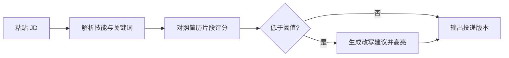
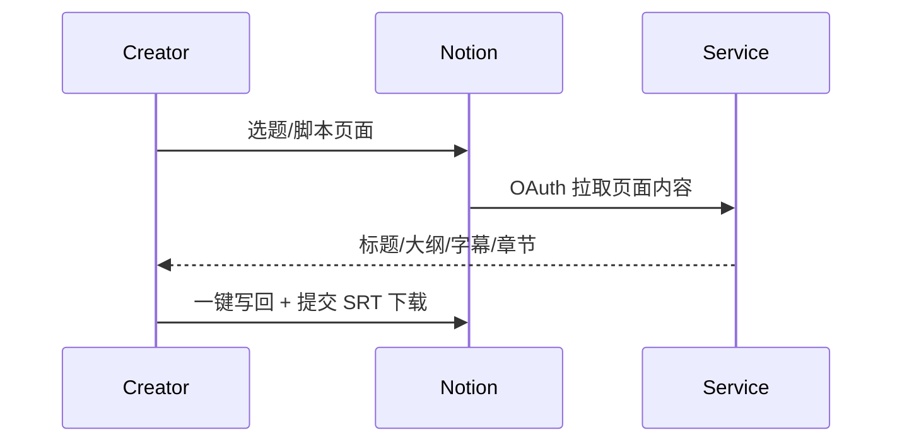
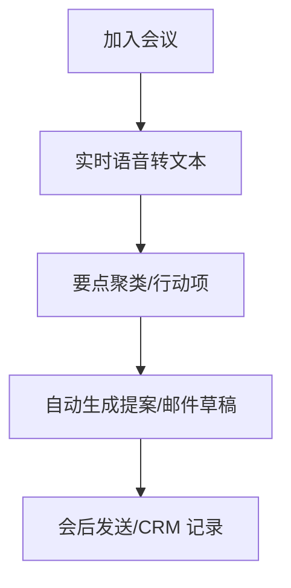
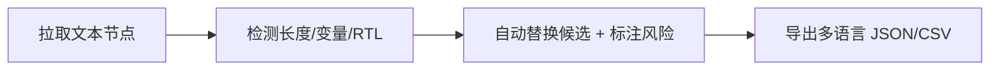
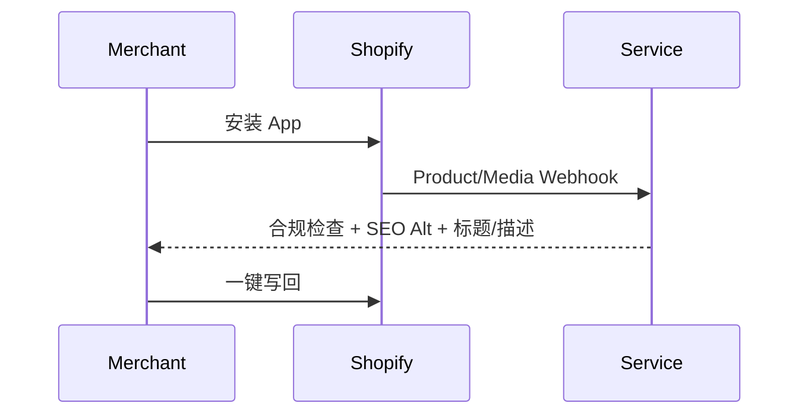
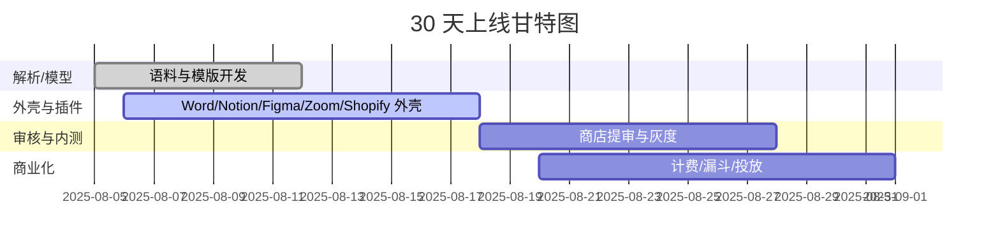

## 机会清单与功能优化版总览

| 产品 | 一句话 | 价格 (USD/月) | 目标用户 | 功能优化版（平台/名称） | 平台接入 | 审核周期 | 分成 |
| --- | --- | ---: | --- | --- | --- | --- | ---: |
| ResumeRefine AI | 60 秒让简历匹配 JD 并量化匹配度 | 6.99 | 求职者/转行人群 | Microsoft Word / JDMatch for Word | Office JavaScript API + Office Add-in | 3–5 天 | 0% |
| ClipSub AI | 一键生成短视频字幕 + 爆款标题 + 章节点 | 5.99 | 短视频创作者 | Notion / ClipPlan AI | Notion API + OAuth 公共集成 | 0 天（上线即用） | 0% |
| ZoomCoach AI | 会议中实时要点抓取 + 会后提案草稿 | 3.99 | 自由职业者/顾问 | Zoom / ZoomCoach | Zoom Meeting SDK + App Marketplace | 3–7 天 | 0% |
| FigmaLocalize AI | 设计稿一键多语言本地化 + 溢出检测 | 3.99 | UI/UX 设计师 | Figma / L10n Check AI | Figma Plugin API | 1–2 天 | 0% |
| ListingLens AI | 商品图与文案合规 + SEO Alt 自动化 | 4.99 | 独立卖家/Shopify 店主 | Shopify / ListingLens | Shopify GraphQL Admin API + Assets API | 1–3 天 | 0% |

## 共性目标与 KPI（30 天）

- 激活率（首会话完成首个核心动作）≥ 40%
- 付费转化率（试用→付费）≥ 5%
- 24 小时留存 ≥ 40%，7 日留存 ≥ 20%
- 功能优化版对对应平台原链路提效 ≥ 10 倍，或付费转化 ≥ 5 倍
- 每个机会目标 MRR ≥ 600，合计 ≥ 3,000

## 需求优先级框架

- Must-have：完成单一核心作业（JTBD）闭环；账号/支付/基础日志
- Should-have：多语言、导入导出、基础团队分享
- Could-have：模板市场、自动化触发、A/B 实验
- Won’t-have（30 天）：复杂协作、移动原生 App、企业 SSO

## 1. ResumeRefine AI（Word 插件：JDMatch for Word）

### 问题与动机

- 求职者需要高频投递，人工改简历耗时且反馈滞后
- ATS 关键字匹配影响通过率，但大多用户不了解评分机制

### 用户故事（核心）

- 作为求职者，我粘贴 JD 后，希望 60 秒内拿到量化匹配度与修改建议
- 作为求职者，我希望在 Word 中一键替换建议语句并高亮差异

### 核心流程

### 功能需求（MVP）

- JD 粘贴与自动解析（技能/年限/证书/工具）
- 简历段落打分与风险提示（缺失/过时/不量化）
- 一键改写/量化指标/关键词填充（可回滚）
- Word Add-in 侧边栏：遵循 Fluent UI，0 学习成本
- 导出 PDF 与 ATS 友好简历（保留语义标签）

### 非功能需求

- 延迟：首响应 ≤ 3s，改写 ≤ 10s
- 隐私：不存储原始文档，默认 24 小时自动清除缓存
- 合规：提供 GDPR/CCPA 数据访问与删除入口

### 验收清单

- [ ] 10 份真实 JD 与 10 份简历 AB 验证通过率提升
- [ ] Word 插件通过商店审核并可内购
- [ ] 漏斗：访客→注册→粘贴 JD→完成改写→导出简历 全链路埋点

### 里程碑（30 天）

- 第 1–10 天：解析与打分模型、Word 外壳、支付集成
- 第 11–20 天：改写模版、ATS 导出、私测
- 第 21–30 天：商店审核、灰度收费、投放与 cold outreach

## 2. ClipSub AI（Notion 集成：ClipPlan AI）

### 问题与动机

- 短视频创作者需要更快的选题→脚本→字幕→分发链路
- 多平台格式不一（SRT、章节点、Hashtag）导致重复劳动

### 核心流程

### 功能需求（MVP）

- Notion 页面 → 标题/脚本/分镜/字幕（多语言）
- 自动章节点与封面文案建议（A/B 两版）
- 导出 SRT/ASS + 平台标签（TikTok/YouTube/IG）
- Notion 数据库模板（内容日历）与回写

### 非功能需求与验收

- [ ] OAuth 集成，无需人工审核
- [ ] 100 条字幕生成平均 < 8s，准确率主观评分 ≥ 4/5

## 3. ZoomCoach AI（Zoom App：ZoomCoach）

### 问题与动机

- 自由职业者需要在会议中实时抓要点，会后快速输出提案/报价

### 核心流程

### 功能需求（MVP）

- 会议内浮层显示要点与行动项（跟随 Zoom UI 规范）
- 会后 5 分钟内生成提案/报价邮件草稿（含上下文）
- 多语言识别、说话人分离、敏感词提醒

### 验收

- [ ] Zoom App 审核通过；会议 CPU 占用 < 10%
- [ ] 10 场真实会议复盘；用户主观效率评分 ≥ 4.5/5

## 4. FigmaLocalize AI（Figma 插件：L10n Check AI）

### 问题与动机

- 多语言 UI 本地化常见文案溢出、截断、错键盘布局

### 核心流程

### 功能需求（MVP）

- 一键检测文本节点（LTR/RTL/变量安全）
- 自动建议更短文案并给出本地化 key
- 溢出热力图 + 一键截图评审包

### 验收

- [ ] Figma 审核通过；1000 文本节点检测 < 10s
- [ ] 3 种语言（EN/ES/AR）通过可读性评估

## 5. ListingLens AI（Shopify App）

### 问题与动机

- 独立卖家需要合规/高转化的图文素材，且要适配搜索与可访问性

### 核心流程

### 功能需求（MVP）

- 图片合规检测（商标、成人、敏感符号）
- 自动生成标题/描述/ALT（多语言）并 A/B 两版
- 一键写回产品与媒体字段；批量处理

### 验收

- [ ] Shopify 审核通过；500 SKU 批量处理 < 5 分钟
- [ ] 至少 5 家小店实测转化率提升 ≥ 10%

## 平台与分成（功能优化版汇总）

| 平台 | UI/UX 规范 | 接入/审核 | 分成 |
| --- | --- | --- | --- |
| Word | Fluent UI、任务窗格 | AppSource 审核 3–5 天 | 0% |
| Notion | 原生块/数据库 | OAuth 公共集成，无需审核 | 0% |
| Zoom | App 内面板 | Marketplace 审核 3–7 天 | 0% |
| Figma | 插件面板/快捷键 | 插件审核 1–2 天 | 0% |
| Shopify | Polaris UI 嵌入 | App 审核 1–3 天 | 0% |

## 指标与分析

| 指标 | 目标 | 仪表来源 |
| --- | ---: | --- |
| 首日转化（注册→核心动作） | ≥ 40% | PostHog 事件流 |
| 试用→付费 | ≥ 5% | Stripe/Paddle 订阅转化 |
| 7 日留存 | ≥ 20% | Cohort 分析 |
| 功能优化版提效 | ≥ 10x | 任务耗时对比（自报/日志） |

## 依赖与风险

- 平台审核延迟：准备私密链接与备用分发（侧载/受限测试）
- 大模型成本波动：采用缓存/提示词蒸馏/分层调用
- 合规：图片/语音内容需地域过滤与用户申诉通道

## 上线节奏（高层）

