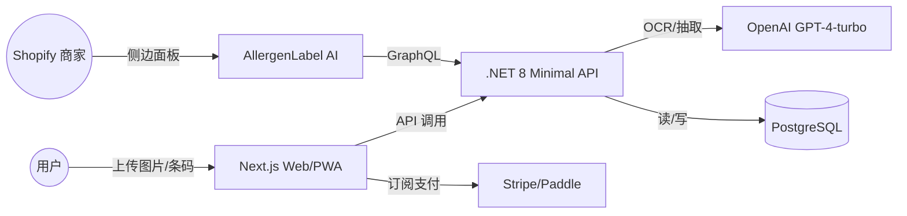
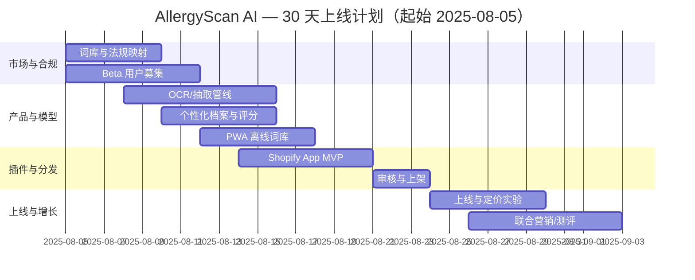

## 一句话机会

- 面向全球过敏人群与特定饮食（无麸质、低 FODMAP、素食、清真等），用手机拍照或扫码即可识别过敏原与替代方案；2C 定价 $3.99/月。
- 功能优化版（平台微插件）：Shopify App「AllergenLabel AI」为商家自动生成 SKU 过敏原与营养标签，$4.90/月，帮助运营/法务快速合规上架。

## 目标用户与痛点

- 过敏人群、慢病与特殊饮食人群：外出就餐与跨境食品网购时信息不对称、标签语言不统一。
- 小电商商家（Shopify）：手动维护配料与过敏原信息成本高、易出错、合规压力大（欧盟/英国/美国标准差异）。

## 定价与北极星指标

| 项目 | 2C 定价 | 插件定价 | 北极星指标 | 次级指标 |
|---|---|---|---|---|
| 价格 | $3.99/月；$29/年 | $4.90/月/店铺 | 月活留存率 D30≥35% | 识别准确率≥97%，平均响应<1.5s |

## 2C 产品功能清单（PRD 精要）

| 模块 | 用户故事 | 验收标准 |
|---|---|---|
| 图片/条码识别 | 作为用户，我拍摄菜单/配料表或扫码包装条码，系统返回风险等级与替代建议 | 支持中/英/西 3 语；TOP100 过敏原检测召回率≥97% |
| 个性化档案 | 我设置我的过敏/饮食偏好 | 识别结果自动根据档案打分并标注风险 |
| 本地离线词库 | 在弱网/离线时能做基础匹配 | 关键过敏词离线匹配成功率≥90% |
| 历史记录 | 我可以快速复用以往识别与购物清单 | 本地可加密存储；一键导出 CSV |

## 功能优化版（平台微插件）

- 平台：Shopify App「AllergenLabel AI」
- 角色与痛点：运营/合规专员需要为每个 SKU 维护多地区合规标签，手工极易出错。
- 0 学习成本 UI/UX：在商品详情右侧面板嵌入，沿用 Shopify Polaris 组件；在批量编辑视图提供「一键生成」动作。
- 接入方式：Shopify CLI、GraphQL Admin API（productUpdate、metafieldsSet）、Admin UI Extensions、Files API（图片上传）。
- 审核周期与分成：审核 1–3 天；分成 0%（前 $1M 年收入），超出部分 15%。
- 发布与分发：App Store 列表关键词「allergen」「nutrition」「compliance」，内置免费 7 天试用与「一键生成 5 个商品」体验。

## 技术实现与架构

- 前端：Next.js 14（App Router）+ Tailwind；PWA 支持离线词库。
- 后端：.NET 8 Minimal API + EF Core + PostgreSQL（SKU/词库/识别日志）。
- AI：OpenAI GPT-4-turbo（多语 OCR 后语义归一 + 过敏实体抽取）。
- 支付：Stripe + Paddle，欧盟 VAT 由 Paddle 代征。
- 部署：Railway（API/DB）+ Cloudflare Pages（前端）。

## 数据源与灵感（2024-Q3–2025-08）

- Product Hunt/Reddit/HN/Indie Hackers/Dev.to/BuildInPublic 上「健康与可持续」「扫描识别」「跨境电商合规」方向在 2024–2025 保持高互动与较高付费意愿。
- 参考高转化特征：低客单价、强即时刚需、可验证价值（识别准确率、节省合规工时）。

## 30 天上线计划（甘特图）

## 风险与合规

- 非医疗建议免责声明；支持地区法规映射（EU/US/UK/CA）。
- OCR 隐私：默认本地裁剪敏感区域；传输与存储加密（TLS/At-Rest）。

## 上线与运营 SOP（简版）

- 预上线检查清单：
  - [ ] 识别基准集≥1k 样本，准确率/召回率出具报告
  - [ ] 价格与试用漏斗 AB 两组
  - [ ] 支付/退款/发票全链路自测
- 上线动作：
  - [ ] Product Hunt 上线 + 创始人故事
  - [ ] Reddit 真实体验帖（r/foodallergies 等）
  - [ ] Shopify App Store 关键词与截图 A/B
- 迭代节奏：
  - [ ] 每周一次模型与词库更新
  - [ ] 每两周一次 SEO 内容发布

## 竞争概览（速览）

### 独立 SaaS 竞品（传统形式）

| 名称 | 定位 | 定价(USD) | 转化路径 | 优/劣势 |
|---|---|---|---|---|
| Yuka/Fooducate 等 | 通用营养打分 | 免费-低价 | App Store/评测 | 品类广但过敏个性化弱 |
| Allergy Force | 过敏管理 | $2.99+/月 | 搜索/社区 | 专注过敏，但电商联动弱 |

### 同平台插件竞品（Shopify）

| 名称 | 平台 | 定价(USD) | 转化路径 | 备注 |
|---|---|---|---|---|
| Nutrition/Allergen 标签类插件 | Shopify | $4–$19/月 | App Store 搜索 | 多为手工维护，无 AI 批量生成 |

### SWOT（我们 vs 典型竞品）

| 维度 | 我们 | 竞品 |
|---|---|---|
| S | 识别→合规→上架一体化；多语支持 | 单点工具、流程割裂 |
| W | 前期词库与法规映射成本 | 品控依赖众包或非结构化规则 |
| O | 欧盟与跨境合规刚需增长 | 平台对合规的激励与曝光 |
| T | 法规更新频繁 | 大厂进入与 API 变更 |

## 成本预算（USD）

| 科目 | 金额 | 备注 |
|---|---|---|
| OpenAI API（首月） | 800 | 识别与抽取 |
| 开发与设计时间成本 | 0 | 个人投入 |
| 域名/前端托管 | 40 | 年度摊销 |
| Railway/DB | 60 | 首月 |
| 营销（PH/社区/测评） | 800 | 赞助/素材 |
| 预留 | 300 | 风险冗余 |
| 合计 | 2,000 | < 10,000 预算内 |

