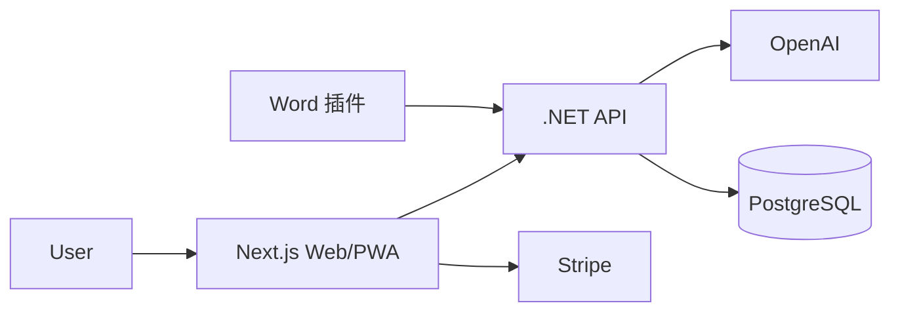
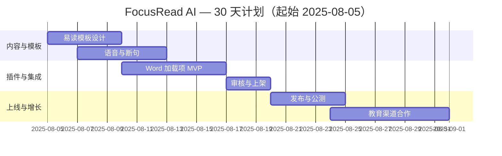

## 一句话机会

- 面向阅读障碍/注意力分散人群，将网页/PDF/图片转为易读排版与语音，个性化字距/对比度/分段提示；2C $2.99/月。
- 功能优化版：Microsoft Word 加载项「FocusRead for Word」为编辑/律师/学生在 Word 中一键转换为易读稿、对齐无障碍规范，$4.90/月。

## 目标用户与痛点

- 普通用户：长文阅读负担大、移动端排版差、注意力维持困难。
- 专业用户：需要在 Word 中快速检查无障碍可读性与格式规范。

## 定价与北极星指标

| 项目 | 2C 定价 | 插件定价 | 北极星指标 | 次级指标 |
|---|---|---|---|---|
| 价格 | $2.99/月；$24/年 | $4.90/月/席位 | 有声阅读时长/日≥12 分钟 | 转换延迟<800ms，NPS≥45 |

## 2C 产品功能清单（PRD 精要）

| 模块 | 用户故事 | 验收标准 |
|---|---|---|
| 易读化转换 | 我将网页/PDF 转为高对比度、加字距、断句提示的排版 | 可配置模板≥4；移动端自适应 |
| 语音与节拍 | 我可以用自然语音播放并自动跟读高亮 | 语音断句准确率≥95% |
| 专注番茄钟 | 我开启 25 分钟聚焦模式并屏蔽分心元素 | 可自定义白名单域名 |

## 功能优化版（平台微插件）

- 平台：Microsoft Word（Office Add-in）
- 角色与痛点：编辑/法务需在 Word 中检查可读性与规范，一键修复样式。
- 0 学习成本 UI/UX：Ribbon 按钮 + Taskpane 侧边栏，沿用 Fluent UI；选中文档区域即预览。
- 接入方式：Office.js Word JavaScript API（Requirement Set 1.3+）、Manifest v1.1、SSO 可选。
- 审核与分成：AppSource 审核 3–5 天；若自有计费，微软分成 0%。
- 发布与分发：关键词「readability」「accessibility」，教育/无障碍社区联动推广。

## 技术实现与架构

- 前端：Next.js 14（Web/PWA）+ Web Speech + Tailwind。
- 后端：.NET 8 Minimal API；文本分析与排版规则引擎。
- AI：OpenAI GPT-4-turbo（句法断句与摘要）。
- 支付：Stripe + Paddle；部署：Railway + Cloudflare Pages。

## 30 天上线计划（甘特图）

## 上线与运营 SOP（简版）

- [ ] 可读性评分对照（Flesch 等）与改善前后对比
- [ ] AppSource 列表 A/B 截图与关键词
- [ ] 社区试用码 200 份，收集录屏反馈

## 竞争概览（速览）

### 独立 SaaS 竞品

| 名称 | 定位 | 定价 | 备注 |
|---|---|---|---|
| Speechify/Voice Dream | 文字转语音 | $60+/年 | 有声强，排版弱 |
| Readable.com | 可读性评分 | $8+/月 | 评分强，AI 修复弱 |

### 同平台插件竞品（Word）

| 名称 | 定位 | 定价 | 备注 |
|---|---|---|---|
| 多个语法/样式检查插件 | 语法/样式 | 免费-付费 | 少见系统化易读化模板 |

### SWOT

| 维度 | 我们 | 竞品 |
|---|---|---|
| S | 易读化+语音+无障碍一体化 | 功能分散 |
| W | 需要适配复杂 Word 样式 | 单点评分易复制 |
| O | 教育/无障碍采购 | 大厂内置风险 |
| T | 平台 API 变更 | 内容版权风险 |

## 成本预算（USD）

| 科目 | 金额 | 备注 |
|---|---|---|
| OpenAI/语音 | 500 | 首月 |
| 托管/域名 | 60 | 首月 |
| 营销与测评 | 700 | 首月 |
| 预留 | 240 |  |
| 合计 | 1,500 | <10,000 预算内 |

