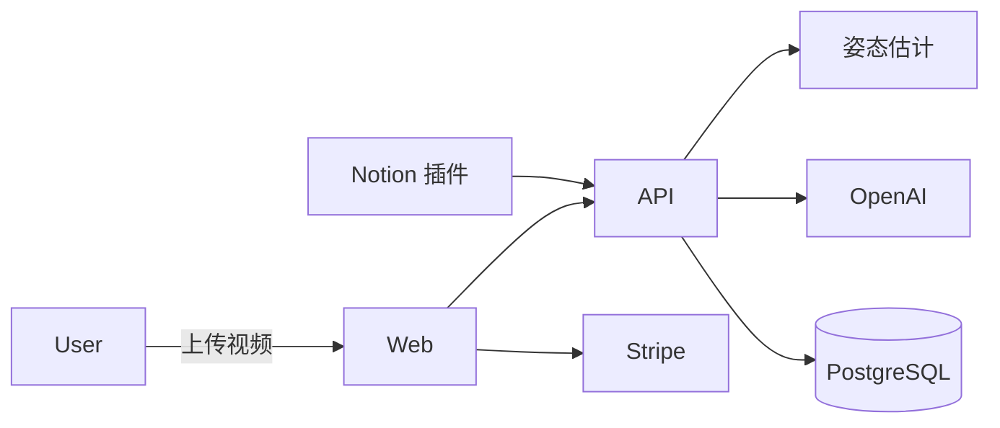
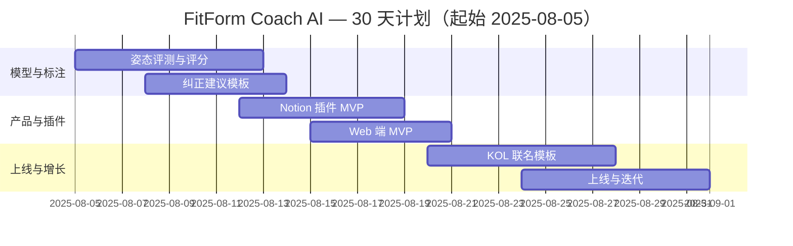

## 一句话机会

- 用手机录像即可得到关键动作（深蹲/硬拉/俯卧撑等）姿势评分与纠正建议；2C $3.99/月。
- 功能优化版：Notion 插件「WorkoutBlock AI」在训练笔记中一键生成个性化周计划与动作要点卡片，$3.00/月。

## 目标用户与痛点

- 初学者：无私教指导、容易受伤；需要简单、即时、可执行的纠正建议。
- 教练/创作者：需要在 Notion 中快速批量生成个性化计划。

## 定价与北极星指标

| 项目 | 2C 定价 | 插件定价 | 北极星指标 | 次级指标 |
|---|---|---|---|---|
| 价格 | $3.99/月；$36/年 | $3.00/月 | 每周纠正视频≥3 条 | 用户伤痛反馈下降≥30% |

## 2C 产品功能清单（PRD 精要）

| 模块 | 用户故事 | 验收标准 |
|---|---|---|
| 动作关键点 | 我上传视频，系统自动标注关节角度与轨迹 | 关键点检测 PCK@0.2 ≥ 0.85 |
| 姿势评分 | 我获取 0–100 分与文字/图示纠正 | 核心要点≥3 条；建议可落地 |
| 训练计划 | 我根据目标生成 4 周计划 | RPE/组数/频率可配置 |

## 功能优化版（平台微插件）

- 平台：Notion 公共集成「WorkoutBlock AI」
- 角色与痛点：教练/创作者在 Notion 中维护多学员计划，手动重复多。
- 0 学习成本 UI/UX：Slash 命令 /workout 与块菜单生成「周计划」与「动作要点卡」。
- 接入方式：Notion API（/v1/pages、/v1/blocks、/v1/databases），OAuth 公共集成，回调到云端生成。
- 审核与分成：公开集成无需审核；分成 0%。
- 分发：Notion 模板市场 + 社区健身博主联名模板。

## 技术实现与架构

- 前端：Next.js 14；后端：.NET 8 + EF Core + PostgreSQL。
- AI：OpenAI GPT-4-turbo（动作点评与计划文本化）；关键点可用 MediaPipe/姿态估计第三方服务作为辅助。
- 支付：Stripe；部署：Railway + Cloudflare Pages。

## 30 天上线计划（甘特图）

## 上线与运营 SOP（简版）

- [ ] 拍摄示例库 50 条，前后对比
- [ ] Notion 模板 3 套（新手/减脂/增肌）
- [ ] 联名折扣码与复购激励

## 竞争概览（速览）

### 独立 SaaS 竞品

| 名称 | 定位 | 定价 | 备注 |
|---|---|---|---|
| Freeletics/Strong | 训练计划 | $30+/年 | 计划强，动作纠正弱 |
| Kaia/姿势类 | 姿势健康 | $5–$15/月 | 医疗导向，健身场景弱 |

### 同平台插件竞品（Notion）

| 名称 | 定位 | 定价 | 备注 |
|---|---|---|---|
| 若干健身模板 | 手工模板 | $0–$20 | 缺少 AI 个性化与动作纠正 |

### SWOT

| 维度 | 我们 | 竞品 |
|---|---|---|
| S | 姿态→纠正→计划闭环 | 单点能力分散 |
| W | 视频质量依赖 | 模板缺少动态适配 |
| O | 居家健身持续 | 创作者生态带动 |
| T | 医疗合规边界 | 设备碎片化 |

## 成本预算（USD）

| 科目 | 金额 | 备注 |
|---|---|---|
| 模型/推理 | 800 | 首月 |
| 托管/域名 | 60 | 首月 |
| 营销 | 600 | KOL 与素材 |
| 预留 | 240 |  |
| 合计 | 1,700 | <10,000 预算内 |

