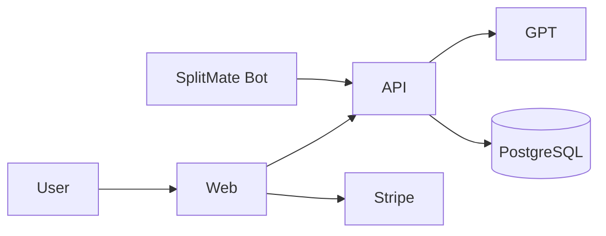
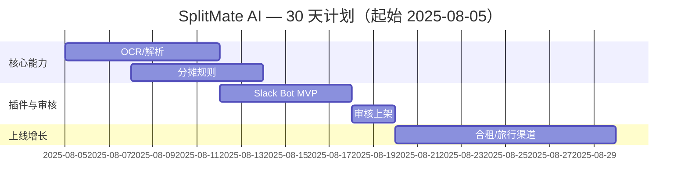

## 一句话机会

- 面向合租/情侣/朋友旅行等场景，自动识别账单并分摊、提醒结算与优化订阅；2C $2.99/月。
- 功能优化版：Slack 应用「SplitMate Bot」在团队频道中按成员/项目分摊，$2/席位/月。

## 目标用户与痛点

- 日常分摊复杂、手工汇总易漏；订阅常年续费但被动消费。
- 团队/社团在 Slack 中已有协作场景，分摊刚需且频次高。

## 定价与北极星指标

| 项目 | 2C 定价 | 插件定价 | 北极星指标 | 次级指标 |
|---|---|---|---|---|
| 价格 | $2.99/月；$20/年 | $2/席位/月 | 每月完成分摊≥3 单 | 逾期率<5%，留存 D30≥40% |

## 2C 产品功能清单（PRD 精要）

| 模块 | 用户故事 | 验收标准 |
|---|---|---|
| OCR 账单 | 我拍照/导入账单，系统识别金额/参与人 | 金额识别误差<1% |
| 智能分摊 | 按 AA、比例、权重、里程等分配 | 支持多币种与汇率 |
| 订阅优化 | 我导入订阅账单，系统给出取消建议 | 冷启动订阅识别≥50 种 |

## 功能优化版（平台微插件）

- 平台：Slack 应用（Bolt SDK）
- 角色与痛点：活动组织者/运营在频道内就地处理分摊，无需跳应用。
- 0 学习成本 UI/UX：/split 命令、消息动作、Home Tab 总览，沿用 Slack Block Kit。
- 接入方式：Bolt for JS/TS、Events API（app_mention/message.channels）、Slash Commands、Scopes（channels:history 等）。
- 审核与分成：目录审核 ~1 天；分成 0%（自有计费）。
- 分发：App Directory/模板频道/社区包。

## 技术实现与架构

- 前端：Next.js 14（Web 控制台）。后端：.NET 8 + PostgreSQL。
- AI：OpenAI GPT-4-turbo（账单语义解析与规则归因）。
- 支付：Stripe；部署：Railway + Cloudflare Pages。

## 30 天上线计划（甘特图）

## 上线与运营 SOP（简版）

- [ ] 15 组真实群体公测
- [ ] 模板频道（旅行/合租/活动）与海报
- [ ] 自动催收与结算提醒模板

## 竞争概览（速览）

### 独立 SaaS 竞品

| 名称 | 定位 | 定价 | 备注 |
|---|---|---|---|
| Splitwise 等 | 分摊工具 | 免费-付费 | 老牌强势，团队协作与自动化弱 |

### 同平台插件竞品（Slack）

| 名称 | 定位 | 定价 | 备注 |
|---|---|---|---|
| 若干费用机器人 | 报销/投票 | 免费-付费 | 非分摊专用，结算链路不全 |

### SWOT

| 维度 | 我们 | 竞品 |
|---|---|---|
| S | 分摊+订阅优化闭环；Slack 就地完成 | 分摊与结算割裂 |
| W | 多币种合规与汇率 | 需要渠道教育 |
| O | 旅行/合租高频场景 | 团队协作导流 |
| T | 老牌网络效应 | 支付合规差异 |

## 成本预算（USD）

| 科目 | 金额 | 备注 |
|---|---|---|
| OCR/API | 400 | 首月 |
| 托管/域名 | 60 | 首月 |
| 营销 | 600 | 渠道投放 |
| 预留 | 240 |  |
| 合计 | 1,300 | <10,000 预算内 |

