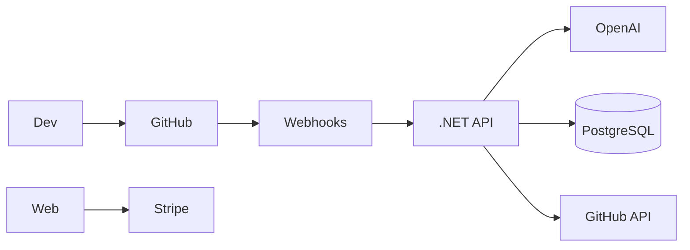
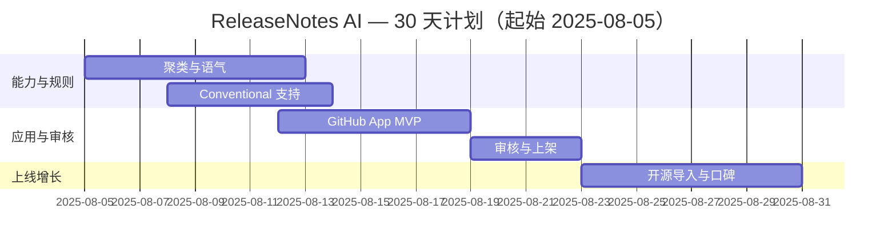

## 一句话机会

- 面向独立开发者与小团队，自动把 commit/PR 变更聚合为用户可读的更新日志、邮件与商店更新说明；2C $4.90/月。
- 功能优化版：GitHub App「ReleaseNotes Bot」在 PR/Release 流程中生成 SemVer 级别变更与中文/英文说明，$6.00/月/库。

## 目标用户与痛点

- 个人开发者：发布频繁但缺少高质量变更说明，影响转化与留存。
- 团队：需要在 GitHub 流程内标准化发布与多渠道同步。

## 定价与北极星指标

| 项目 | 2C 定价 | 插件定价 | 北极星指标 | 次级指标 |
|---|---|---|---|---|
| 价格 | $4.90/月；$49/年 | $6.00/月/库 | 每月自动发布≥2 次 | 打开率/点击率提升≥20% |

## 2C 产品功能清单（PRD 精要）

| 模块 | 用户故事 | 验收标准 |
|---|---|---|
| 变更聚类 | 按 PR/Commit 自动聚类为 Features/Bug/Docs/Perf | 误分率<5% |
| 语气优化 | 生成用户可读的简洁说明与多语版本 | 英/中≥2 语；可选语气 |
| 渠道分发 | 一键同步到网站/邮件/Twitter/PH 更新 | 成功率≥99% |

## 功能优化版（平台微插件）

- 平台：GitHub App + GitHub Marketplace
- 角色与痛点：工程师/PM 需要在 PR 合并与 Release 时自动生成并落盘 CHANGELOG。
- 0 学习成本 UI/UX：Check-run 状态、PR 评论建议、Release Draft 自动填充，遵循 GitHub UI 规范。
- 接入方式：GitHub App（webhook：push、pull_request、release），REST/GraphQL API（commits、issues、releases），可选 GitHub Actions。
- 审核与分成：Marketplace 审核 3–7 天；分成 95/5（开发者/平台）。
- 分发：Marketplace 列表 + 开源项目植入。

## 技术实现与架构

- 前端：Next.js 14；后端：.NET 8 + PostgreSQL。
- AI：OpenAI GPT-4-turbo（变更摘要/语气），规则引擎（Conventional Commits）。
- 支付：Stripe；部署：Railway + Cloudflare Pages。

## 30 天上线计划（甘特图）

## 上线与运营 SOP（简版）

- [ ] 集成 20 个开源示例库并对比人工写作质量
- [ ] 市场页列出真实案例与 diff 截图
- [ ] 邮件模板（发布/回顾/破冰）

## 竞争概览（速览）

### 独立 SaaS 竞品

| 名称 | 定位 | 定价 | 备注 |
|---|---|---|---|
| Release-notes 工具 | 说明生成 | $5–$20/月 | 多为通用摘要，GitHub 流程融合度低 |

### 同平台插件竞品（GitHub）

| 名称 | 定位 | 定价 | 备注 |
|---|---|---|---|
| Changelog 机器人/Actions | 自动生成 | 免费/付费 | 多为模板式、缺少多语/营销整合 |

### SWOT

| 维度 | 我们 | 竞品 |
|---|---|---|
| S | PR→Release→多渠道闭环；多语 | 单点工具 |
| W | 依赖代码规范程度 | 模板难个性化 |
| O | Indie/OSS 市场大 | 市场口碑传播强 |
| T | GitHub 政策变更 | 大模型成本 |

## 成本预算（USD）

| 科目 | 金额 | 备注 |
|---|---|---|
| OpenAI | 500 | 首月 |
| 托管/域名 | 60 | 首月 |
| 审核与推广 | 600 | 市场素材 |
| 预留 | 240 |  |
| 合计 | 1,400 | <10,000 预算内 |

