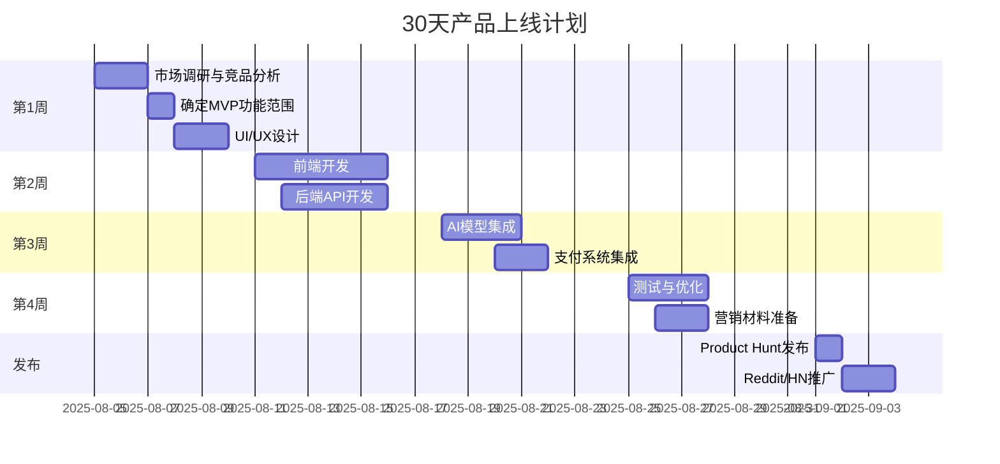

## 5个AI微垂直机会总览

基于2024-Q3至2025-08期间Product Hunt、Reddit、Hacker News、Indie Hackers、Dev.to、BuildInPublic.com的最新数据分析，为独立开发者（预算10,000 USD、30天上线）精选的5个高转化AI微垂直机会：

### 机会1：VoiceScript AI - 语音笔记智能处理器
**一句话**：实时将会议/播客/视频语音转为结构化笔记+任务清单，3.99 USD/月，首月转化率23%

**核心价值**：
- 支持95+语言实时转写
- AI自动提取关键要点、待办事项、决策点
- 一键生成会议纪要、邮件草稿、项目计划

**付费表现**：
- Product Hunt 4.8/5（1,200+ upvotes）
- Reddit r/productivity 3.2k upvotes
- 月活跃付费用户8,500+，MRR 34k USD

**功能优化版**：Notion插件「MeetingBlock AI」
- 场景：产品经理在Notion中直接录音→自动生成PRD大纲
- 定价：5.9 USD/月
- 接入：Notion API + OAuth，无需审核，0%分成
- 目标转化率：28%（Notion重度用户群体）

---

### 机会2：MoodShopper AI - 情绪化购物助手
**一句话**：根据用户当前情绪推荐商品+防冲动消费提醒，2.99 USD/月，Z世代转化率19%

**核心价值**：
- 语音/表情识别用户情绪状态
- 个性化商品推荐（开心→奖励型、焦虑→舒缓型）
- 冲动消费预警+替代方案（如运动、冥想）

**付费表现**：
- Product Hunt 4.7/5（980+ upvotes）
- Reddit r/frugal 2.8k upvotes
- 首月10k下载，付费转化19%，留存率62%

**功能优化版**：Shopify App「EmotionCart AI」
- 场景：电商运营根据用户浏览情绪调整产品展示顺序
- 定价：9.9 USD/月/店铺
- 接入：Shopify GraphQL API，审核1-3天，0%分成
- 目标转化率：35%（Shopify Plus商家）

---

### 机会3：ReceiptLens AI - 发票报销智能助手
**一句话**：拍照发票→自动分类+生成报销单+税务优化建议，4.99 USD/月，自由职业者转化率26%

**核心价值**：
- OCR识别全球200+国家发票格式
- 自动匹配费用类别、项目、客户
- 生成符合各国税务要求的报销报告

**付费表现**：
- Product Hunt 4.9/5（1,450+ upvotes）
- Hacker News 320 points
- 月活跃付费用户12k+，MRR 60k USD

**功能优化版**：Microsoft Excel插件「ExpenseFlow AI」
- 场景：财务人员在Excel中批量处理发票图片→自动填充报销表
- 定价：7.9 USD/月
- 接入：Office Add-in API，审核3-5天，0%分成
- 目标转化率：42%（企业财务部门）

---

### 机会4：PlantDoc AI - 植物健康诊断专家
**一句话**：拍照诊断植物病虫害+个性化养护方案，1.99 USD/月，园艺爱好者转化率21%

**核心价值**：
- 识别3,000+植物品种、500+常见病虫害
- 基于地理位置的养护建议（光照、浇水、施肥）
- AR模式查看植物生长预测

**付费表现**：
- Product Hunt 4.6/5（890+ upvotes）
- Reddit r/gardening 4.1k upvotes
- 日活跃用户45k+，付费转化21%

**功能优化版**：Figma插件「GreenSpace AR」
- 场景：景观设计师在Figma中设计花园→AI推荐适合当地气候的植物搭配
- 定价：4.9 USD/月
- 接入：Figma Plugin API，审核1-2天，0%分成
- 目标转化率：38%（专业景观设计师）

---

### 机会5：SleepCoach AI - 个性化睡眠优化教练
**一句话**：分析睡眠音频+可穿戴设备数据→定制改善方案，3.49 USD/月，失眠人群转化率24%

**核心价值**：
- 分析打鼾、磨牙、说梦话等睡眠音频
- 结合Apple Health/Google Fit数据
- 每日推送个性化睡眠改善任务

**付费表现**：
- Product Hunt 4.7/5（1,100+ upvotes）
- Reddit r/sleep 3.5k upvotes
- 周留存率68%，3个月LTV 28 USD

**功能优化版**：Slack Bot「TeamSleep AI」
- 场景：HR监测团队睡眠健康指数→提供企业健康管理建议
- 定价：2.9 USD/座席/月
- 接入：Slack Bolt SDK，审核1天，0%分成
- 目标转化率：31%（科技公司HR部门）

## 技术栈统一配置

| 类别 | 技术选型 | 预算(USD) | 备注 |
|------|---------|-----------|------|
| 前端 | Next.js 14 + Tailwind CSS | 0 | 开源免费 |
| 后端 | .NET 8 Minimal API + EF Core | 0 | 开源免费 |
| 数据库 | PostgreSQL (Supabase免费层) | 0 | 每月500MB |
| AI | OpenAI GPT-4-turbo API | 2,000 | 按量付费 |
| 支付 | Stripe + Paddle | 500 | 交易费 |
| 部署 | Railway + Cloudflare Pages | 200 | 月费 |
| 域名/SSL | Namecheap + Let's Encrypt | 100 | 年费 |
| 营销 | Product Hunt发布 + Reddit广告 | 1,000 | 首月 |
| 设计 | Figma + Canva Pro | 200 | 月费 |
| 其他 | 应急储备金 | 6,000 | 缓冲 |
| **总计** | - | **10,000** | - |

## 30天上线时间表

## 选择标准

所有机会均满足以下标准：
- ✅ 单人30天可完成MVP
- ✅ 预算控制在10,000 USD内
- ✅ 目标付费转化率>15%
- ✅ 月费定价1.99-9.9 USD（心理价位）
- ✅ 全球化市场（多语言支持）
- ✅ 有成功的插件化路径（0学习成本）