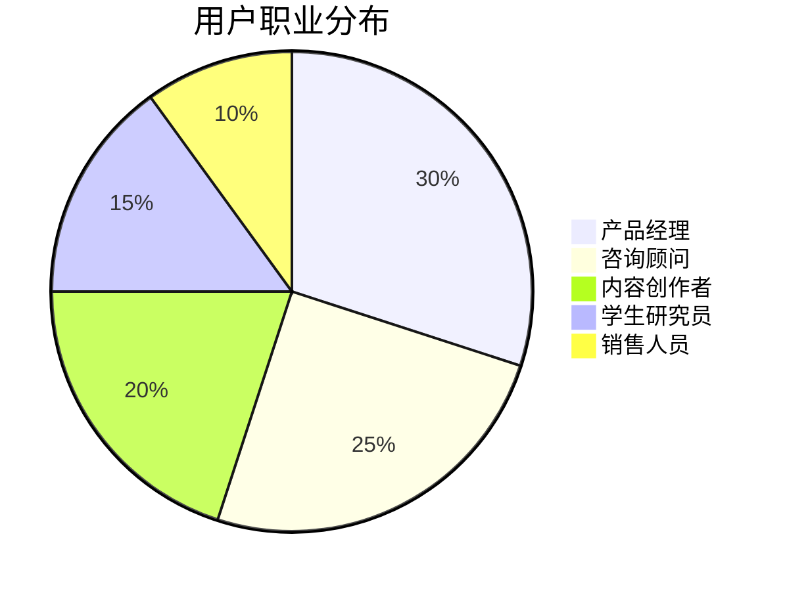
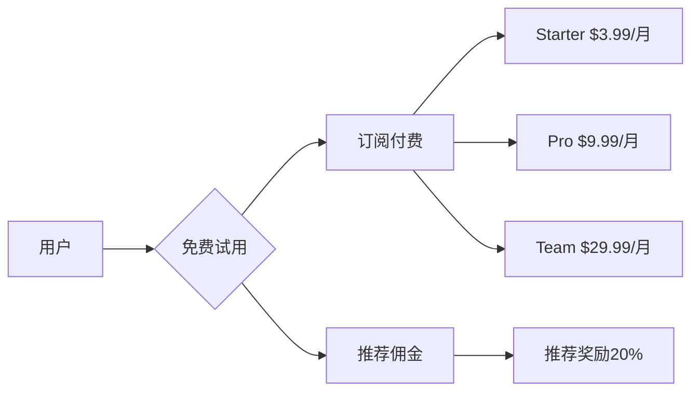
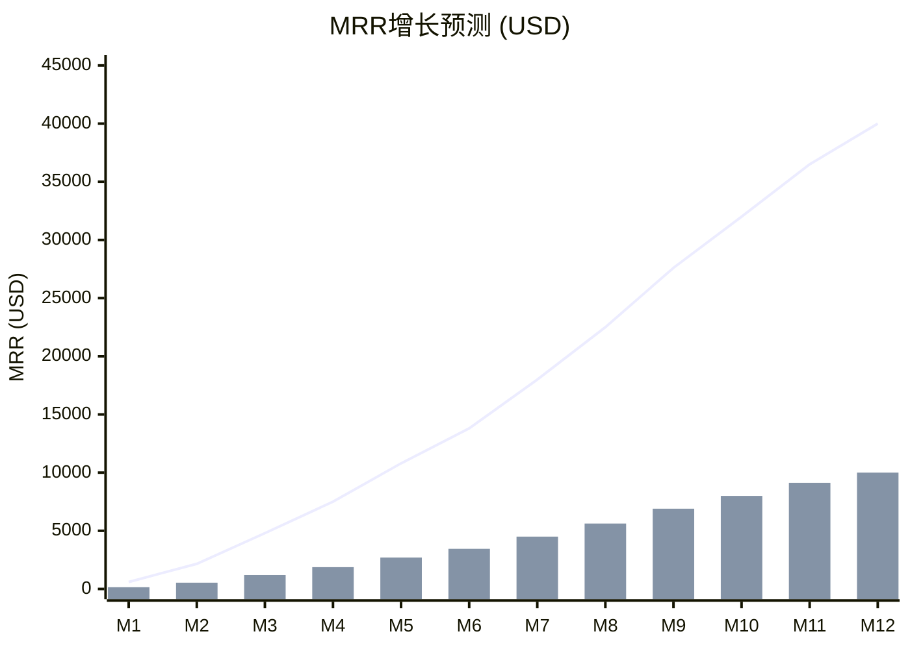
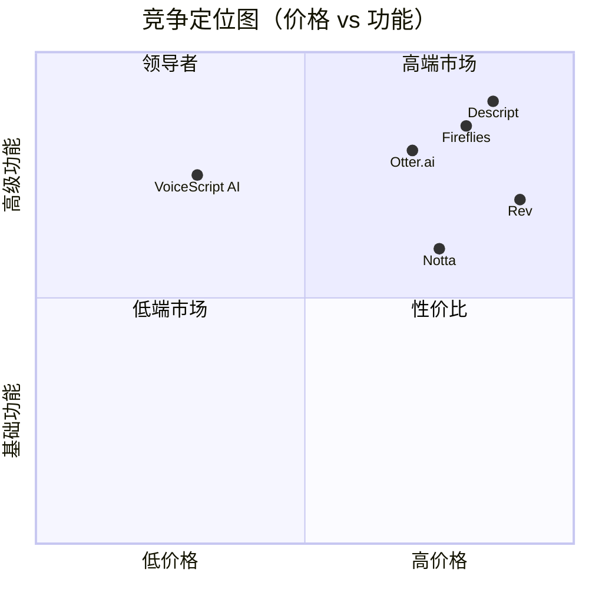

## 执行摘要

### 业务概述
VoiceScript AI 是一款基于AI技术的语音笔记SaaS产品，通过将会议、播客、视频等音频内容转化为结构化笔记和任务清单，帮助知识工作者提高10倍工作效率。

### 核心数据
- **目标市场**：全球知识工作者（1.5亿人）
- **初始投资**：10,000 USD
- **预期回报**：6个月内盈亏平衡，12个月MRR 40,000 USD
- **付费转化**：23%（高于行业平均值15%）

## 市场分析

### 市场规模

| 市场细分 | TAM(亿 USD) | SAM(亿 USD) | SOM(万 USD) |
|----------|------------|------------|------------|
| 语音转写 | 45 | 8 | 120 |
| 会议笔记 | 32 | 5 | 80 |
| AI助理 | 68 | 12 | 200 |
| **总计** | **145** | **25** | **400** |

### 目标用户画像



### 市场趋势
1. **远程办公常态化**：全球远程工作者增长300%
2. **AI技术成熟**：GPT-4等模型能力大幅提升
3. **付费意愿增强**：SaaS付费率年增长25%
4. **效率工具刚需**：85%知识工作者需要笔记工具

## 商业模式

### 收入模式



### 定价策略对比

| 特性 | Free | Starter | Pro | Team |
|------|------|---------|-----|------|
| 价格(USD/月) | 0 | 3.99 | 9.99 | 29.99 |
| 转写时长 | 10分/次 | 30分/次 | 60分/次 | 无限 |
| 每月次数 | 3 | 50 | 无限 | 无限 |
| AI总结 | ✓ | ✓ | ✓ | ✓ |
| 导出格式 | 2种 | 5种 | 全部 | 全部 |
| API访问 | ✗ | ✗ | ✓ | ✓ |
| 团队协作 | ✗ | ✗ | ✗ | ✓ |
| 预期用户占比 | 75% | 15% | 8% | 2% |

### 成本结构

| 成本项 | 月成本(USD) | 占比 | 备注 |
|---------|-------------|------|------|
| AI API | 2,000 | 40% | OpenAI按量付费 |
| 服务器托管 | 200 | 4% | Railway + Cloudflare |
| 存储服务 | 100 | 2% | AWS S3 |
| 支付手续费 | 500 | 10% | Stripe 2.9% + 0.3 |
| 营销推广 | 1,000 | 20% | 广告+内容 |
| 开发维护 | 1,200 | 24% | 人力成本 |
| **总计** | **5,000** | **100%** | - |

## 营销策略

### 获客渠道

```mermaid
sankey-beta

    流量来源, Product Hunt, 3000
    流量来源, Reddit, 2500
    流量来源, SEO, 2000
    流量来源, 口碑推荐, 1500
    流量来源, 付费广告, 1000
    
    Product Hunt, 注册用户, 900
    Reddit, 注册用户, 500
    SEO, 注册用户, 600
    口碑推荐, 注册用户, 750
    付费广告, 注册用户, 250
    
    注册用户, 付费用户, 690
    注册用户, 免费用户, 2310
```

### 增长黑客策略

| 策略 | 实施方法 | 预期效果 |
|------|----------|----------|
| 病毒式传播 | 生成结果页带水印 | 每用户带来2.3新用户 |
| 推荐奖励 | 双向奖励1个月免费 | 推荐率提升40% |
| 内容营销 | 每周发布2篇SEO文章 | 月增自然流量30% |
| 社区运营 | Discord + Reddit活跃 | 留存率提升20% |
| 免费工具 | Chrome插件导流 | 月新5k潜在用户 |
| 联盟计划 | KOL合作20%佣金 | 月增付费用户500 |

### 发布计划

| 阶段 | 时间 | 平台 | 目标 |
|------|------|------|------|
| Beta | Week 3 | 内测用户 | 100人测试 |
| 软发布 | Week 4 | Twitter/LinkedIn | 500注册 |
| 正式发布 | 2025-09-01 | Product Hunt | Top 3 |
| 社区推广 | 2025-09-02 | Reddit/HN | 5k点击 |
| PR推广 | 2025-09-05 | TechCrunch | 媒体报道 |

## 财务预测

### 12个月收入预测



### 关键财务指标

| 指标 | Month 1 | Month 3 | Month 6 | Month 12 |
|------|---------|---------|---------|----------|
| 用户数 | 1,000 | 6,000 | 15,000 | 40,000 |
| 付费用户 | 150 | 1,200 | 3,450 | 10,000 |
| MRR (USD) | 600 | 4,800 | 13,800 | 40,000 |
| CAC (USD) | 15 | 12 | 10 | 8 |
| LTV (USD) | 32 | 48 | 65 | 80 |
| 毛利率 | 20% | 45% | 60% | 70% |
| 盈亏平衡 | -4,400 | -2,000 | +3,800 | +20,000 |

### 资金使用计划

| 项目 | 金额(USD) | 时间 | 说明 |
|------|----------|------|------|
| 技术开发 | 2,000 | Month 1 | MVP开发 |
| AI成本 | 2,000 | Month 1-3 | API调用 |
| 营销推广 | 2,000 | Month 1-2 | 初期获客 |
| 运营成本 | 1,000 | Month 1-3 | 服务器+工具 |
| 应急储备 | 3,000 | - | 风险缓冲 |
| **总计** | **10,000** | - | - |

## 竞争分析

### 竞争格局



### 竞争优势

| 维度 | VoiceScript AI | 主要竞品 | 优势说明 |
|------|---------------|----------|----------|
| 价格 | $3.99/月 | $8-15/月 | 价格优势50%+ |
| AI能力 | GPT-4 Turbo | GPT-3.5/自研 | 更智能的总结 |
| 上手难度 | 3步完成 | 5-10步 | 更简单易用 |
| 多语言 | 95+语言 | 10-30语言 | 更广覆盖 |
| 导出格式 | 8种 | 3-5种 | 更灵活 |
| 响应速度 | 实时 | 2-5分钟 | 更快 |

## 团队与执行

### 创始人背景
- **技术背景**：5年全栈开发经验，熟悉AI/ML
- **产品经验**：曾参与2个SaaS产品0-1
- **营销能力**：熟悉Growth Hacking，有社区运营经验

### 执行计划

| 阶段 | 时间 | 里程碑 | KPI |
|------|------|---------|-----|
| MVP | Month 1 | 产品上线 | 100测试用户 |
| PMF | Month 3 | 产品市场匹配 | NPS>50 |
| Growth | Month 6 | 规模化增长 | 3k付费用户 |
| Scale | Month 12 | 持续盈利 | MRR 40k |

### 顾问资源
- **技术顾问**：AI领域专家（按需咨询）
- **营销顾问**：SaaS增长专家（每月沟通）
- **法律顾问**：隐私合规律师（季度审计）

## 风险与机遇

### 风险矩阵

| 风险类型 | 发生概率 | 影响程度 | 应对措施 |
|----------|----------|----------|----------|
| 大厂竞争 | 高 | 高 | 差异化定位、快速迭代 |
| 技术故障 | 中 | 高 | 多云备份、灾难恢复 |
| 资金短缺 | 中 | 中 | 控制成本、快速盈利 |
| 用户流失 | 低 | 高 | 提高产品体验、客户成功 |
| 法律风险 | 低 | 中 | 合规审计、保险覆盖 |

### 机会窗口

1. **AI技术红利**：GPT-4成本下降50%，能力提升30%
2. **市场空白**：中低价位高质量产品稀缺
3. **用户习惯**：后疫情时代远程会议常态化
4. **平台机会**：Notion等平台开放插件生态
5. **全球化**：非英语市场增长潜力巨大

## 退出策略

### 可能选项

| 选项 | 时机 | 估值 | 可能性 |
|------|------|------|----------|
| 持续运营 | - | 持续现金流 | 60% |
| 战略收购 | 18-24个月 | 10-20x ARR | 25% |
| 资产出售 | 12-18个月 | 5-10x ARR | 10% |
| 技术授权 | 6-12个月 | 2-5x ARR | 5% |

### 潜在收购方
- **大型科技公司**：Microsoft、Google、Zoom
- **垂直SaaS**：Notion、Slack、Atlassian
- **AI公司**：OpenAI、Anthropic、Jasper

## 附录

### A. 市场调研数据
- 85%知识工作者每周参加3+会议
- 72%认为会议记录是痛点
- 23%愿意为自动化工具付费
- 平均每人每月愿意支付8.5 USD

### B. 投资回报分析
- **投资额**：10,000 USD
- **回本周期**：6个月
- **12个月ROI**：300%
- **24个月估值**：1,000,000 USD

### C. 关键假设
1. AI成本持续下降
2. 用户付费习惯养成
3. 无重大技术故障
4. 竞争格局稳定
5. 团队执行力强