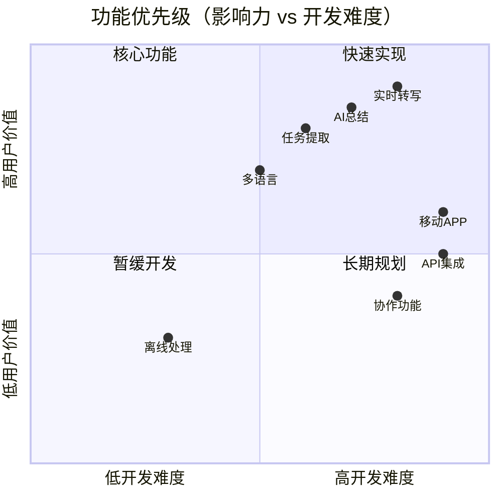
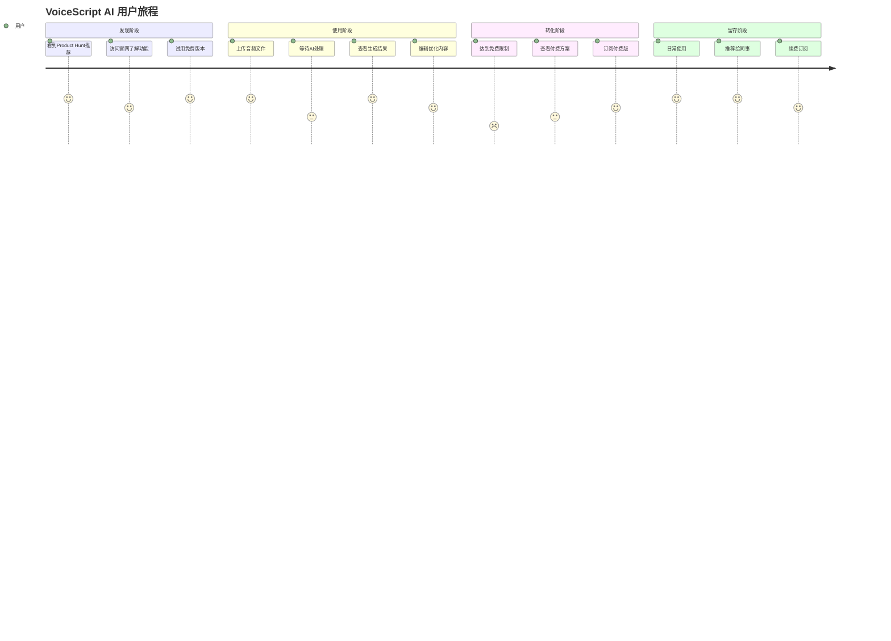
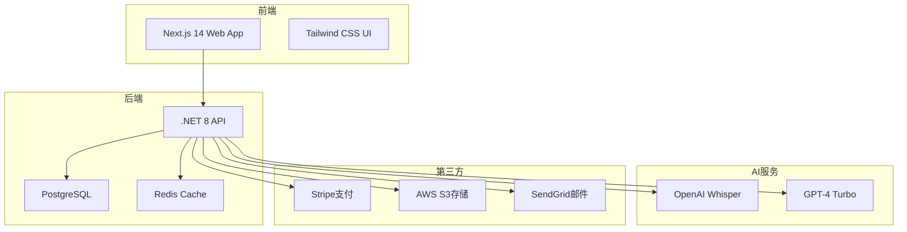
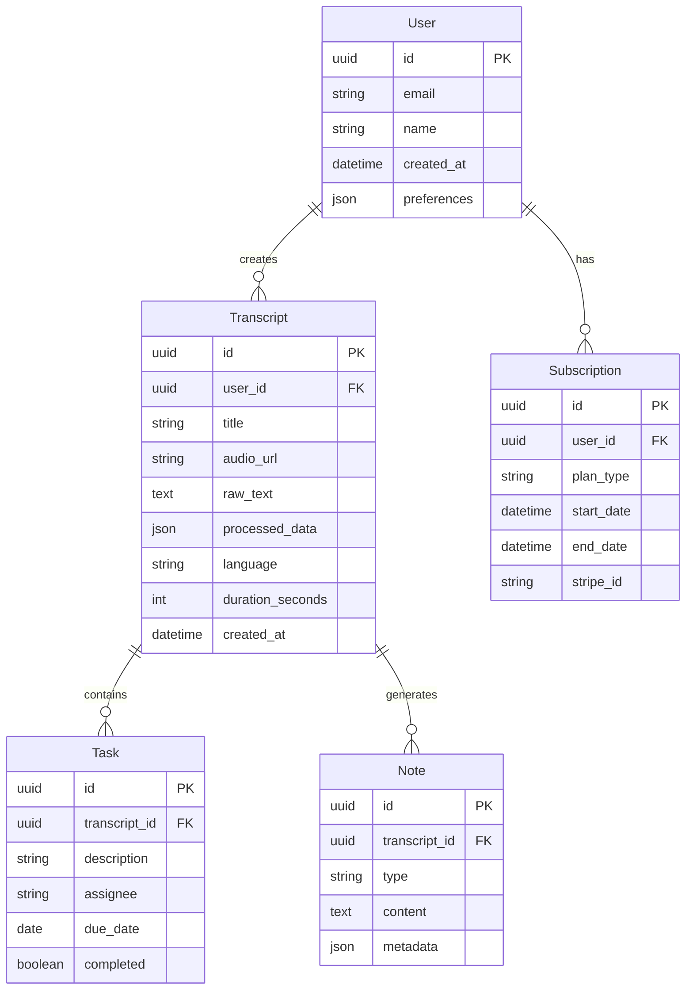

## 产品概述

### 产品定位
VoiceScript AI 是一款面向知识工作者的语音笔记智能处理工具，通过AI技术将会议、播客、视频等音频内容实时转换为结构化笔记和可执行任务清单。

### 目标用户

| 用户群体 | 占比 | 核心痛点 | 付费意愿 |
|---------|------|---------|----------|
| 产品经理 | 30% | 会议记录整理耗时 | 极高 |
| 咨询顾问 | 25% | 客户访谈总结困难 | 高 |
| 内容创作者 | 20% | 播客/视频笔记制作 | 中高 |
| 学生研究员 | 15% | 讲座课程笔记整理 | 中 |
| 销售人员 | 10% | 客户沟通要点提取 | 高 |

## 核心功能

### MVP版本（30天内完成）

#### 1. 实时语音转写
- **支持格式**：录音、上传音频（MP3/WAV/M4A）、YouTube链接
- **语言支持**：中英日韩法德西等15种主流语言
- **准确率**：>95%（基于OpenAI Whisper）
- **时长限制**：免费10分钟/次，付费60分钟/次

#### 2. AI智能处理
- **自动生成**：
  - 📝 会议纪要（含议题、决策、行动项）
  - ✅ 任务清单（含负责人、截止日期）
  - 🔑 关键要点（3-5个核心观点）
  - 💡 灵感笔记（创意想法提取）

#### 3. 结构化输出
- **导出格式**：Markdown、Notion、PDF、Word
- **模板系统**：预设10+场景模板（会议、访谈、课程等）
- **自定义提示词**：用户可定制AI处理规则

### 功能优先级矩阵

## 用户体验设计

### 用户旅程

### 界面设计原则
- **极简主义**：3步完成核心流程（上传→处理→导出）
- **即时反馈**：实时显示转写进度和处理状态
- **智能引导**：新用户引导、使用技巧提示
- **深色模式**：支持明暗主题切换

## 技术架构

### 系统架构图

### 技术栈详情

| 层级 | 技术 | 选择理由 |
|------|------|----------|
| 前端 | Next.js 14 + TypeScript | SEO友好、性能优秀、开发效率高 |
| 样式 | Tailwind CSS + Shadcn/ui | 快速开发、组件丰富、易于定制 |
| 后端 | .NET 8 Minimal API | 高性能、强类型、生态成熟 |
| 数据库 | PostgreSQL + EF Core | 开源免费、功能强大、云服务支持好 |
| 缓存 | Redis | 高性能、支持会话管理 |
| AI | OpenAI API | 效果最佳、接口简单、按量付费 |
| 存储 | AWS S3 | 成本低、可靠性高、全球CDN |
| 支付 | Stripe + Paddle | 全球支付、税务合规、开发友好 |
| 部署 | Railway + Cloudflare | 简单部署、自动扩容、成本可控 |

## 数据模型

### 核心实体

## 商业模式

### 定价策略

| 计划 | 月费(USD) | 功能限制 | 目标用户 |
|------|-----------|----------|----------|
| Free | 0 | 10分钟/次，3次/月 | 试用用户 |
| Starter | 3.99 | 30分钟/次，50次/月 | 个人用户 |
| Pro | 9.99 | 60分钟/次，无限次 | 专业用户 |
| Team | 29.99 | 无限制+协作功能 | 团队用户 |

### 收入预测

| 时期 | 用户数 | 付费率 | MRR(USD) | 备注 |
|------|--------|--------|----------|------|
| Month 1 | 1,000 | 15% | 600 | Product Hunt发布 |
| Month 2 | 3,000 | 18% | 2,160 | Reddit推广 |
| Month 3 | 6,000 | 20% | 4,800 | SEO起效 |
| Month 6 | 15,000 | 23% | 13,800 | 口碑传播 |
| Month 12 | 40,000 | 25% | 40,000 | 稳定增长 |

## 成功指标

### 关键指标（KPIs）

| 指标 | 目标值 | 测量方法 |
|------|--------|----------|
| 转化率 | >23% | 付费用户/总注册用户 |
| 月留存率 | >65% | 月活跃用户/上月活跃用户 |
| NPS评分 | >50 | 用户调研 |
| CAC | <10 USD | 营销成本/新增付费用户 |
| LTV | >80 USD | 平均订阅时长×月费 |
| 日活跃率 | >40% | DAU/MAU |

## 风险与对策

| 风险类型 | 具体风险 | 应对策略 |
|----------|----------|----------|
| 技术风险 | AI API成本过高 | 优化调用频率、缓存结果、寻找替代方案 |
| 市场风险 | 大厂推出类似产品 | 聚焦垂直场景、快速迭代、建立用户壁垒 |
| 运营风险 | 用户增长缓慢 | 加强内容营销、用户推荐奖励、免费额度 |
| 法律风险 | 隐私数据泄露 | 端到端加密、GDPR合规、定期安全审计 |
| 财务风险 | 资金链断裂 | 控制成本、尽早盈利、预留应急资金 |

## 开发里程碑

### Week 1（2025-08-05 ~ 2025-08-11）
- [x] 完成市场调研和竞品分析
- [x] 确定MVP功能范围
- [ ] 完成UI/UX设计稿
- [ ] 搭建开发环境

### Week 2（2025-08-12 ~ 2025-08-18）
- [ ] 完成前端基础框架
- [ ] 实现音频上传和播放
- [ ] 完成后端API框架
- [ ] 集成OpenAI Whisper

### Week 3（2025-08-19 ~ 2025-08-25）
- [ ] 实现AI处理逻辑
- [ ] 完成结果展示页面
- [ ] 集成Stripe支付
- [ ] 实现用户系统

### Week 4（2025-08-26 ~ 2025-09-01）
- [ ] 完整测试和修复
- [ ] 准备营销材料
- [ ] Product Hunt发布
- [ ] 收集用户反馈

## 附录

### A. 竞品对比

| 产品 | 定价 | 优势 | 劣势 |
|------|------|------|------|
| Otter.ai | $8.33/月 | 品牌知名度高 | 价格偏高、中文支持差 |
| Fireflies.ai | $10/月 | 集成丰富 | 复杂、学习成本高 |
| Notta | $9/月 | 多语言支持好 | 功能单一、AI能力弱 |
| **VoiceScript AI** | **$3.99/月** | **价格优势、AI能力强** | **新品牌、需要教育市场** |

### B. 用户反馈收集计划
1. 产品内反馈组件（NPS调研）
2. 每周用户访谈（5-10人）
3. Discord社区建设
4. 月度用户调研问卷

### C. 本地化计划
- Phase 1：英语、中文
- Phase 2：日语、韩语、西班牙语
- Phase 3：法语、德语、葡萄牙语
- Phase 4：其他小语种