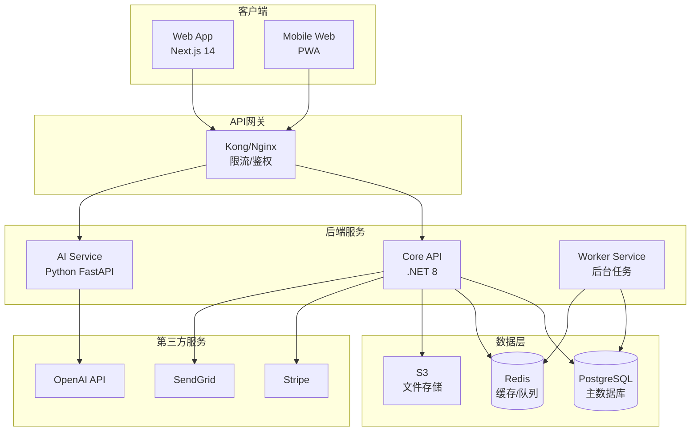
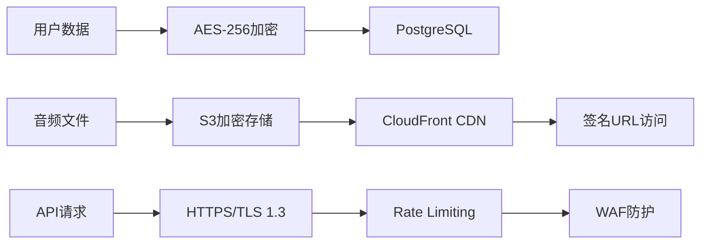
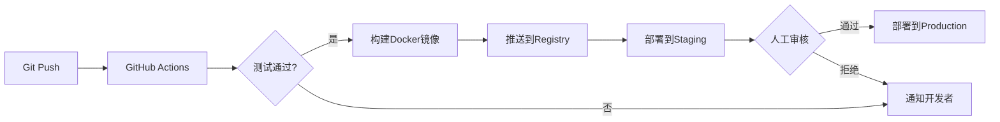
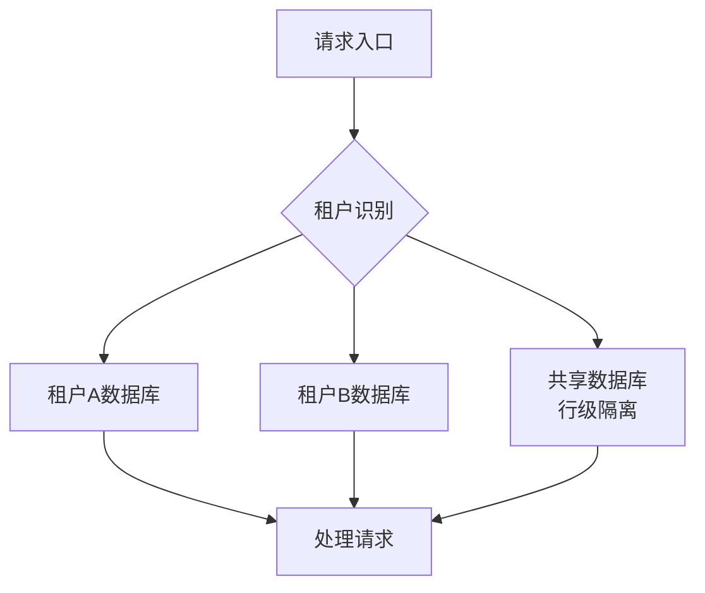

## 技术架构需求

### 系统架构图



## 前端需求

### 技术栈要求

| 类别 | 技术选型 | 版本要求 | 用途说明 |
|------|----------|----------|----------|
| 框架 | Next.js | 14.0+ | 全栈React框架 |
| 语言 | TypeScript | 5.0+ | 类型安全 |
| 样式 | Tailwind CSS | 3.4+ | 原子化CSS |
| 组件库 | Shadcn/ui | 最新 | UI组件 |
| 状态管理 | Zustand | 4.0+ | 轻量级状态管理 |
| 表单 | React Hook Form | 7.0+ | 表单处理 |
| 验证 | Zod | 3.0+ | Schema验证 |
| 请求 | Axios | 1.0+ | HTTP客户端 |
| 图表 | Recharts | 2.0+ | 数据可视化 |
| 音频 | WaveSurfer.js | 7.0+ | 音频波形 |

### 页面路由设计

```
/                       # 首页
/auth
  /login               # 登录
  /register            # 注册
  /forgot-password     # 忘记密码
/dashboard             # 用户仪表板
/transcripts
  /new                 # 新建转写
  /[id]               # 转写详情
  /[id]/edit          # 编辑转写
/settings
  /profile            # 个人资料
  /billing            # 账单管理
  /api-keys           # API密钥
/pricing              # 定价页面
/docs                 # 文档中心
```

### 核心组件规范

| 组件名称 | 功能描述 | 性能要求 |
|----------|----------|----------|
| AudioUploader | 音频上传/录音 | 支持拖拽、大文件分片 |
| TranscriptEditor | 转写文本编辑器 | 实时保存、协同编辑 |
| TaskExtractor | 任务提取器 | AI实时处理 |
| ExportModal | 导出模态框 | 多格式支持 |
| PricingCard | 定价卡片 | 动态价格显示 |
| LanguageSelector | 语言选择器 | 95+语言支持 |

## 后端需求

### API设计规范

#### RESTful端点设计

```yaml
# 认证相关
POST   /api/auth/register
POST   /api/auth/login
POST   /api/auth/refresh
POST   /api/auth/logout

# 转写相关
GET    /api/transcripts
POST   /api/transcripts
GET    /api/transcripts/{id}
PUT    /api/transcripts/{id}
DELETE /api/transcripts/{id}
POST   /api/transcripts/{id}/process
GET    /api/transcripts/{id}/tasks
POST   /api/transcripts/{id}/export

# 用户相关
GET    /api/users/profile
PUT    /api/users/profile
GET    /api/users/usage
GET    /api/users/subscription

# 支付相关
POST   /api/payments/create-intent
POST   /api/payments/confirm
POST   /api/payments/webhook
GET    /api/payments/history

# 文件相关
POST   /api/files/upload
GET    /api/files/{id}
DELETE /api/files/{id}
```

### 数据库设计

#### 核心数据表

```sql
-- 用户表
CREATE TABLE users (
    id UUID PRIMARY KEY DEFAULT gen_random_uuid(),
    email VARCHAR(255) UNIQUE NOT NULL,
    password_hash VARCHAR(255) NOT NULL,
    full_name VARCHAR(255),
    avatar_url VARCHAR(500),
    language VARCHAR(10) DEFAULT 'en',
    timezone VARCHAR(50) DEFAULT 'UTC',
    created_at TIMESTAMP DEFAULT CURRENT_TIMESTAMP,
    updated_at TIMESTAMP DEFAULT CURRENT_TIMESTAMP,
    last_login_at TIMESTAMP,
    is_active BOOLEAN DEFAULT true,
    email_verified BOOLEAN DEFAULT false
);

-- 订阅表
CREATE TABLE subscriptions (
    id UUID PRIMARY KEY DEFAULT gen_random_uuid(),
    user_id UUID REFERENCES users(id) ON DELETE CASCADE,
    plan_type VARCHAR(20) NOT NULL, -- free, starter, pro, team
    status VARCHAR(20) NOT NULL, -- active, cancelled, expired
    stripe_subscription_id VARCHAR(255),
    stripe_customer_id VARCHAR(255),
    current_period_start TIMESTAMP,
    current_period_end TIMESTAMP,
    cancel_at_period_end BOOLEAN DEFAULT false,
    created_at TIMESTAMP DEFAULT CURRENT_TIMESTAMP,
    updated_at TIMESTAMP DEFAULT CURRENT_TIMESTAMP
);

-- 转写记录表
CREATE TABLE transcripts (
    id UUID PRIMARY KEY DEFAULT gen_random_uuid(),
    user_id UUID REFERENCES users(id) ON DELETE CASCADE,
    title VARCHAR(500) NOT NULL,
    audio_file_url VARCHAR(1000),
    audio_duration_seconds INTEGER,
    language VARCHAR(10),
    raw_text TEXT,
    processed_data JSONB,
    status VARCHAR(20), -- pending, processing, completed, failed
    error_message TEXT,
    created_at TIMESTAMP DEFAULT CURRENT_TIMESTAMP,
    updated_at TIMESTAMP DEFAULT CURRENT_TIMESTAMP,
    processed_at TIMESTAMP
);

-- 任务表
CREATE TABLE tasks (
    id UUID PRIMARY KEY DEFAULT gen_random_uuid(),
    transcript_id UUID REFERENCES transcripts(id) ON DELETE CASCADE,
    description TEXT NOT NULL,
    assignee VARCHAR(255),
    due_date DATE,
    priority VARCHAR(10), -- low, medium, high
    status VARCHAR(20) DEFAULT 'pending',
    created_at TIMESTAMP DEFAULT CURRENT_TIMESTAMP,
    completed_at TIMESTAMP
);

-- 使用记录表
CREATE TABLE usage_logs (
    id UUID PRIMARY KEY DEFAULT gen_random_uuid(),
    user_id UUID REFERENCES users(id) ON DELETE CASCADE,
    action_type VARCHAR(50), -- transcribe, export, api_call
    resource_id UUID,
    credits_used INTEGER,
    metadata JSONB,
    created_at TIMESTAMP DEFAULT CURRENT_TIMESTAMP
);
```

### 性能要求

| 指标 | 要求 | 测量方法 |
|------|------|----------|
| API响应时间 | P95 < 200ms | New Relic APM |
| 并发用户数 | 支持1000+ | 负载测试 |
| 文件上传 | 100MB/文件 | 分片上传 |
| 转写处理 | <2分钟/10分钟音频 | 后台任务监控 |
| 数据库查询 | <50ms | 慢查询日志 |
| 缓存命中率 | >80% | Redis监控 |

## AI集成需求

### OpenAI API集成

```python
# AI服务配置
class AIConfig:
    WHISPER_MODEL = "whisper-1"
    GPT_MODEL = "gpt-4-turbo-preview"
    EMBEDDING_MODEL = "text-embedding-3-small"
    
    MAX_TOKENS = 4000
    TEMPERATURE = 0.7
    
    RATE_LIMITS = {
        "whisper": 50,  # requests per minute
        "gpt4": 100,    # requests per minute
        "embedding": 500 # requests per minute
    }
```

### 提示词模板

```yaml
meeting_summary:
  system: |
    You are an expert meeting analyst. Extract key information 
    from the transcript and format it clearly.
  
  user: |
    Analyze this meeting transcript and provide:
    1. Main topics discussed (3-5 bullet points)
    2. Key decisions made
    3. Action items with assignees
    4. Important dates/deadlines
    5. Follow-up questions
    
    Transcript: {transcript_text}

task_extraction:
  system: |
    You are a task extraction specialist. Identify actionable 
    items from conversations.
  
  user: |
    Extract all tasks from this transcript. For each task include:
    - Description (clear and concise)
    - Assignee (if mentioned)
    - Due date (if mentioned)
    - Priority (inferred from context)
    
    Format as JSON array.
    
    Transcript: {transcript_text}
```

## 安全需求

### 认证与授权

| 需求项 | 实现方式 | 备注 |
|--------|----------|------|
| 用户认证 | JWT Token | Access Token 15分钟过期 |
| 刷新机制 | Refresh Token | 7天过期，HttpOnly Cookie |
| 密码加密 | Argon2id | 内存成本19MB |
| 2FA支持 | TOTP | Google Authenticator兼容 |
| OAuth | Google, Microsoft | 第三方登录 |
| 权限控制 | RBAC | 角色基础访问控制 |

### 数据安全



### 合规要求

- [ ] GDPR合规（欧盟用户）
- [ ] CCPA合规（加州用户）
- [ ] SOC 2 Type I认证准备
- [ ] 数据驻留选项
- [ ] 用户数据导出功能
- [ ] 账户删除功能
- [ ] 隐私政策和服务条款

## 部署需求

### 基础设施配置

```yaml
# docker-compose.yml
version: '3.8'
services:
  web:
    build: ./frontend
    ports:
      - "3000:3000"
    environment:
      - NEXT_PUBLIC_API_URL=${API_URL}
  
  api:
    build: ./backend
    ports:
      - "5000:5000"
    depends_on:
      - postgres
      - redis
    environment:
      - DATABASE_URL=${DATABASE_URL}
      - REDIS_URL=${REDIS_URL}
      - OPENAI_API_KEY=${OPENAI_API_KEY}
  
  postgres:
    image: postgres:15
    volumes:
      - postgres_data:/var/lib/postgresql/data
    environment:
      - POSTGRES_PASSWORD=${DB_PASSWORD}
  
  redis:
    image: redis:7-alpine
    command: redis-server --appendonly yes
    volumes:
      - redis_data:/data

volumes:
  postgres_data:
  redis_data:
```

### CI/CD流程



## 监控需求

### 监控指标

| 类别 | 指标 | 告警阈值 | 监控工具 |
|------|------|----------|----------|
| 应用性能 | 响应时间 | >2秒 | New Relic |
| 应用性能 | 错误率 | >1% | Sentry |
| 基础设施 | CPU使用率 | >80% | CloudWatch |
| 基础设施 | 内存使用率 | >85% | CloudWatch |
| 数据库 | 连接数 | >80% | PostgreSQL监控 |
| 数据库 | 慢查询 | >1秒 | pg_stat_statements |
| 业务指标 | 转化率 | <15% | Mixpanel |
| 业务指标 | 日活跃用户 | <预期80% | Google Analytics |

### 日志管理

```json
{
  "timestamp": "2025-08-05T10:30:45.123Z",
  "level": "INFO",
  "service": "api",
  "trace_id": "abc123",
  "user_id": "user_456",
  "method": "POST",
  "path": "/api/transcripts",
  "status": 200,
  "duration_ms": 145,
  "message": "Transcript created successfully"
}
```

## 测试需求

### 测试覆盖率要求

| 测试类型 | 覆盖率目标 | 工具 |
|----------|-----------|------|
| 单元测试 | >80% | Jest, xUnit |
| 集成测试 | >60% | Supertest |
| E2E测试 | 核心流程100% | Playwright |
| 性能测试 | 全部API | K6 |
| 安全测试 | 季度执行 | OWASP ZAP |

### 测试用例示例

```typescript
// 单元测试示例
describe('TranscriptService', () => {
  it('should process audio file successfully', async () => {
    const audioFile = mockAudioFile();
    const result = await transcriptService.process(audioFile);
    
    expect(result.status).toBe('completed');
    expect(result.text).toBeDefined();
    expect(result.tasks).toHaveLength(3);
  });
  
  it('should handle API rate limits gracefully', async () => {
    // 模拟速率限制
    mockOpenAI.mockRejectedValue(new RateLimitError());
    
    const result = await transcriptService.process(mockAudioFile());
    
    expect(result.status).toBe('queued');
    expect(retryQueue).toContainTask(result.id);
  });
});
```

## 扩展性需求

### 水平扩展策略

1. **无状态设计**：所有服务无状态，支持随时扩容
2. **数据库读写分离**：主从复制，读请求分流
3. **缓存层**：Redis集群，减少数据库压力
4. **队列系统**：异步处理，削峰填谷
5. **CDN加速**：静态资源全球分发

### 多租户支持



## 第三方集成需求

### 必需集成

| 服务 | 用途 | 优先级 | 月成本(USD) |
|------|------|--------|-------------|
| OpenAI | AI处理 | P0 | 2000 |
| Stripe | 支付 | P0 | 2.9%+0.3 |
| SendGrid | 邮件 | P0 | 100 |
| AWS S3 | 存储 | P0 | 100 |
| Cloudflare | CDN | P1 | 20 |
| Sentry | 错误监控 | P1 | 50 |
| Mixpanel | 分析 | P2 | 25 |

### 可选集成

- Slack通知
- Zapier自动化
- Google Drive导出
- Notion同步
- Microsoft Teams
- Zoom录音导入