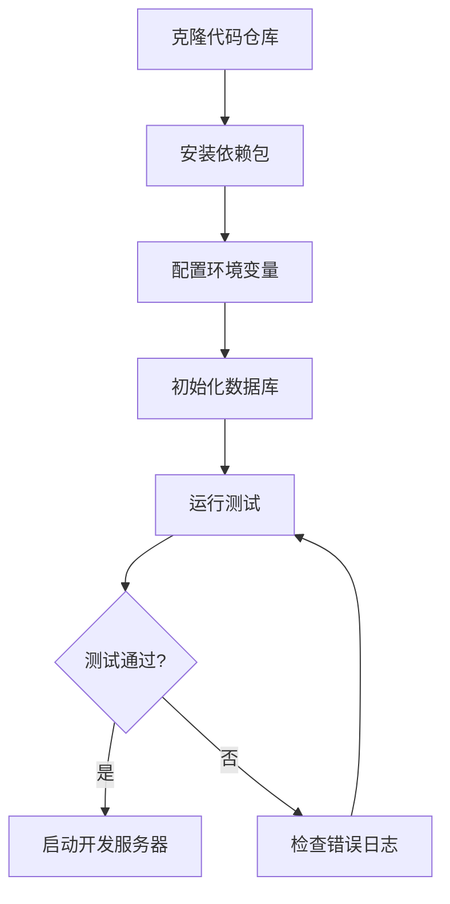
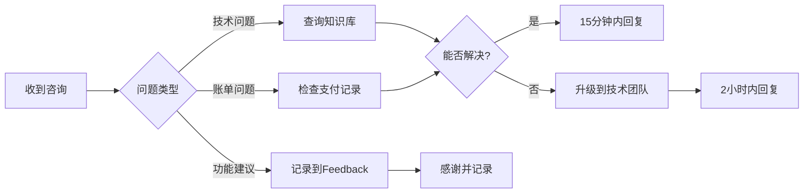
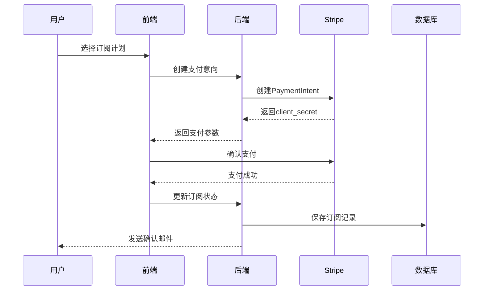
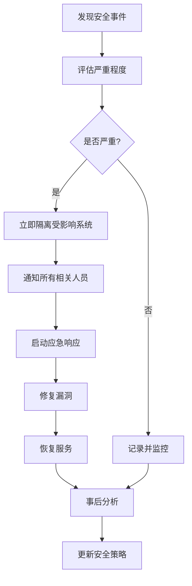
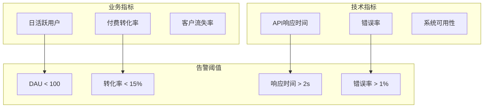
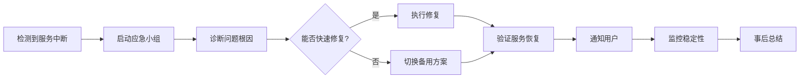

## 开发流程SOP

### 环境搭建流程

#### 前置条件检查清单
- [ ] Node.js 18+ 已安装
- [ ] .NET 8 SDK 已安装
- [ ] PostgreSQL 15+ 已安装
- [ ] Git 已配置
- [ ] VS Code / Visual Studio 已安装

#### 步骤详情

### 日常开发流程

| 步骤 | 操作 | 工具/命令 | 预计时间 |
|------|------|-----------|----------|
| 1 | 创建功能分支 | `git checkout -b feature/xxx` | 1分钟 |
| 2 | 编写代码 | VS Code | 2-4小时 |
| 3 | 本地测试 | `npm test` + `dotnet test` | 15分钟 |
| 4 | 代码审查 | GitHub PR | 30分钟 |
| 5 | 合并主分支 | `git merge` | 5分钟 |
| 6 | 部署测试环境 | Railway CLI | 10分钟 |

## 产品发布SOP

### 发布前检查清单

#### 技术检查
- [ ] 所有单元测试通过
- [ ] 集成测试完成
- [ ] 性能测试达标（<2s响应时间）
- [ ] 安全扫描无高危漏洞
- [ ] API文档更新
- [ ] 数据库迁移脚本准备

#### 产品检查
- [ ] 核心功能验收完成
- [ ] UI/UX审查通过
- [ ] 多语言文本校对
- [ ] 帮助文档就绪
- [ ] 定价计划配置

#### 营销准备
- [ ] Product Hunt素材准备
- [ ] 社交媒体文案
- [ ] 邮件模板配置
- [ ] 演示视频录制
- [ ] 新闻稿撰写

### 发布时间线

```mermaid
gantt
    title 产品发布时间线
    dateFormat HH:mm
    section 发布日
    最终检查           :00:00, 2h
    Product Hunt发布   :01:00, 30m
    监控系统           :01:00, 12h
    Reddit发帖         :09:00, 30m
    Twitter推广        :10:00, 30m
    回复评论           :02:00, 10h
    数据收集           :12:00, 12h
```

## 客户服务SOP

### 客户咨询响应流程

### 响应时间标准

| 问题级别 | 定义 | 响应时间 | 解决时间 |
|----------|------|----------|----------|
| P0-紧急 | 服务完全不可用 | 15分钟 | 2小时 |
| P1-高 | 核心功能故障 | 30分钟 | 4小时 |
| P2-中 | 非核心功能问题 | 2小时 | 24小时 |
| P3-低 | 体验优化建议 | 24小时 | 72小时 |

### 客户投诉处理

1. **接收投诉**
   - 记录详细信息
   - 分配工单号
   - 发送确认邮件

2. **调查分析**
   - 复现问题
   - 查找根因
   - 制定解决方案

3. **解决实施**
   - 执行解决方案
   - 测试验证
   - 通知客户

4. **跟进关怀**
   - 24小时后回访
   - 确认满意度
   - 提供补偿（如需要）

## 支付处理SOP

### 支付集成流程

### 退款处理流程

| 步骤 | 操作 | 负责人 | 时限 |
|------|------|--------|------|
| 1 | 接收退款申请 | 客服 | 立即 |
| 2 | 审核退款理由 | 客服主管 | 2小时 |
| 3 | 执行退款操作 | 财务 | 24小时 |
| 4 | 更新用户状态 | 系统自动 | 实时 |
| 5 | 发送确认邮件 | 系统自动 | 实时 |
| 6 | 记录退款原因 | 客服 | 当日 |

## 数据安全SOP

### 数据备份策略

| 备份类型 | 频率 | 保留期 | 存储位置 |
|----------|------|--------|----------|
| 数据库全量 | 每日 | 30天 | AWS S3 |
| 数据库增量 | 每小时 | 7天 | AWS S3 |
| 用户文件 | 实时 | 永久 | S3 + CDN |
| 配置文件 | 每次变更 | 90天 | Git |
| 日志文件 | 每日 | 90天 | CloudWatch |

### 安全事件响应

## 营销推广SOP

### Product Hunt发布流程

#### 发布前7天
- [ ] 准备产品Logo (240x240px)
- [ ] 撰写产品描述 (60字以内)
- [ ] 准备产品截图 (5张)
- [ ] 录制演示GIF
- [ ] 建立Hunter社区联系

#### 发布日（太平洋时间00:01）
1. **00:01** - 正式发布
2. **00:05** - 团队成员投票
3. **00:30** - 通知早期用户
4. **06:00** - Reddit/Twitter推广
5. **09:00** - 邮件推送
6. **12:00** - 社区互动
7. **18:00** - 数据分析
8. **23:00** - 总结反馈

### 内容营销流程

| 内容类型 | 发布频率 | 平台 | 目标 |
|----------|----------|------|------|
| 博客文章 | 2篇/周 | 官网+Medium | SEO流量 |
| 教程视频 | 1个/周 | YouTube | 用户教育 |
| 案例分享 | 2个/月 | 官网 | 信任建立 |
| 社交动态 | 1条/日 | Twitter | 品牌曝光 |
| 邮件通讯 | 2封/月 | Email | 用户留存 |

## 性能监控SOP

### 关键指标监控

### 日常监控清单

#### 每小时检查
- [ ] 服务器CPU/内存使用率
- [ ] API响应时间
- [ ] 错误日志
- [ ] 支付成功率

#### 每日检查
- [ ] 新增用户数
- [ ] 活跃用户数
- [ ] 收入数据
- [ ] 客户反馈

#### 每周检查
- [ ] 用户留存率
- [ ] 功能使用率
- [ ] 性能趋势
- [ ] 竞品动态

## 用户增长SOP

### A/B测试流程

1. **假设定义**
   - 明确测试目标
   - 定义成功指标
   - 计算样本量

2. **实验设计**
   - 创建变体版本
   - 配置流量分配
   - 设置实验时长

3. **执行监控**
   - 实时数据收集
   - 异常情况处理
   - 中期数据分析

4. **结果分析**
   - 统计显著性检验
   - 业务影响评估
   - 决策建议输出

### 用户引导优化

| 步骤 | 优化点 | 目标指标 | 当前值 | 目标值 |
|------|--------|----------|--------|--------|
| 注册 | 简化表单 | 完成率 | 60% | 80% |
| 激活 | 新手引导 | 激活率 | 40% | 60% |
| 首次使用 | 示例内容 | 完成率 | 50% | 70% |
| 付费转化 | 价值展示 | 转化率 | 15% | 23% |
| 留存 | 功能教育 | 7日留存 | 45% | 65% |

## 危机管理SOP

### 服务中断应急响应

### 公关危机处理

1. **评估阶段** (0-30分钟)
   - 收集事实信息
   - 评估影响范围
   - 组建应对小组

2. **响应阶段** (30-120分钟)
   - 制定应对策略
   - 准备官方声明
   - 选择沟通渠道

3. **执行阶段** (2-24小时)
   - 发布官方回应
   - 持续监控舆情
   - 及时更新进展

4. **恢复阶段** (24小时后)
   - 修复问题根源
   - 重建用户信任
   - 总结经验教训