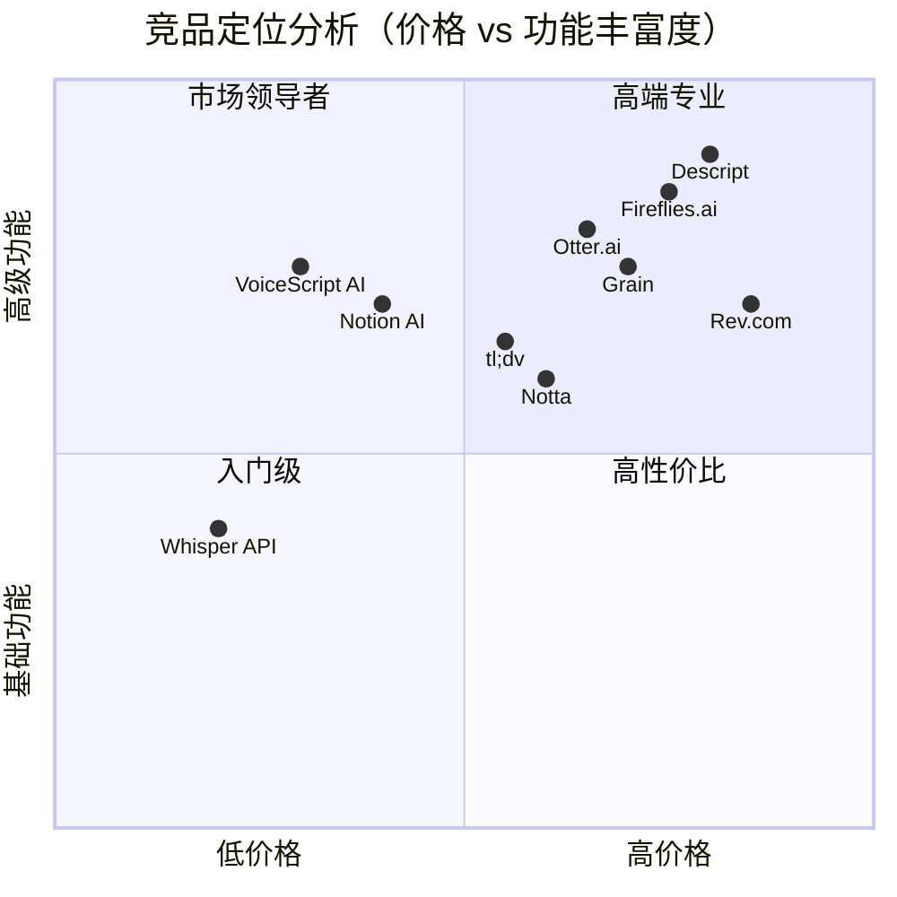
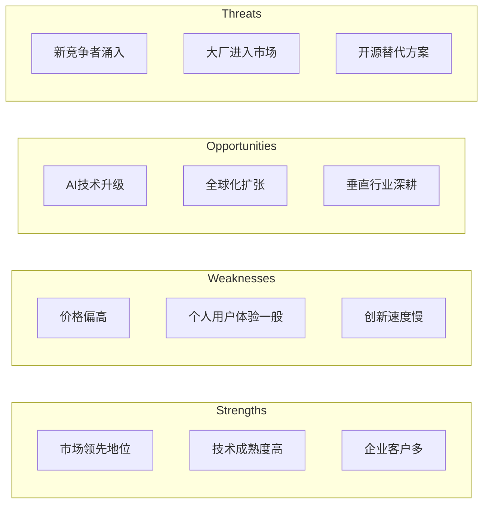
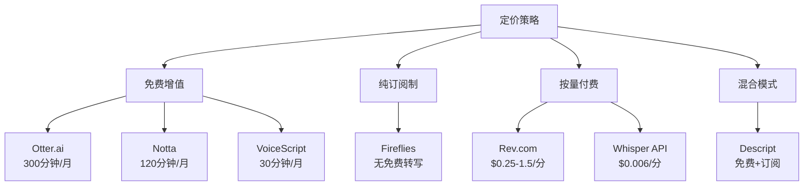
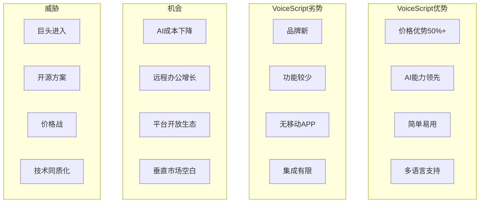
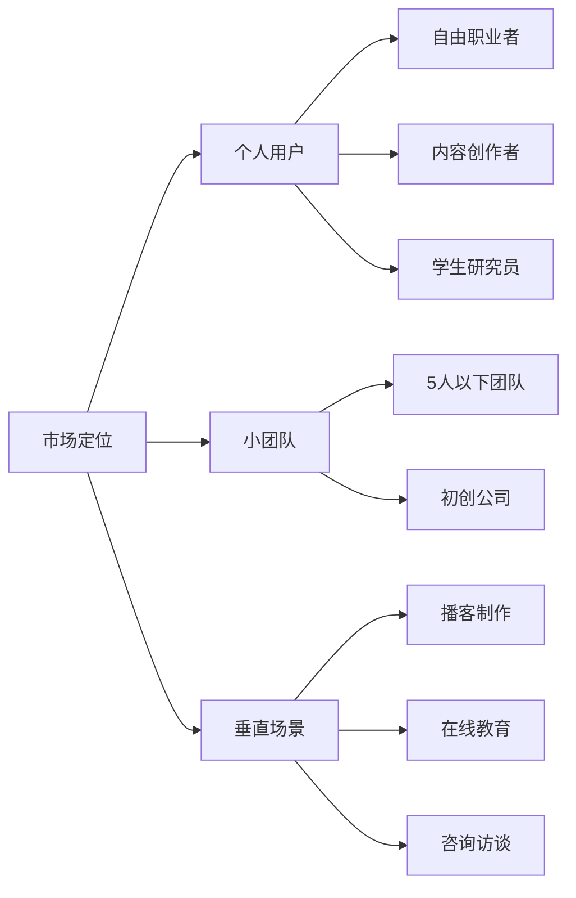
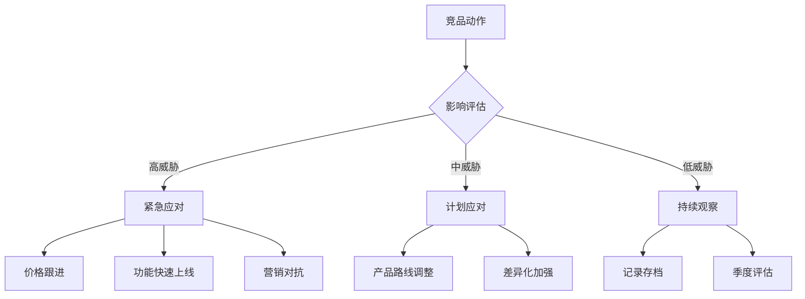

## 竞品总览

### 市场格局分布

## 独立SaaS竞品分析

### 1. Otter.ai

| 维度 | 详情 | 评分 |
|------|------|------|
| **公司背景** | 2016年成立，总部加州，融资6300万USD | - |
| **定价** | Free: 300分钟/月 Pro: $8.33/月 Business: $20/月 | 7/10 |
| **核心功能** | • 实时转写 • 自动会议记录 • 团队协作 • Zoom/Teams集成 | 9/10 |
| **目标用户** | 企业团队、教育机构 | - |
| **月活用户** | 约1000万 | - |
| **优势** | • 品牌知名度高 • 实时协作强 • 集成丰富 | - |
| **劣势** | • 价格偏高 • 中文支持差 • 免费版限制多 | - |
| **用户评价** | 4.4/5 (G2), 4.5/5 (Capterra) | - |

**SWOT分析：**

### 2. Fireflies.ai

| 维度 | 详情 | 评分 |
|------|------|------|
| **公司背景** | 2017年成立，融资1900万USD | - |
| **定价** | Free: 800分钟存储 Pro: $10/月 Business: $19/月 | 6/10 |
| **核心功能** | • 自动会议记录 • CRM集成 • 搜索和分析 • API访问 | 8/10 |
| **目标用户** | 销售团队、客户成功团队 | - |
| **月活用户** | 约500万 | - |
| **优势** | • CRM集成强大 • 搜索功能优秀 • API开放 | - |
| **劣势** | • 界面复杂 • 学习曲线陡 • 移动端体验差 | - |
| **用户评价** | 4.5/5 (G2), 4.6/5 (Product Hunt) | - |

### 3. Notta

| 维度 | 详情 | 评分 |
|------|------|------|
| **公司背景** | 2020年成立，日本公司，亚洲市场强 | - |
| **定价** | Free: 120分钟/月 Pro: $9/月 Business: $19/月 | 7/10 |
| **核心功能** | • 104种语言支持 • 实时翻译 • 时间戳标记 • 导出多格式 | 7/10 |
| **目标用户** | 跨国团队、内容创作者 | - |
| **月活用户** | 约200万 | - |
| **优势** | • 多语言支持好 • 亚洲市场强 • 价格合理 | - |
| **劣势** | • AI功能弱 • 品牌知名度低 • 功能创新少 | - |
| **用户评价** | 4.3/5 (G2), 4.4/5 (AppStore) | - |

### 4. Rev.com

| 维度 | 详情 | 评分 |
|------|------|------|
| **公司背景** | 2010年成立，人工+AI混合模式 | - |
| **定价** | 人工转写: $1.5/分钟 AI转写: $0.25/分钟 | 4/10 |
| **核心功能** | • 99%准确率 • 人工校对 • 字幕制作 • 翻译服务 | 9/10 |
| **目标用户** | 媒体公司、法律机构 | - |
| **优势** | • 准确率最高 • 专业领域强 • 质量保证 | - |
| **劣势** | • 价格昂贵 • 处理速度慢 • 无实时功能 | - |

### 5. Descript

| 维度 | 详情 | 评分 |
|------|------|------|
| **公司背景** | 2017年成立，融资1亿USD，创新型产品 | - |
| **定价** | Free: 1小时/月 Creator: $12/月 Pro: $24/月 | 5/10 |
| **核心功能** | • 音视频编辑 • 文字编辑音频 • 播客制作 • 屏幕录制 | 10/10 |
| **目标用户** | 播客制作者、视频创作者 | - |
| **优势** | • 功能创新 • 编辑能力强 • 一站式解决方案 | - |
| **劣势** | • 学习成本高 • 价格偏高 • 资源占用大 | - |

## 平台插件竞品分析

### 1. Notion AI（功能优化版对标）

| 维度 | 详情 | 对比VoiceScript |
|------|------|---------------|
| **平台** | Notion内置AI功能 | Notion插件 |
| **定价** | $10/月（附加费） | $5.9/月 |
| **功能** | • AI写作 • 总结提炼 • 翻译 | • 语音转写 • 会议纪要 • 任务提取 |
| **集成度** | 原生集成 | API集成 |
| **用户体验** | 无缝体验 | 需要授权 |
| **优势** | 官方支持、功能全面 | 专注语音、价格低 |
| **劣势** | 无语音功能、价格高 | 非原生、功能单一 |

### 2. Microsoft Word Dictate

| 维度 | 详情 | 对比VoiceScript |
|------|------|---------------|
| **平台** | Word内置功能 | Word插件 |
| **定价** | Microsoft 365订阅内 | $7.9/月 |
| **功能** | • 语音输入 • 基础命令 | • 智能转写 • AI处理 • 格式化 |
| **支持语言** | 20+ | 95+ |
| **AI能力** | 基础 | 高级（GPT-4） |
| **优势** | 免费（订阅内）、稳定 | AI能力强、多语言 |
| **劣势** | 功能简单、无AI处理 | 需额外付费 |

### 3. Slack音频消息功能

| 维度 | 详情 | 对比VoiceScript |
|------|------|---------------|
| **平台** | Slack原生功能 | Slack Bot |
| **定价** | 免费 | $2.9/座席/月 |
| **功能** | • 音频消息 • 自动转写 | • 会议记录 • 任务分配 • 团队分析 |
| **准确率** | 85% | 95%+ |
| **处理能力** | 基础转写 | 智能分析 |
| **优势** | 免费、即时 | 功能丰富、团队协作 |
| **劣势** | 功能有限、准确率低 | 需付费、设置复杂 |

## 竞争策略对比

### 定价策略比较

### 获客渠道对比

| 渠道 | Otter.ai | Fireflies | Notta | VoiceScript AI |
|------|----------|-----------|-------|----------------|
| SEO | ⭐⭐⭐⭐⭐ | ⭐⭐⭐⭐ | ⭐⭐⭐ | ⭐⭐ |
| 付费广告 | ⭐⭐⭐⭐ | ⭐⭐⭐ | ⭐⭐ | ⭐ |
| 内容营销 | ⭐⭐⭐⭐ | ⭐⭐⭐⭐ | ⭐⭐ | ⭐⭐⭐ |
| 社交媒体 | ⭐⭐⭐ | ⭐⭐⭐ | ⭐⭐ | ⭐⭐⭐⭐ |
| 产品集成 | ⭐⭐⭐⭐⭐ | ⭐⭐⭐⭐⭐ | ⭐⭐ | ⭐⭐⭐ |
| 口碑推荐 | ⭐⭐⭐⭐ | ⭐⭐⭐ | ⭐⭐ | ⭐⭐⭐⭐⭐ |

## SWOT综合分析

### VoiceScript AI vs 主要竞品

## 差异化竞争策略

### 1. 产品差异化

| 策略 | 具体措施 | 预期效果 |
|------|----------|----------|
| **价格破坏** | $3.99/月，同类最低 | 快速获客 |
| **AI优势** | GPT-4能力，智能度最高 | 用户粘性 |
| **极简体验** | 3步完成，0学习成本 | 降低门槛 |
| **插件生态** | 主流平台全覆盖 | 场景渗透 |

### 2. 市场定位差异

### 3. 增长策略差异

**VoiceScript独特增长策略：**

1. **病毒式功能**
   - 生成结果带品牌水印
   - 分享获额度奖励
   - 邀请好友双向奖励

2. **平台借力**
   - Notion模板市场
   - Chrome商店推广
   - Product Hunt月度发布

3. **内容飞轮**
   - 每周2篇SEO文章
   - YouTube教程视频
   - 用户案例分享

## 竞品监控计划

### 监控维度

| 监控项 | 频率 | 工具 | 负责人 |
|--------|------|------|--------|
| 价格变动 | 每周 | 手动检查 | 产品经理 |
| 功能更新 | 每月 | 产品更新日志 | 产品经理 |
| 用户评价 | 每周 | G2/Capterra | 客户成功 |
| 流量数据 | 每月 | SimilarWeb | 市场营销 |
| 融资动态 | 实时 | Crunchbase | CEO |
| 技术趋势 | 每季度 | GitHub/论文 | CTO |

### 应对预案

## 合作机会分析

### 潜在合作伙伴

| 类型 | 公司 | 合作方式 | 优先级 |
|------|------|----------|--------|
| 互补产品 | Calendly | 会议安排+记录 | 高 |
| 平台方 | Notion | 官方集成认证 | 高 |
| 同类产品 | tl;dv | 技术合作 | 中 |
| 渠道商 | AppSumo | 限时优惠推广 | 高 |
| 技术提供方 | AssemblyAI | API备选方案 | 中 |

## 长期竞争展望

### 3年市场预测

1. **市场整合期**（2025-2026）
   - 中小玩家被收购或退出
   - 头部3-5家占据80%市场
   - 价格战趋于理性

2. **技术同质化**（2026-2027）
   - AI能力差距缩小
   - 功能趋同
   - 体验和生态成为关键

3. **垂直深耕期**（2027-2028）
   - 通用产品增长放缓
   - 垂直行业解决方案兴起
   - 平台化vs专业化分化

### VoiceScript应对策略

**短期（0-6月）：**
- 快速获取10,000付费用户
- 建立品牌认知
- 完善核心功能

**中期（6-18月）：**
- 深耕1-2个垂直场景
- 开放API生态
- 国际化扩张

**长期（18-36月）：**
- 寻求战略投资或收购
- 平台化转型
- AI能力输出