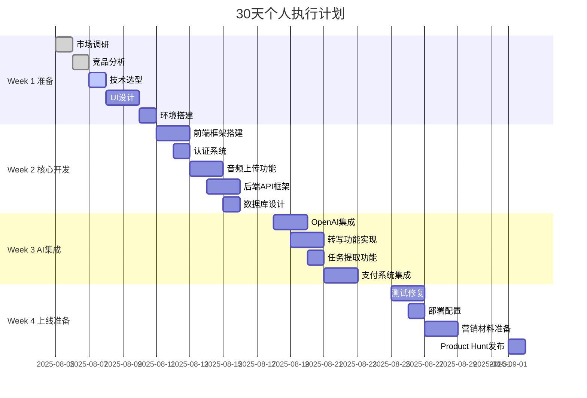
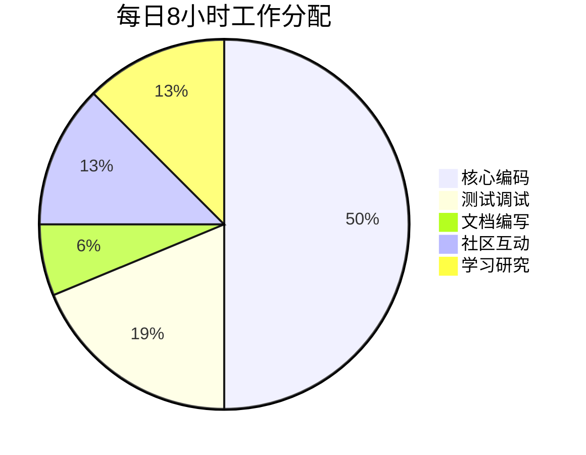

## 30天执行总览



## Week 1: 准备阶段（2025-08-05 ~ 2025-08-11）

### Day 1-2: 市场调研与竞品分析 ✅

#### 上午任务（4小时）
- [x] 分析Product Hunt近3个月语音转写类产品
- [x] 研究Reddit r/productivity用户痛点帖子
- [x] 整理Hacker News相关讨论
- [x] 记录用户高频需求Top 10

#### 下午任务（4小时）
- [x] 试用Otter.ai免费版，记录优缺点
- [x] 试用Fireflies.ai，分析定价策略
- [x] 研究Notta的用户评价
- [x] 制作竞品对比表格

### Day 3: 技术选型与架构设计

#### 上午任务（4小时）
- [ ] 搭建Next.js 14项目模板
- [ ] 配置TypeScript和ESLint
- [ ] 安装Tailwind CSS和Shadcn/ui
- [ ] 创建基础页面路由

#### 下午任务（4小时）
- [ ] 搭建.NET 8 API项目
- [ ] 配置PostgreSQL数据库
- [ ] 设置Redis缓存
- [ ] 编写API基础中间件

### Day 4-5: UI/UX设计

#### 设计任务清单
- [ ] Logo设计（使用Canva）
- [ ] 配色方案（参考Tailwind调色板）
- [ ] 首页线框图
- [ ] 仪表板界面设计
- [ ] 转写详情页设计
- [ ] 定价页面设计
- [ ] 响应式适配方案

#### 设计工具
- Figma（免费版）
- Canva Pro（月费12.99 USD）
- TailwindUI组件库参考

### Day 6: 开发环境搭建

#### 环境配置清单
```bash
# 前端环境
□ Node.js 18+ 安装
□ pnpm包管理器
□ VS Code插件配置
□ Chrome DevTools设置

# 后端环境
□ .NET 8 SDK安装
□ PostgreSQL 15本地安装
□ Redis本地安装
□ Postman API测试

# 云服务账号
□ Railway账号注册
□ Cloudflare账号
□ AWS S3配置
□ OpenAI API密钥申请
```

## Week 2: 核心功能开发（2025-08-12 ~ 2025-08-18）

### Day 7-8: 前端基础功能

#### 必做任务（优先级P0）
| 时间 | 任务 | 完成标准 |
|------|------|----------|
| 2h | 创建认证页面UI | 登录/注册/忘记密码 |
| 3h | 实现JWT认证逻辑 | Token存储和刷新 |
| 2h | 构建仪表板布局 | 侧边栏+主内容区 |
| 3h | 音频上传组件 | 拖拽上传+进度条 |
| 2h | 转写列表页面 | 分页+搜索+筛选 |
| 2h | 响应式适配 | 移动端完美显示 |

### Day 9-10: 后端核心API

#### API开发清单
```csharp
// 需要实现的核心API端点
□ POST /api/auth/register
□ POST /api/auth/login  
□ GET  /api/auth/refresh
□ POST /api/transcripts
□ GET  /api/transcripts
□ GET  /api/transcripts/{id}
□ POST /api/files/upload
□ GET  /api/users/profile
□ PUT  /api/users/profile
```

#### 数据库迁移脚本
```sql
-- Day 9上午完成
□ 创建users表
□ 创建subscriptions表
□ 创建transcripts表
□ 创建tasks表
□ 创建索引优化查询
```

### Day 11: 文件上传系统

#### 实现步骤
1. **前端分片上传**（2小时）
   - [ ] 实现文件分片逻辑
   - [ ] 断点续传支持
   - [ ] 上传进度显示

2. **后端接收处理**（2小时）
   - [ ] 分片接收API
   - [ ] 文件合并逻辑
   - [ ] S3上传集成

3. **音频格式验证**（1小时）
   - [ ] 支持MP3/WAV/M4A
   - [ ] 文件大小限制
   - [ ] 音频时长检测

## Week 3: AI集成与高级功能（2025-08-19 ~ 2025-08-25）

### Day 12-13: OpenAI集成

#### 集成任务清单

| 任务 | 预计时间 | 依赖 | 状态 |
|------|----------|------|------|
| Whisper API调用封装 | 2h | OpenAI密钥 | ⏳ |
| 音频转文字实现 | 3h | Whisper API | ⏳ |
| GPT-4调用封装 | 2h | OpenAI密钥 | ⏳ |
| 智能总结功能 | 3h | GPT-4 API | ⏳ |
| 任务提取功能 | 2h | GPT-4 API | ⏳ |
| 错误处理和重试 | 2h | - | ⏳ |
| API限流控制 | 1h | Redis | ⏳ |

#### 提示词优化
```python
# 需要测试和优化的提示词
prompts = {
    "meeting_summary": "测试10个不同会议场景",
    "task_extraction": "测试5种任务格式",
    "key_points": "测试不同长度文本",
    "email_draft": "测试3种邮件风格"
}
```

### Day 14-15: 支付系统集成

#### Stripe集成步骤

1. **账号设置**（1小时）
   - [ ] Stripe账号注册
   - [ ] 获取API密钥
   - [ ] 配置Webhook端点
   - [ ] 设置产品和价格

2. **前端集成**（3小时）
   - [ ] 安装Stripe.js
   - [ ] 创建支付表单
   - [ ] 实现3D验证
   - [ ] 支付成功页面

3. **后端处理**（4小时）
   - [ ] 创建支付意向API
   - [ ] Webhook事件处理
   - [ ] 订阅状态同步
   - [ ] 发票生成逻辑

### Day 16-17: 功能完善

#### 必须完成的功能
- [ ] 导出功能（Markdown/PDF/Word）
- [ ] 多语言支持（至少中英文）
- [ ] 邮件通知系统
- [ ] 用户设置页面
- [ ] 使用量统计展示

#### 可选功能（时间充裕再做）
- [ ] 团队协作功能
- [ ] API文档生成
- [ ] Chrome扩展
- [ ] 移动端PWA

## Week 4: 测试与发布（2025-08-26 ~ 2025-09-01）

### Day 18-19: 测试与修复

#### 测试清单

**功能测试**
- [ ] 注册流程完整测试
- [ ] 音频上传各种格式
- [ ] 转写准确性验证
- [ ] 支付流程测试
- [ ] 导出功能测试

**性能测试**
- [ ] 页面加载速度 < 2秒
- [ ] API响应时间 < 200ms
- [ ] 并发用户测试（100+）
- [ ] 大文件上传测试

**兼容性测试**
- [ ] Chrome/Firefox/Safari
- [ ] 移动端响应式
- [ ] 不同网络环境

### Day 20: 部署上线

#### 部署步骤
```bash
# 上午：部署准备
□ 购买域名 (voicescript.ai)
□ 配置DNS和SSL证书
□ 设置环境变量
□ 数据库迁移到云端

# 下午：正式部署
□ 前端部署到Cloudflare Pages
□ 后端部署到Railway
□ 配置监控告警
□ 性能优化（CDN、压缩等）
```

### Day 21-22: 营销准备

#### Product Hunt发布准备

**素材制作**（Day 21）
- [ ] 产品Logo（240x240px）
- [ ] 产品截图5张（Gallery）
- [ ] 60秒演示GIF
- [ ] 产品描述文案（60字）
- [ ] 详细介绍（500字）

**社区预热**（Day 22）
- [ ] 联系10个Hunter好友
- [ ] Reddit软文3篇
- [ ] Twitter预告推文
- [ ] 个人博客发布
- [ ] 邮件列表通知

### Day 23-25: 发布与推广

#### 发布日时间表（太平洋时间）

| 时间 | 任务 | 平台 | 备注 |
|------|------|------|------|
| 00:01 | 正式发布 | Product Hunt | 设置闹钟 |
| 00:05 | 团队投票 | Product Hunt | 5个账号 |
| 00:30 | 发帖 | Reddit | 3个相关sub |
| 06:00 | 推文 | Twitter | 带标签 |
| 09:00 | 发帖 | Hacker News | Show HN |
| 12:00 | 邮件 | Newsletter | 早期用户 |
| 全天 | 回复评论 | 所有平台 | 及时响应 |

## 日常执行规范

### 每日时间分配



### 每日必做清单

#### 早晨（30分钟）
- [ ] 检查昨日进度
- [ ] 更新今日计划
- [ ] 查看错误日志
- [ ] 回复用户反馈

#### 编码时段（6小时）
- [ ] 专注核心功能开发
- [ ] 及时提交代码
- [ ] 编写必要注释
- [ ] 单元测试覆盖

#### 晚间（1.5小时）
- [ ] 代码审查
- [ ] 更新进度文档
- [ ] 准备明日任务
- [ ] 学习相关技术

### 工具与资源清单

#### 开发工具
- **IDE**: VS Code + 插件包
- **API测试**: Postman/Insomnia
- **数据库管理**: TablePlus
- **版本控制**: Git + GitHub

#### 学习资源
- **Next.js文档**: nextjs.org/docs
- **OpenAI文档**: platform.openai.com
- **Stripe文档**: stripe.com/docs
- **Stack Overflow**: 遇到问题首选

#### 效率工具
- **任务管理**: Notion/Linear
- **时间追踪**: Toggl
- **番茄钟**: Pomodoro
- **笔记**: Obsidian

## 风险应对预案

### 技术风险应对

| 风险 | 概率 | 应对方案 | 备选方案 |
|------|------|----------|----------|
| OpenAI API限流 | 高 | 实现队列系统 | 使用Azure OpenAI |
| 数据库性能问题 | 中 | 添加索引优化 | 升级数据库规格 |
| 支付集成失败 | 低 | 详细日志调试 | 切换到Paddle |
| 部署失败 | 中 | 本地测试充分 | 使用Vercel备选 |

### 时间风险应对

**如果进度延迟：**
1. 砍掉非核心功能
2. 使用现成UI组件
3. 简化AI处理逻辑
4. 推迟多语言支持
5. 外包部分工作

**最小可行产品（MVP）功能：**
- ✅ 用户注册登录
- ✅ 音频上传转写
- ✅ AI智能总结
- ✅ 基础导出功能
- ✅ 订阅支付
- ❌ 团队协作（可后续添加）
- ❌ API开放（可后续添加）
- ❌ 移动APP（可后续添加）

## 发布后维护计划

### 第一周重点
1. **监控与修复**
   - 24/7监控服务状态
   - 快速修复严重bug
   - 收集用户反馈

2. **用户支持**
   - 及时回复邮件
   - 更新FAQ文档
   - 创建视频教程

3. **迭代优化**
   - 分析用户行为
   - A/B测试优化
   - 性能调优

### 月度计划
- **Month 1**: 稳定性优化，修复bug
- **Month 2**: 添加用户需求功能
- **Month 3**: 开放API，扩展集成
- **Month 6**: 移动端APP发布

## 个人提醒事项

### 健康管理
- 每2小时休息10分钟
- 保持规律作息
- 适量运动
- 注意饮食

### 心态调整
- 接受不完美
- 快速迭代
- 用户反馈优先
- 保持学习

### 财务控制
- 严格控制预算
- 优先免费方案
- 记录所有支出
- 预留应急资金

### 关键决策原则
1. **用户价值优先**：每个功能都要解决实际问题
2. **简单可用**：宁可简单也不要复杂
3. **快速迭代**：先上线再优化
4. **数据驱动**：用数据说话，不靠猜测