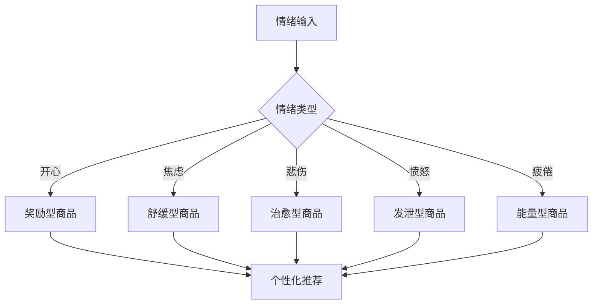
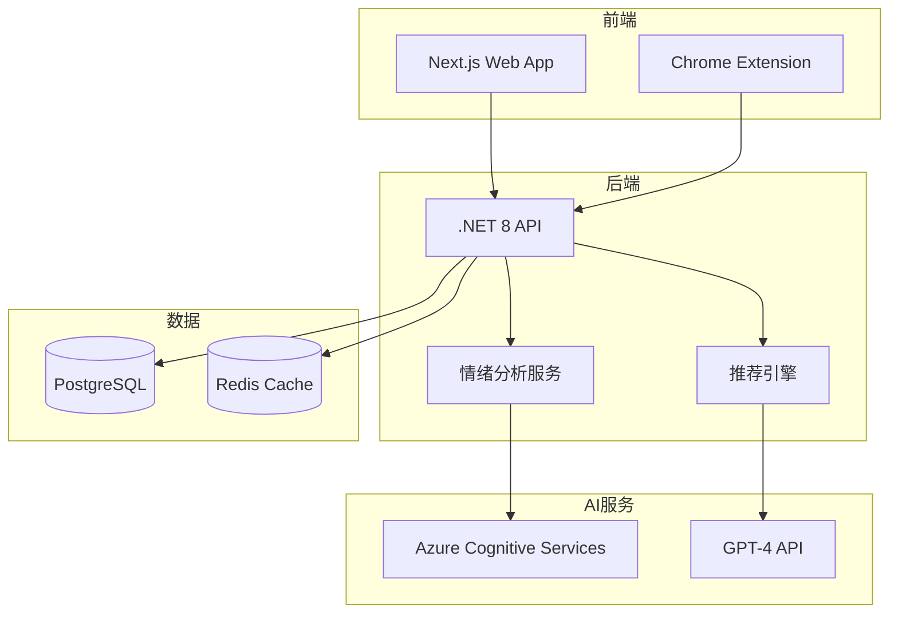
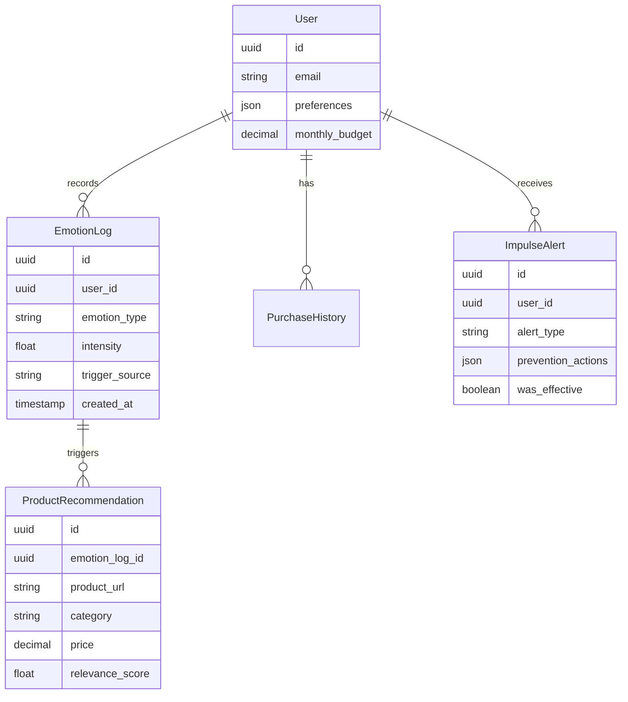

## 产品概述

### 产品定位
MoodShopper AI 是一款基于情绪识别的智能购物助手，通过分析用户当前情绪状态，提供个性化商品推荐并预防冲动消费，帮助用户做出更理性的购物决策。

### 目标用户

| 用户群体 | 占比 | 核心痛点 | 付费意愿 |
|---------|------|---------|----------|
| Z世代消费者 | 40% | 情绪化消费严重 | 高 |
| 职场白领 | 30% | 压力消费频繁 | 中高 |
| 家庭主妇 | 20% | 购物决策困难 | 中 |
| 学生群体 | 10% | 预算控制困难 | 中 |

## 核心功能

### MVP版本功能（30天完成）

#### 1. 情绪识别系统
- **语音情绪分析**：通过语音语调识别7种基础情绪
- **表情识别**：摄像头捕捉面部表情（可选）
- **文字情绪分析**：分析用户输入文字的情绪倾向
- **情绪历史追踪**：记录情绪变化曲线

#### 2. 智能推荐引擎


#### 3. 冲动消费预警
- **消费预警算法**：基于情绪波动预测冲动消费概率
- **冷静期设置**：强制等待24-48小时
- **替代方案推荐**：运动、冥想、社交等健康替代
- **预算提醒**：实时显示月度预算剩余

### 功能优先级矩阵

| 功能 | 用户价值 | 开发难度 | 优先级 |
|------|---------|----------|--------|
| 情绪识别 | 极高 | 中 | P0 |
| 商品推荐 | 高 | 低 | P0 |
| 冲动预警 | 极高 | 低 | P0 |
| 数据分析 | 中 | 中 | P1 |
| 社交分享 | 低 | 低 | P2 |

## 功能优化版 - Shopify App

### EmotionCart AI 插件功能

#### 核心能力
- **情绪热力图**：实时显示店铺访客情绪分布
- **动态商品排序**：根据访客情绪调整商品展示顺序
- **情绪化定价**：基于情绪状态的动态折扣
- **转化率预测**：预测不同情绪状态下的购买概率

#### 接入方式
```yaml
平台: Shopify App Store
API: Shopify GraphQL Admin API
审核: 1-3天
分成: 0%（前100万USD年收入）
定价: $9.9/月/店铺
目标: Shopify Plus商家
预期转化率: 35%
```

## 技术架构

### 系统架构


## 数据模型

### 核心实体关系


## 商业模式

### 定价策略

| 计划 | 月费(USD) | 功能 | 目标用户 |
|------|-----------|------|----------|
| Free | 0 | 5次/天情绪分析 | 试用用户 |
| Personal | 2.99 | 无限分析+基础推荐 | 个人用户 |
| Premium | 5.99 | 全功能+数据分析 | 重度用户 |
| Family | 9.99 | 5个账户 | 家庭用户 |

## 成功指标

| 指标 | 目标值 | 测量方法 |
|------|--------|----------|
| 冲动消费减少率 | >30% | 用户自报告+数据分析 |
| 用户满意度 | NPS>60 | 月度调研 |
| 日活跃率 | >45% | DAU/MAU |
| 付费转化率 | >19% | 付费用户/总用户 |
| 用户留存 | 3月>50% | Cohort分析 |