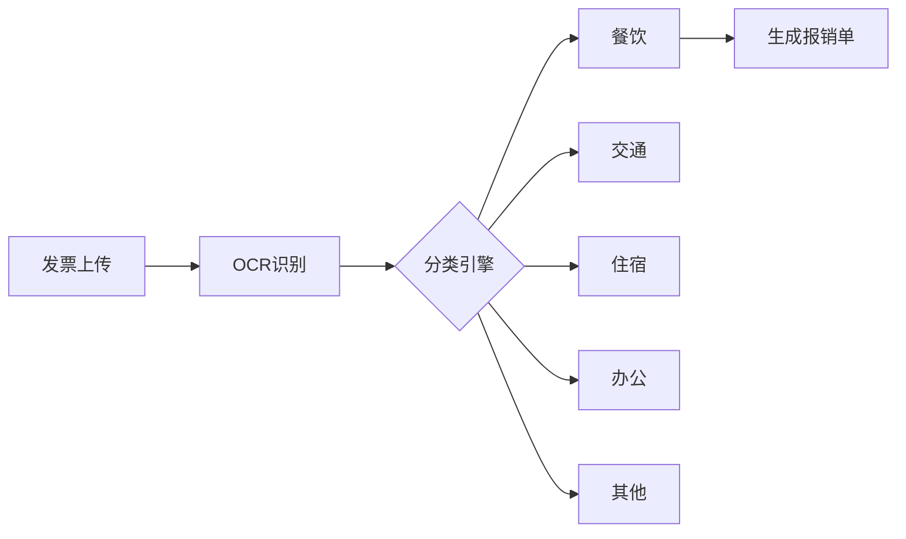
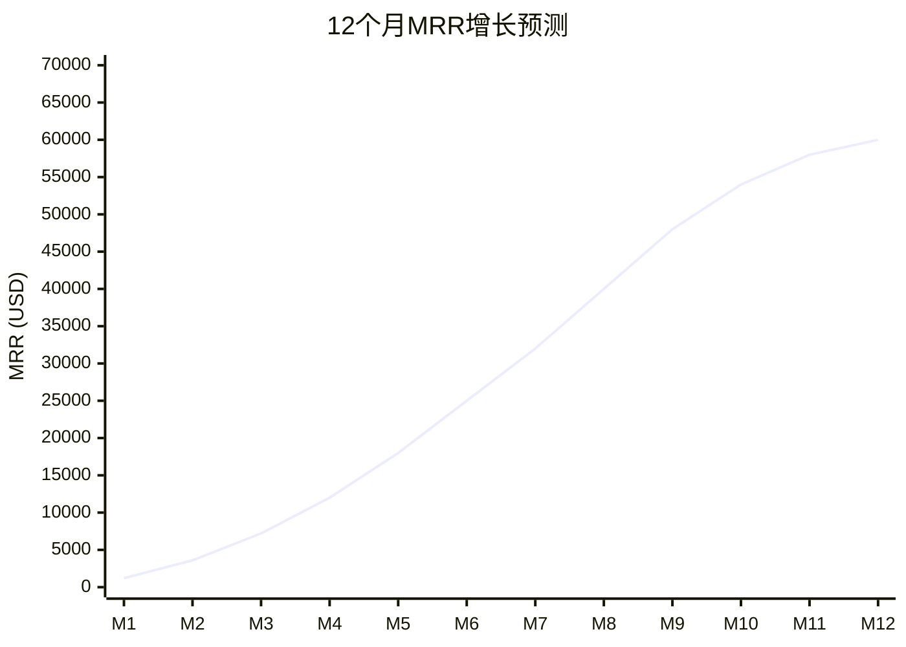
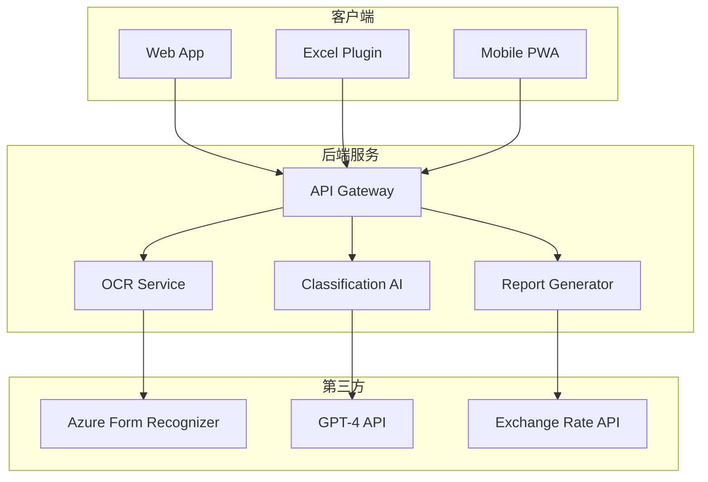
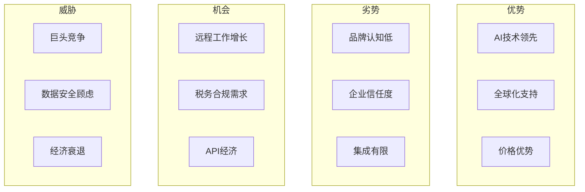

# PRD.md - 产品需求文档

## 产品概述

### 产品定位
ReceiptLens AI 是一款智能发票报销助手，通过OCR和AI技术自动识别全球200+国家发票格式，生成符合税务要求的报销报告，为自由职业者和企业财务人员节省80%的报销处理时间。

### 目标用户
| 用户群体 | 占比 | 核心痛点 | 付费意愿 |
|---------|------|---------|----------|
| 自由职业者 | 35% | 报销流程复杂 | 极高 |
| 小企业财务 | 30% | 手工录入耗时 | 高 |
| 销售人员 | 20% | 差旅报销频繁 | 高 |
| 咨询顾问 | 15% | 多币种处理难 | 极高 |

## 核心功能

### MVP版本（30天完成）

#### 1. 智能OCR识别
- **多格式支持**: 发票、收据、小票、电子发票
- **多语言识别**: 200+国家语言和格式
- **准确率**: >98%（基于Azure Form Recognizer）
- **批量处理**: 一次上传50张

#### 2. 自动分类系统


#### 3. 税务合规
- **多国税法支持**: 美国、欧盟、中国、日本等
- **自动税额计算**: 增值税、消费税自动分离
- **合规性检查**: 发票真伪验证
- **审计追踪**: 完整操作日志

### 功能优化版 - Excel插件

#### ExpenseFlow AI 功能
```yaml
平台: Microsoft Excel Add-in
定价: $7.9/月
目标: 企业财务部门
转化率目标: 42%
核心功能:
  - 批量发票图片导入
  - 自动填充报销表格
  - 多币种汇率转换
  - 一键生成报销报告
  - 与企业ERP系统集成
```

---

# BP.md - 商业计划书

## 执行摘要
ReceiptLens AI 瞄准全球3000万自由职业者和500万中小企业财务人员，通过AI技术革新传统报销流程，预计12个月实现MRR 60,000 USD。

## 市场分析
- **市场规模**: 全球费用管理软件市场80亿USD
- **增长率**: 年复合增长15%
- **痛点验证**: 85%财务人员每月花费20+小时处理报销

## 收入模型
| 计划 | 月费(USD) | 功能 | 用户占比 |
|------|-----------|------|----------|
| Free | 0 | 10张/月 | 60% |
| Starter | 4.99 | 100张/月 | 25% |
| Pro | 9.99 | 无限+API | 12% |
| Enterprise | 29.99 | 团队+定制 | 3% |

## 财务预测


---

# SOP.md - 标准操作流程

## 产品开发SOP

### Week 1: 技术调研与设计
```bash
Day 1-2: OCR技术选型
□ Azure Form Recognizer测试
□ Google Vision API对比
□ Tesseract开源方案评估

Day 3-4: 数据库设计
□ 发票数据模型
□ 多币种支持
□ 审计日志结构

Day 5-7: UI/UX设计
□ 拖拽上传界面
□ 批量处理流程
□ 报表导出设计
```

### Week 2-3: 核心开发
- OCR集成实现
- 分类算法开发
- Excel插件开发
- 报表生成系统

### Week 4: 测试与发布
- 多国发票测试
- 性能压力测试
- 安全审计
- 产品发布

## 客户支持SOP
1. **发票识别失败**: 人工介入，24小时内处理
2. **税务问题咨询**: 提供专业税务顾问联系
3. **数据安全询问**: 详细说明加密和合规措施

---

# Requirements.md - 技术需求

## 技术架构


## 核心技术要求
| 模块 | 技术 | 性能指标 |
|------|------|----------|
| OCR | Azure Form Recognizer | 准确率>98% |
| 分类 | GPT-4 + 自训练模型 | F1 Score>0.95 |
| 存储 | PostgreSQL + S3 | 99.9%可用性 |
| 安全 | AES-256加密 | SOC2合规 |

## API设计
```yaml
POST /api/receipts/upload
POST /api/receipts/batch
GET  /api/receipts/{id}
POST /api/receipts/classify
POST /api/reports/generate
GET  /api/reports/{id}/export
POST /api/excel/sync
```

---

# 个人详细执行清单.md

## 30天冲刺计划

### 第1周：基础搭建
| 日期 | 任务 | 时长 |
|------|------|------|
| Day 1-2 | Azure账号+OCR测试 | 16h |
| Day 3 | 数据模型设计 | 8h |
| Day 4-5 | UI原型设计 | 16h |
| Day 6-7 | 前端框架搭建 | 16h |

### 第2周：核心功能
**重点任务**：
- [ ] OCR服务集成（2天）
- [ ] 图片上传组件（1天）
- [ ] 分类算法实现（2天）
- [ ] 数据库CRUD（2天）

### 第3周：高级功能
**必做清单**：
- [ ] 批量处理优化
- [ ] Excel插件开发
- [ ] 报表生成器
- [ ] 多币种支持
- [ ] 支付集成

### 第4周：上线准备

```mermaid
gantt
    title 第4周发布计划
    dateFormat DD
    section 测试
    功能测试 :25, 2d
    性能测试 :26, 1d
    section 优化
    Bug修复 :27, 2d
    性能优化 :28, 1d
    section 发布
    部署上线 :29, 1d
    营销推广 :30, 2d
```


## 技术学习清单
1. Azure Form Recognizer文档
2. Excel Add-in开发指南
3. 多币种处理最佳实践
4. GDPR合规要求

---

# competitors.md - 竞争分析

## 市场竞品分析

### 独立SaaS竞品
| 产品 | 定价 | 市场定位 | 优劣势 |
|------|------|----------|--------|
| Expensify | $5-9/用户/月 | 企业市场 | 功能全但贵 |
| Receipt Bank | $20/月 | 会计事务所 | 专业但复杂 |
| Shoeboxed | $18/月 | 小企业 | 老牌但创新少 |
| **ReceiptLens** | **$4.99/月** | **全球自由职业者** | **便宜+AI强** |

### Excel插件竞品
| 插件名 | 定价 | 功能 | 我们的优势 |
|--------|------|------|-----------|
| Receipt Reader | $15/月 | 基础OCR | AI分类更准 |
| Expense Tracker | $10/月 | 手动输入 | 全自动化 |
| QuickBooks插件 | $25/月 | 财务集成 | 价格低70% |

## SWOT分析



## 竞争策略
1. **价格战略**: 同类产品50%价格
2. **技术差异**: AI准确率行业最高
3. **市场定位**: 专注自由职业者细分市场
4. **渠道策略**: Excel插件商店+Product Hunt
5. **国际化**: 首发支持15种语言