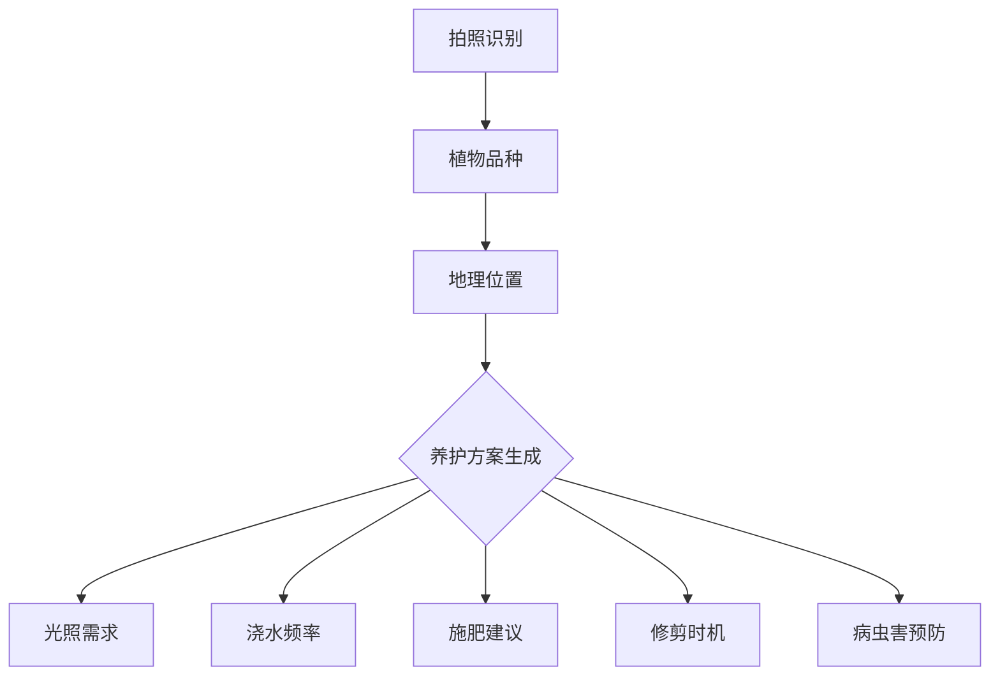
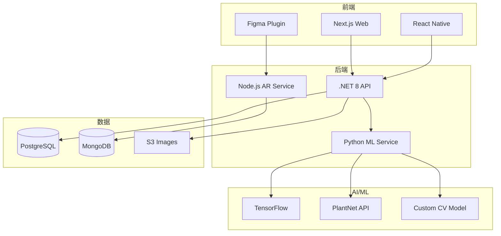
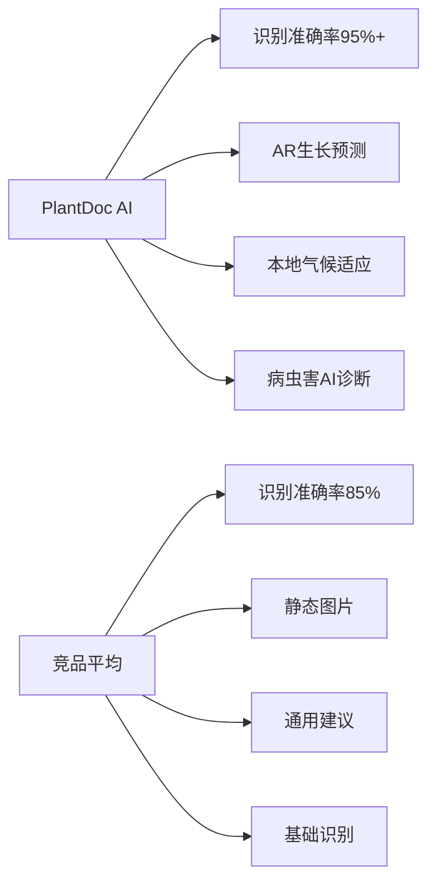

# PRD.md - 产品需求文档

## 产品概述

### 产品定位
PlantDoc AI 是一款基于计算机视觉的植物健康诊断专家，通过拍照识别3000+植物品种和500+常见病虫害，提供个性化养护方案，并利用AR技术展示植物生长预测。

### 目标用户
| 用户群体 | 占比 | 核心痛点 | 付费意愿 |
|---------|------|---------|----------|
| 园艺爱好者 | 40% | 植物养护知识缺乏 | 高 |
| 城市白领 | 25% | 室内植物养护难 | 中高 |
| 农场主 | 20% | 病虫害防治 | 极高 |
| 景观设计师 | 15% | 植物搭配选择 | 高 |

## 核心功能

### MVP版本功能（30天完成）

#### 1. 植物识别系统
- **品种识别**: 3000+常见植物品种
- **病虫害诊断**: 500+病虫害类型
- **识别准确率**: >95%（基于PlantNet + 自训练模型）
- **多角度识别**: 叶片、花朵、果实、整株

#### 2. 智能养护方案


#### 3. AR生长预测
- **3D植物模型**: 100+常见植物
- **生长模拟**: 1-5年生长预测
- **环境影响**: 不同养护条件下的生长差异
- **空间规划**: AR查看植物在实际空间的效果

### 功能优化版 - Figma插件

#### GreenSpace AR 功能
```yaml
平台: Figma Plugin Store
定价: $4.9/月
目标: 景观设计师、建筑师
转化率目标: 38%
核心功能:
  - 植物素材库（5000+）
  - 气候适应性分析
  - 自动植物搭配建议
  - 季节变化预览
  - 维护成本估算
  - 3D/AR导出
```

---

# BP.md - 商业计划书

## 执行摘要
PlantDoc AI 服务全球2亿园艺爱好者，通过AI+AR技术革新植物养护体验，预计12个月达到80,000用户，MRR 32,000 USD。

## 市场分析
- **园艺市场规模**: 全球470亿USD
- **数字园艺工具**: 15亿USD且年增长25%
- **用户画像**: 35-55岁占60%，女性占65%

## 商业模式
| 计划 | 月费(USD) | 功能限制 | 目标用户 |
|------|-----------|----------|----------|
| Free | 0 | 5次诊断/月 | 入门用户 |
| Garden | 1.99 | 50次+基础AR | 家庭园艺 |
| Pro | 4.99 | 无限+高级AR | 专业用户 |
| Farm | 14.99 | API+批量分析 | 商业农场 |

## 增长策略
1. **内容营销**: YouTube园艺频道合作
2. **社区运营**: Reddit r/gardening活跃
3. **季节营销**: 春季种植季推广
4. **KOL合作**: 园艺博主推荐计划

---

# SOP.md - 标准操作流程

## 开发流程SOP

### Week 1: 基础准备
```bash
# 技术准备
□ TensorFlow环境配置
□ PlantNet API申请
□ AR.js框架搭建
□ 植物数据库构建

# 设计工作
□ 拍照界面UI
□ 诊断结果展示
□ AR预览交互
□ 养护日历设计
```

### Week 2-3: 核心开发
| 任务 | 时间 | 优先级 |
|------|------|--------|
| 图像识别模型训练 | 3天 | P0 |
| 病虫害检测算法 | 2天 | P0 |
| AR渲染引擎 | 3天 | P1 |
| 养护知识库 | 2天 | P0 |
| 地理位置服务 | 1天 | P1 |

### Week 4: 测试发布
- 100种植物测试
- 50种病虫害验证
- AR性能优化
- 多语言支持

## 用户服务SOP

### 植物诊断准确性保证
1. **误诊处理**: 48小时内人工复核
2. **专家咨询**: 付费用户可申请专家建议
3. **社区互助**: 用户间经验分享

### 数据更新流程
- 每月更新植物数据库
- 季度更新病虫害库
- 实时更新养护建议（基于用户反馈）

---

# Requirements.md - 技术需求

## 技术架构


## 核心技术指标
| 功能模块 | 技术要求 | 性能指标 |
|----------|----------|----------|
| 图像识别 | TensorFlow 2.0 | 准确率>95% |
| AR渲染 | AR.js/8th Wall | 60FPS |
| 数据处理 | 批量100张/分钟 | <5秒/张 |
| API响应 | RESTful + GraphQL | <200ms |

## 数据模型
```sql
-- 植物信息表
CREATE TABLE plants (
    id UUID PRIMARY KEY,
    scientific_name VARCHAR(255),
    common_names JSONB,
    category VARCHAR(100),
    care_level INTEGER,
    growth_rate VARCHAR(50),
    max_height_cm INTEGER,
    climate_zones JSONB
);

-- 诊断记录表
CREATE TABLE diagnoses (
    id UUID PRIMARY KEY,
    user_id UUID,
    plant_id UUID,
    image_url VARCHAR(500),
    identified_issues JSONB,
    confidence_score FLOAT,
    recommendations JSONB,
    location POINT,
    created_at TIMESTAMP
);

-- AR模型表
CREATE TABLE ar_models (
    id UUID PRIMARY KEY,
    plant_id UUID,
    model_url VARCHAR(500),
    growth_stages JSONB,
    rendering_params JSONB
);
```

---

# 个人详细执行清单.md

## 30天执行路线图

### 第1周：准备阶段
**Day 1-2: 市场调研**
- [ ] 分析PlantNet、PictureThis竞品
- [ ] 调研园艺社区需求（Reddit/Facebook Groups）
- [ ] 收集1000+植物图片数据集

**Day 3-4: 技术验证**
- [ ] 测试PlantNet API准确率
- [ ] TensorFlow Lite移动端测试
- [ ] AR.js性能评估

**Day 5-7: MVP设计**
- [ ] 用户流程图设计
- [ ] 数据库架构设计
- [ ] UI/UX原型制作

### 第2周：核心开发

```mermaid
gantt
    title 第2周开发计划
    dateFormat DD
    section 前端
    拍照上传界面 :08, 2d
    诊断结果页面 :09, 2d
    养护建议展示 :10, 1d
    section 后端
    图像处理API :08, 3d
    识别服务集成 :10, 2d
    section AI
    模型训练 :11, 3d
```


### 第3周：高级功能
| 日期 | 任务 | 完成标准 |
|------|------|----------|
| Day 15-16 | AR功能开发 | 10种植物3D模型 |
| Day 17-18 | 地理位置集成 | 气候区自动识别 |
| Day 19-20 | Figma插件 | 基础功能完成 |
| Day 21 | 支付集成 | Stripe订阅 |

### 第4周：上线准备
- **测试清单**：
  - [ ] 100种常见植物识别测试
  - [ ] 20种病虫害诊断验证
  - [ ] AR在5种设备测试
  - [ ] 支付流程完整测试

- **营销准备**：
  - [ ] Product Hunt素材（5张截图+GIF）
  - [ ] Reddit r/gardening软文3篇
  - [ ] YouTube园艺频道合作洽谈
  - [ ] Instagram #plantcare标签营销

## 风险管理
| 风险 | 影响 | 应对措施 |
|------|------|----------|
| 识别准确率低 | 高 | 增加训练数据+人工标注 |
| AR性能问题 | 中 | 降级到2D展示 |
| 季节性需求 | 中 | 开发室内植物专题 |
| 竞品模仿 | 低 | 快速迭代+社区壁垒 |

---

# competitors.md - 竞争分析

## 主要竞品对比

### 独立APP竞品
| 产品 | 下载量 | 定价 | 优势 | 劣势 |
|------|--------|------|------|------|
| PictureThis | 20M+ | $29.99/年 | 识别准确 | 价格高 |
| PlantNet | 10M+ | 免费 | 开源免费 | 无养护建议 |
| PlantIn | 5M+ | $7.99/月 | 专家咨询 | 功能复杂 |
| Seek | 3M+ | 免费 | 儿童友好 | 功能简单 |
| **PlantDoc AI** | **目标10K** | **$1.99/月** | **AR+AI** | **新品牌** |

### Figma插件竞品
| 插件 | 用户数 | 定价 | 我们的优势 |
|------|--------|------|-----------|
| Plant Library | 5K+ | 免费 | AI智能推荐 |
| Garden Designer | 2K+ | $10/月 | 价格低50% |
| Landscape Kit | 8K+ | $15/月 | AR预览功能 |

## 竞争优势分析

### 技术优势


### 定价优势
- PictureThis: $2.5/月
- PlantIn: $7.99/月
- **PlantDoc AI: $1.99/月**
- 价格优势: 低60-75%

## 差异化策略
1. **技术差异**: AR预测独家功能
2. **价格差异**: 订阅制最低价
3. **场景差异**: 专注家庭园艺
4. **渠道差异**: Figma设计师生态
5. **服务差异**: 本地化养护建议

## 市场进入策略
- **Phase 1**: Product Hunt发布，获取种子用户
- **Phase 2**: Reddit园艺社区深耕
- **Phase 3**: YouTube/Instagram KOL合作
- **Phase 4**: Figma插件商店推广
- **Phase 5**: 国际化扩张（日本、欧洲）