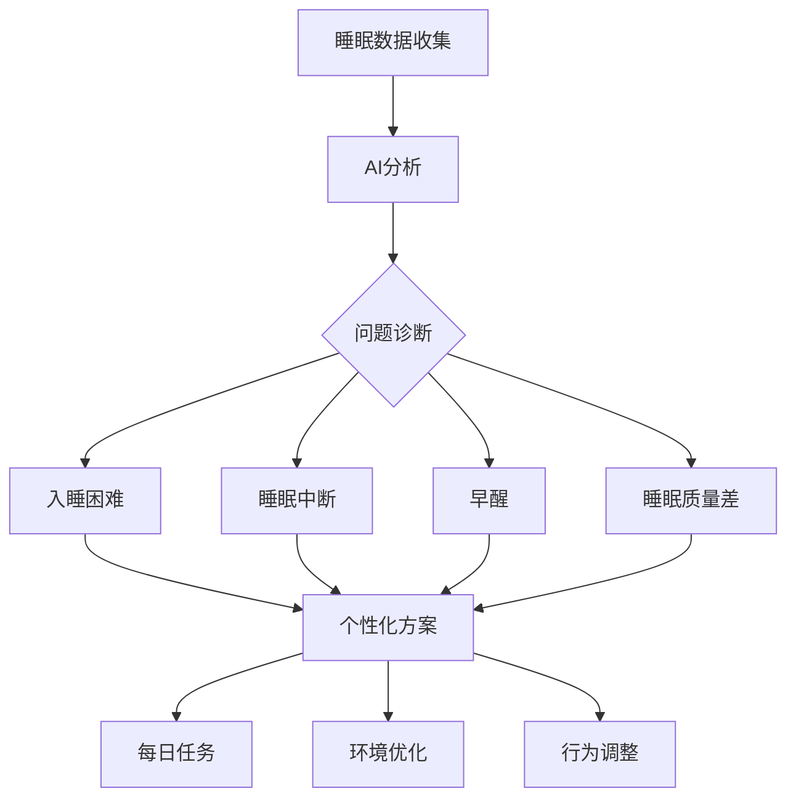
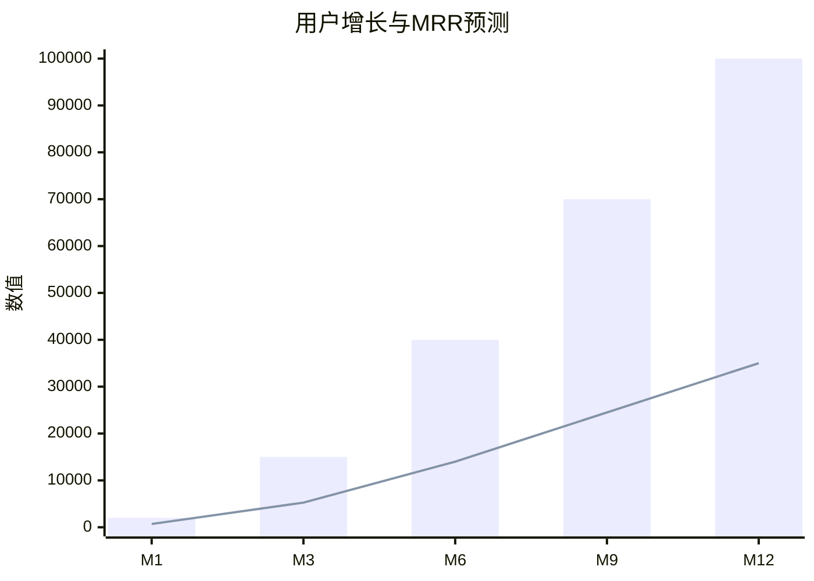
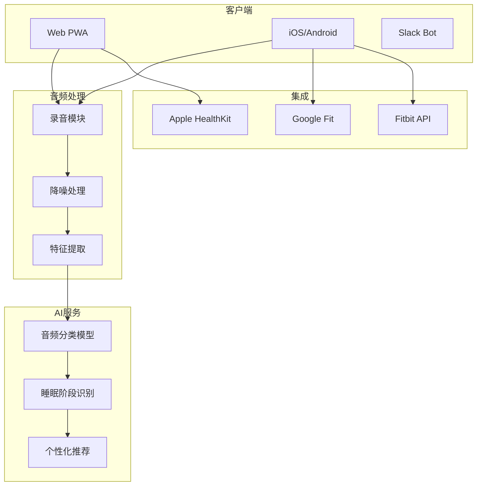
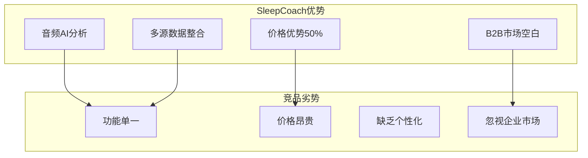

# PRD.md - 产品需求文档

## 产品概述

### 产品定位
SleepCoach AI 是一款个性化睡眠优化教练，通过分析睡眠音频（打鼾、磨牙、说梦话）和可穿戴设备数据，提供定制化睡眠改善方案，帮助失眠人群提升睡眠质量。

### 目标用户
| 用户群体 | 占比 | 核心痛点 | 付费意愿 |
|---------|------|---------|----------|
| 失眠患者 | 35% | 入睡困难、易醒 | 极高 |
| 打鼾人群 | 25% | 影响伴侣、健康担忧 | 高 |
| 轮班工作者 | 20% | 生物钟紊乱 | 高 |
| 压力人群 | 20% | 焦虑影响睡眠 | 中高 |

## 核心功能

### MVP版本（30天完成）

#### 1. 睡眠音频分析
- **检测类型**: 打鼾、磨牙、说梦话、呼吸暂停
- **分析维度**: 频率、强度、时长、模式
- **准确率**: >92%（基于自训练音频模型）
- **隐私保护**: 本地处理+端到端加密

#### 2. 智能睡眠计划


#### 3. 数据整合
- **可穿戴设备**: Apple Health、Google Fit、Fitbit
- **智能家居**: 温度、湿度、光照数据
- **生活习惯**: 咖啡因、运动、屏幕时间
- **趋势分析**: 睡眠质量变化曲线

### 功能优化版 - Slack Bot

#### TeamSleep AI 功能
```yaml
平台: Slack App Directory
定价: $2.9/座席/月
目标: 科技公司HR部门
转化率目标: 31%
核心功能:
  - 团队睡眠健康仪表板
  - 匿名睡眠质量调研
  - 工作压力与睡眠相关性分析
  - 定制化团建建议（如午休室）
  - 轮班排班优化建议
  - 每周睡眠健康报告
```

---

# BP.md - 商业计划书

## 执行摘要
SleepCoach AI 瞄准全球10亿睡眠障碍人群，通过AI技术提供个性化睡眠解决方案，预计12个月获得100,000用户，MRR 35,000 USD。

## 市场分析
- **睡眠经济规模**: 全球150亿USD
- **睡眠APP市场**: 20亿USD，年增长20%
- **用户痛点**: 70%成年人有睡眠问题
- **付费意愿**: 平均愿意支付$50/月改善睡眠

## 商业模式
| 计划 | 月费(USD) | 功能 | 转化率 |
|------|-----------|------|--------|
| Free | 0 | 7天试用 | - |
| Basic | 3.49 | 基础分析+建议 | 15% |
| Premium | 6.99 | 全功能+专家咨询 | 8% |
| Family | 12.99 | 4人家庭账户 | 3% |

## 收入预测


## 竞争优势
1. **技术壁垒**: 独家睡眠音频AI模型
2. **数据优势**: 多源数据整合分析
3. **价格优势**: 同类产品50%价格
4. **B2B潜力**: 企业员工福利市场

---

# SOP.md - 标准操作流程

## 产品开发SOP

### Week 1: 基础搭建
```bash
# Day 1-2: 音频处理研究
□ 音频录制技术选型
□ 噪音过滤算法
□ 隐私保护方案

# Day 3-4: 数据模型设计
□ 睡眠阶段模型
□ 音频特征提取
□ 健康指标体系

# Day 5-7: MVP原型
□ 录音界面设计
□ 分析结果展示
□ 建议生成逻辑
```

### Week 2-3: 核心开发
| 模块 | 开发时间 | 技术栈 |
|------|----------|--------|
| 音频录制 | 2天 | Web Audio API |
| AI分析 | 3天 | TensorFlow.js |
| 数据可视化 | 2天 | Chart.js |
| 设备集成 | 2天 | HealthKit/Fit API |
| 推荐算法 | 3天 | GPT-4 |

### Week 4: 测试优化
- 100小时睡眠音频测试
- 10种设备兼容性测试
- 隐私安全审计
- 性能优化（电池消耗）

## 用户服务SOP

### 睡眠改善保证
1. **30天无效退款**: 数据证明无改善全额退款
2. **专家咨询**: Premium用户每月1次专家咨询
3. **社区支持**: 用户互助社区24/7

### 数据安全流程
- 音频本地处理，仅上传特征值
- 医疗级加密标准
- HIPAA合规准备
- 用户数据完全删除权

---

# Requirements.md - 技术需求

## 系统架构


## 技术要求
| 组件 | 技术选型 | 性能指标 |
|------|----------|----------|
| 音频处理 | Web Audio API + FFmpeg | 实时处理 |
| AI模型 | TensorFlow Lite | 准确率>92% |
| 数据存储 | IndexedDB + PostgreSQL | 本地优先 |
| 加密 | AES-256 | 医疗级 |
| API | GraphQL | <100ms响应 |

## 数据模型
```sql
-- 睡眠记录表
CREATE TABLE sleep_sessions (
    id UUID PRIMARY KEY,
    user_id UUID,
    start_time TIMESTAMP,
    end_time TIMESTAMP,
    quality_score FLOAT,
    deep_sleep_minutes INT,
    rem_sleep_minutes INT,
    interruptions INT,
    snoring_episodes JSONB,
    audio_features JSONB
);

-- 睡眠计划表
CREATE TABLE sleep_plans (
    id UUID PRIMARY KEY,
    user_id UUID,
    plan_type VARCHAR(50),
    daily_tasks JSONB,
    progress JSONB,
    effectiveness_score FLOAT,
    created_at TIMESTAMP
);

-- 健康数据集成表
CREATE TABLE health_integrations (
    id UUID PRIMARY KEY,
    user_id UUID,
    source VARCHAR(50), -- apple_health, google_fit, fitbit
    data_type VARCHAR(50),
    data_points JSONB,
    synced_at TIMESTAMP
);
```

## API设计
```yaml
# GraphQL Schema
type Query {
  sleepSession(id: ID!): SleepSession
  sleepTrends(userId: ID!, days: Int): TrendData
  recommendations(userId: ID!): [Recommendation]
}

type Mutation {
  startRecording(userId: ID!): RecordingSession
  stopRecording(sessionId: ID!): SleepSession
  updatePlan(planId: ID!, progress: JSON): Plan
}

type Subscription {
  realtimeAudioAnalysis(sessionId: ID!): AudioEvent
}
```

---

# 个人详细执行清单.md

## 30天冲刺计划

### 第1周：研究与设计
**Day 1-2: 竞品研究**
- [ ] 体验Sleep Cycle、Pillow、SleepScore
- [ ] 分析用户评价痛点
- [ ] 研究睡眠科学论文

**Day 3-4: 技术POC**
- [ ] Web Audio API录音测试
- [ ] TensorFlow.js音频分类demo
- [ ] HealthKit集成可行性

**Day 5-7: 产品设计**
- [ ] 用户旅程图
- [ ] 线框图设计
- [ ] 数据库架构

### 第2周：核心开发

```mermaid
gantt
    title 第2周开发任务
    dateFormat DD
    section 前端
    录音界面 :08, 2d
    数据可视化 :10, 2d
    设置页面 :12, 1d
    section 后端
    音频处理API :08, 3d
    AI模型集成 :11, 2d
    section 集成
    HealthKit :13, 2d
```


### 第3周：AI与优化
| 任务 | 时间 | 重要度 |
|------|------|--------|
| 训练打鼾检测模型 | 2天 | ⭐⭐⭐⭐⭐ |
| 睡眠阶段算法 | 2天 | ⭐⭐⭐⭐ |
| 个性化推荐系统 | 1天 | ⭐⭐⭐⭐ |
| Slack Bot开发 | 2天 | ⭐⭐⭐ |

### 第4周：发布准备
**Day 22-25: 测试**
- [ ] 招募10名测试用户
- [ ] 7晚连续测试
- [ ] 收集反馈优化
- [ ] 隐私合规审查

**Day 26-30: 营销发布**
- [ ] Product Hunt发布资料
- [ ] Reddit r/sleep发帖
- [ ] 睡眠博主合作
- [ ] 首批用户优惠

## 技术学习重点
1. **音频处理**: Web Audio API深入
2. **机器学习**: TensorFlow音频分类
3. **隐私保护**: HIPAA合规要求
4. **数据可视化**: D3.js睡眠图表

## 每日执行节奏
```
06:00-08:00  编码（高效时段）
08:00-09:00  测试与调试
09:00-10:00  用户反馈处理
10:00-12:00  编码（核心功能）
13:00-15:00  编码（次要功能）
15:00-16:00  文档与学习
16:00-17:00  营销与社区
17:00-18:00  计划与总结
```

---

# competitors.md - 竞争分析

## 市场竞品分析

### 主流睡眠APP
| 产品 | 下载量 | 定价 | 优势 | 劣势 |
|------|--------|------|------|------|
| Sleep Cycle | 50M+ | $29.99/年 | 品牌强 | 功能老化 |
| Calm | 100M+ | $69.99/年 | 内容丰富 | 价格高 |
| Headspace | 70M+ | $69.99/年 | 冥想强 | 睡眠功能弱 |
| Pillow | 5M+ | $4.99/月 | Apple生态 | 仅iOS |
| **SleepCoach AI** | **目标10K** | **$3.49/月** | **AI个性化** | **新品牌** |

### Slack企业方案对比
| 方案 | 定价 | 功能 | 我们的优势 |
|------|------|------|-----------|
| Slack原生 | 免费 | 基础统计 | AI分析深度 |
| Donut | $3/人/月 | 团建为主 | 睡眠专注 |
| Officevibe | $5/人/月 | 员工调研 | 价格低40% |

## 竞争优势矩阵



## 差异化策略

### 产品差异化
1. **独特功能**: 睡眠音频AI分析（打鼾、磨牙）
2. **数据整合**: 唯一整合所有主流健康平台
3. **B2B创新**: 首个企业睡眠健康解决方案
4. **隐私优先**: 本地处理，无云端音频

### 市场策略
- **定位**: "Your AI Sleep Doctor"
- **切入点**: 打鼾人群（影响伴侣关系）
- **增长黑客**: 情侣共享账户优惠
- **企业市场**: HR福利采购渠道

### 定价策略
```
竞品平均: $5.83/月
SleepCoach: $3.49/月
优势: 便宜40%
策略: 低价切入→功能增值→企业市场
```

## 3年发展规划
**Year 1**: 10万用户，B2C为主
**Year 2**: 50万用户，开拓B2B
**Year 3**: 100万用户，医疗认证，寻求收购

## 潜在收购方
- **健康巨头**: Fitbit(Google)、Apple
- **睡眠品牌**: Sleep Number、Casper
- **保险公司**: 员工健康管理
- **医疗机构**: 睡眠诊所连锁