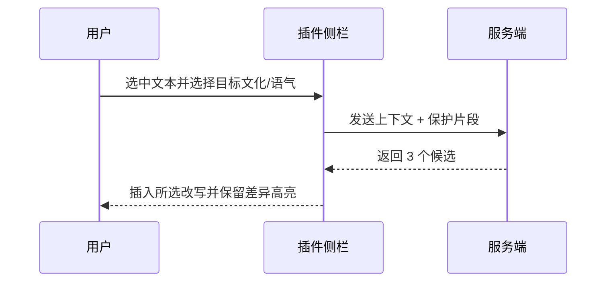

## 概述

- 目标：在 1 次点击内将邮件/私信语气调整为目标文化偏好（如 US/EU/JP/KR/CN 商务），降低沟通误解、提升回复率与成交率。
- 上线目标（30 天）：首月 MRR ≥ USD 1,500；免费试用→付费转化 ≥ 10%。

## 目标用户与场景

| 人群 | 场景 | 诉求 |
|---|---|---|
| 海外自由职业者 | 报价、交付沟通 | 语气自然、专业可信 |
| 销售/BD | 冷邮件与跟进 | 回复率、预约率提升 |
| 求职者 | 求职信/内推 | 语气得体、避免文化误区 |

## 用户故事

- 作为发送者，我希望一键选择目标文化与语气，获得多候选改写。
- 作为用户，我希望保留核心事实与链接不被误改。
- 作为团队用户，我希望保存常用模板并共享给同事。

## 功能范围

| 模块 | 功能 | 说明 |
|---|---|---|
| 语气本地化 | 直接/含蓄/礼貌/热情 等预设 | 文化差异词典与表达约束 |
| 结构优化 | 标题、开场、行动请求（CTA） | 自动生成 3 个版本 |
| 事实保护 | URL/金额/时间等锁定 | 防篡改与差异高亮 |
| 多语言 | EN ⇆ JP/KR/ES/DE/CN | 保留原域术语 |
| 模板库 | 行业与场景模板 | 销售/招聘/客服等 |

## 功能优化版（Gmail/Outlook 插件）

- 名称：ToneBridge for Mail
- UI/UX：Gmail Add-on（侧边栏卡片）/ Outlook Taskpane，遵循宿主快捷键与样式；支持选中文本右键改写。

| 项 | 方案 |
|---|---|
| Gmail 接入 | Google Apps Script + Gmail Add-on（Card Service）+ Gmail API；Google Workspace Marketplace 审核 3–7 天；分成 0% |
| Outlook 接入 | Office JavaScript API（Outlook）+ 清单部署；AppSource 审核 3–5 天；分成 0% |

流程（Mermaid）：

## 成功指标

| 指标 | 目标 |
|---|---|
| 回复率提升 | ≥ 20%（自报 + A/B） |
| 试用→付费 | ≥ 10% |
| 日活写作次数 | ≥ 3 次/DAU |

## 技术与部署

| 层级 | 选型 |
|---|---|
| 前端 | Next.js 14 |
| 后端 | .NET 8 Minimal API + PostgreSQL |
| AI | GPT-4-turbo（可切换同类） |
| 支付 | Stripe + Paddle |
| 部署 | Railway + Cloudflare Pages |

## 里程碑（30 天）

- [ ] D1–D3：语气与文化词典雏形
- [ ] D4–D8：改写与差异高亮 MVP
- [ ] D9–D12：Gmail Add-on MVP 与审核提交
- [ ] D13–D16：Outlook 插件 MVP 与提交
- [ ] D17–D24：模板库与团队共享
- [ ] D25–D30：增长实验与计费优化

