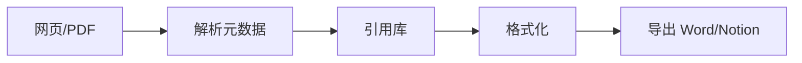
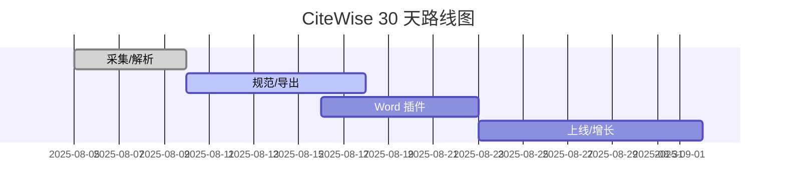

## 概述

- 一句话：学术/职场写作的引用与参考文献助手，PDF/网页一键摘录、去重、格式化（APA/MLA/Chicago/GB/T）。
- 目标：学生与研究者的 2C 工具，期初转化 ≥ 7%。

## 用户与痛点

| 用户 | 痛点 | 动机 |
| --- | --- | --- |
| 本科/研究生 | 引用易漏、格式易错 | 一键正确、批量规范 |
| 研究员/律师助理 | 多文档去重与注释 | 高效整理与规范输出 |

## MVP 功能

| 模块 | 功能 | 指标 |
| --- | --- | --- |
| 采集 | 浏览器扩展/PDF 上下文解析 | 命中率 ≥ 95% |
| 规范 | 引用格式一键转换 | 错误率 ≤ 2% |
| 去重 | DOI/URL/标题去重 | 去重准确 ≥ 98% |
| 输出 | Word/Notion/Markdown 导出 | 成功率 ≥ 99% |

## 流程

## 定价（USD）

| 方案 | 价格 | 权益 |
| --- | --- | --- |
| 月付 | $5.90/月 | 无限条目，去重与导出 |
| 年付 | $49/年 | 优先解析通道 |

## 功能优化版（Microsoft Word：CiteWise for Word）

- UI/UX：任务窗格+上下文右键菜单，沿用 Word 样式与快捷键。
- API/SDK：Office JavaScript API（内容控件、选区、脚注）。
- 审核：3–5 天；分成：0%（外部订阅）。
- 使用：选中文本→识别→插入正确格式引用与参考文献表。

## 合规

- 仅存储引用元数据与用户创建集合；不存储原文档。
- 文献库可导出（BibTeX/CSV）；完全可删除。

## 路线图（30 天）

