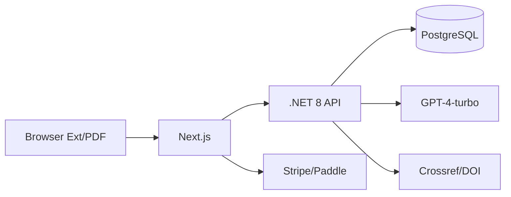

## 架构

## 接口

| 方法 | 路径 | 描述 |
| --- | --- | --- |
| POST | /api/cite/ingest | 解析/入库 |
| POST | /api/cite/format | 格式化输出 |
| POST | /api/cite/dedupe | 去重 |

## 数据

| 表 | 字段 |
| --- | --- |
| sources | id, type, title, authors, doi, url |
| libraries | id, userId, name |
| library_items | id, libraryId, sourceId |

## 非功能

- 准确率：格式错误率 ≤ 2%
- 性能：批量 100 条格式化 ≤ 5s