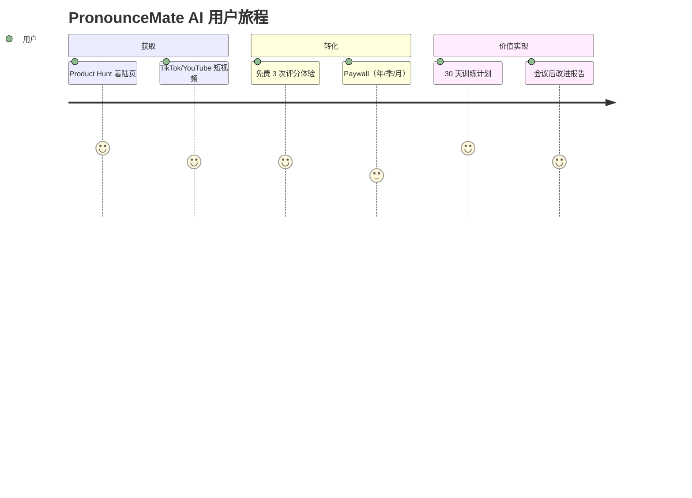
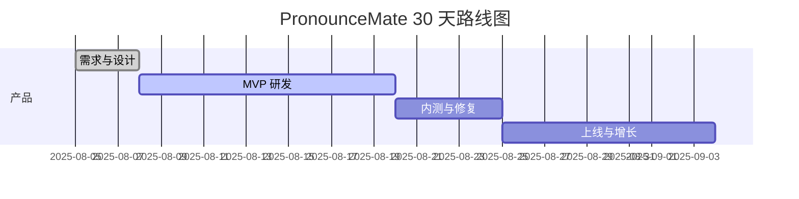

## 概述

- 一句话：面向非母语专业人士的 AI 口音矫正与个性化发音教练，10 分钟获得可操作反馈，30 天显著改善。
- 上线目标：30 天 MVP 上线；上线 14 天内实现付费转化 ≥ 8%，首月 MRR ≥ USD 2,500。
- 技术栈：Next.js 14、.NET 8 Minimal API、EF Core、PostgreSQL、OpenAI GPT-4-turbo、Stripe/Paddle。

## 目标用户与痛点

| 用户细分 | 核心痛点 | 现状替代 | 购买动机 |
| --- | --- | --- | --- |
| 海外工作/求职的非母语英语使用者 | 发音不准、语调生硬、线上会议听不清/被听不懂 | 传统线下口语课、YouTube 教程 | 更快的个性化反馈、隐私、可量化进步 |
| 销售/客服/运营自由职业者 | 高频在线通话、需要清晰表达 | 同事人工辅导 | 会议前/后即时训练与打分 |
| 学生与留学申请者 | 口语考试评分不稳定 | 练习题库 | 针对考纲的评分与纠错报告 |

## 使用场景（清单）

- [ ] 会议前 5 分钟热身练习（关键词+句式）
- [ ] 录音上传→逐句发音评分（音素/重音/连读）
- [ ] 会议后回放→易错清单与改进建议
- [ ] 个性化 30 天训练路径（每日 10 分钟）

## 核心功能（MVP 与迭代）

| 阶段 | 功能 | 说明 | 指标 |
| --- | --- | --- | --- |
| MVP | 本地/云端音频采集与分段 | Web + 移动端 PWA | 录音成功率 ≥ 98% |
| MVP | 发音打分与可视化 | 音素级对齐、错误热力图 | 推断延迟 P95 ≤ 2.5s |
| MVP | 个性化训练计划 | 目标口音/行业词汇包 | D7 留存 ≥ 35% |
| V1.1 | 会议后报告 | 摘要+错误 Top10 | 复训转化 ≥ 25% |
| V1.2 | 多语言支持 | EN→ES/FR/DE/JP | 付费升级转化 ≥ 5% |

## 用户旅程（Mermaid）

## 指标与目标

| 指标 | 目标（30 天） |
| --- | --- |
| 访客→注册 转化率 | ≥ 30% |
| 注册→付费 转化率 | ≥ 8% |
| D7 留存 | ≥ 35% |
| 训练完成率（30 天） | ≥ 45% |
| 退款率 | ≤ 2% |

## 定价（USD）

| 方案 | 价格 | 面向人群 | 权益 |
| --- | --- | --- | --- |
| 月付 | $9.90/月 | 个体 | 全量模型、每日训练 10 分钟、会议后报告 |
| 季付 | $24.90/季 | 个体 | 省 16%，高级行业词包 |
| 年付 | $79/年 | 个体 | 省 34%，优先队列、离线包 |

## 功能优化版（Zoom：AccentCoach）

- 角色：销售、客服、运营、讲师。
- UI/UX：遵循 Zoom In-Meeting App 面板与浮层规范，0 学习成本（按钮、色板、快捷键一致）。
- API/SDK 接入：Zoom App SDK / Meeting SDK；音频流客户端采集→后端评分→面板可视化。
- 审核周期：2–4 天；分成：0%（站外 Stripe 订阅结算）。
- 目标转化：团队内座席付费 ≥ 25%，入会→训练触达率 ≥ 60%。
- 发布流程（清单）：
  - [ ] 创建 Zoom App，配置 OAuth 权限与重定向
  - [ ] 审核材料：说明书、演示视频、隐私合规
  - [ ] Beta 名单与 QA 报告

## 合规与隐私

- 仅在用户同意时采集音频；默认本地前处理，上传脱敏片段。
- 数据驻留：PostgreSQL（加密）、对象存储分区；删除权与导出权（GDPR/CCPA）。
- 模型提示不存储原始音频；日志脱敏。

## 路线图（30 天）

