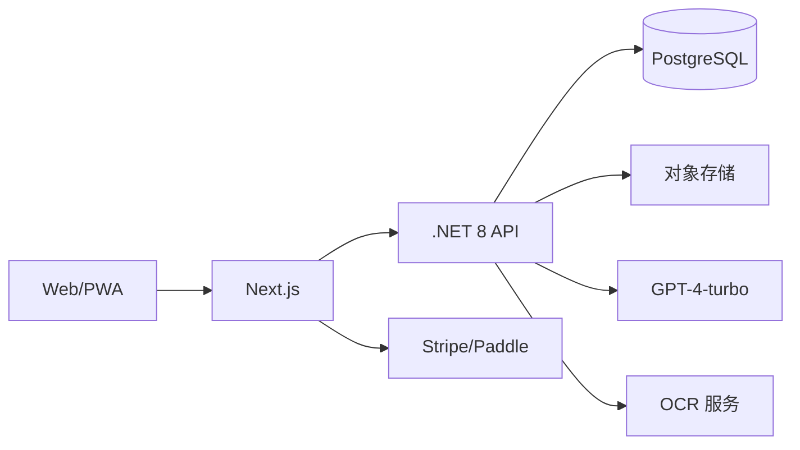

## 架构

## 核心接口

| 方法 | 路径 | 入参 | 出参 |
| --- | --- | --- | --- |
| POST | /api/receipt/ingest | file/emailId | receiptJson |
| POST | /api/budget/alert | thresholds | status |
| GET | /api/export | format | file |

## 数据表

| 表 | 字段 | 说明 |
| --- | --- | --- |
| receipts | id, userId, merchant, items, tax, currency | 票据主体 |
| budgets | id, userId, category, limit | 预算 |
| exports | id, userId, type, uri | 导出记录 |