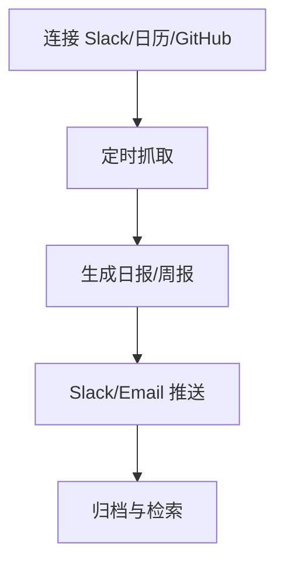
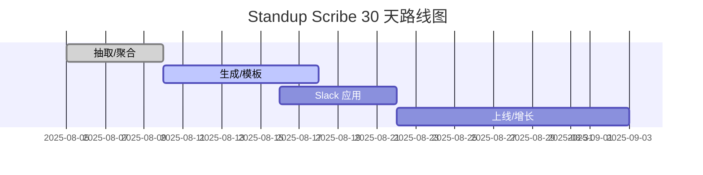

## 概述

- 一句话：为个人与小团队提供“每日站会+周报”自动生成与提醒，跨 Slack/Email/Calendar 聚合，极简 2C/轻团队工具。
- 目标：付费转化 ≥ 10%，取消率 ≤ 3%。

## 用户与痛点

| 用户 | 痛点 | 动机 |
| --- | --- | --- |
| 独立开发者 | 无法持续复盘、信息散落 | 一键生成日报与周报 |
| 小团队负责人 | 跟进进度耗时 | 自动汇总 + 风险提醒 |

## MVP 功能

| 模块 | 功能 | 指标 |
| --- | --- | --- |
| 采集 | Slack/日历/PR/Issue 摘要 | 数据覆盖 ≥ 90% |
| 生成 | 日报/周报/阻塞点 | 召回率 ≥ 90% |
| 提醒 | 时间窗提醒/推送 | 打开率 ≥ 40% |
| 导出 | Markdown/Notion | 成功率 ≥ 99% |

## 流程

## 定价（USD）

| 方案 | 价格 | 权益 |
| --- | --- | --- |
| 月付 | $3.90/月 | 无限日报/周报、3 个集成 |
| 年付 | $29/年 | 优先队列、更多模板 |

## 功能优化版（Slack：Standup Scribe Bot）

- UI/UX：Slash 命令、消息快捷按钮、Home 选项卡，遵循 Slack App 规范。
- SDK：Slack Bolt（OAuth、事件、交互）。
- 审核：~1 天；分成：0%（站外订阅）。
- 典型流程：/standup today → 自动生成 → 一键发布到频道。

## 合规

- 仅处理摘要与元数据；不持久化私信内容（可选）。
- OAuth 最小权限；用户可一键断开与删除数据。

## 路线图（30 天）

