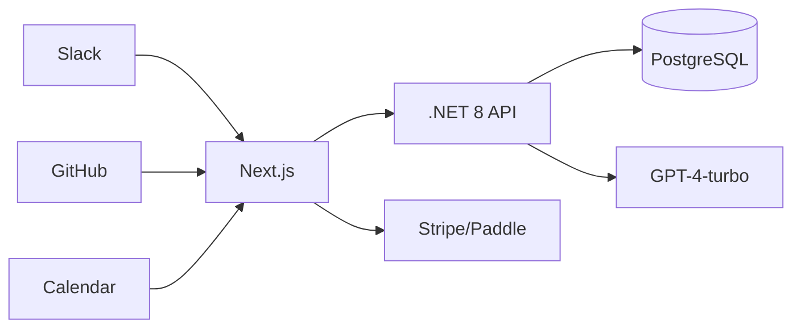

## 架构

## 接口

| 方法 | 路径 | 描述 |
| --- | --- | --- |
| POST | /api/ingest/slack | 事件接收 |
| GET | /api/report/daily | 生成日报 |
| GET | /api/report/weekly | 生成周报 |

## 数据

| 表 | 字段 |
| --- | --- |
| sources | id, type, payload |
| reports | id, userId, type, content |
| schedules | id, userId, cron, channels |