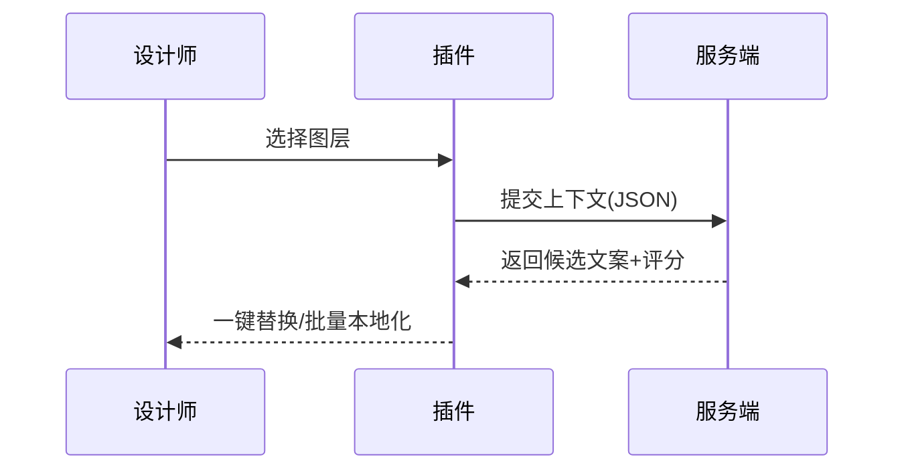
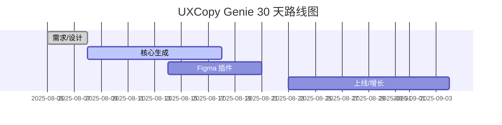

## 概述

- 一句话：为设计师与独立开发者提供“即时微文案”建议（CTA、表单、空状态、错误提示），A/B 评分与本地化一键完成。
- 目标：设计阶段 10× 速度提升；上线后 5× 付费转化提升（微文案驱动）。

## 用户与痛点

| 用户 | 痛点 | 购买动机 |
| --- | --- | --- |
| UI/UX 设计师 | 反复改文案、缺乏数据支撑 | 即看即用、风格统一、A/B 建议 |
| 独立开发者 | 无文案资源、国际化成本高 | 模板+本地化一键 |

## MVP 功能

| 模块 | 功能 | 指标 |
| --- | --- | --- |
| 生成 | CTA/表单/空状态建议 | Latency P95 ≤ 2s |
| A/B | 多候选评分 | 点击率提升 ≥ 15% |
| i18n | 10 种语言本地化 | 误差率 ≤ 5% |
| 样式 | 语气与品牌词设定 | 团队复用 |

## 工作流

## 定价（USD）

| 方案 | 价格 | 权益 |
| --- | --- | --- |
| 月付 | $6/月 | 每月 2,000 代币，A/B 与 i18n |
| 年付 | $59/年 | 省 18%，团队模板 |

## 功能优化版（Figma 插件：UXCopy Genie）

- UI/UX：右侧属性面板 + 快捷键 + 选区批量操作，遵循 Figma 插件 UI 规范。
- API/SDK：Figma Plugin API。
- 审核周期：1–2 天；分成：0%（插件不代收款，站外订阅）。
- 典型使用：选中图层→生成 3 个候选→一键本地化→回写文本。

## 合规

- 仅上传文本上下文与低分辨率缩略图；不上传设计源文件。
- 工作区与项目隔离；团队数据可导出/删除。

## 路线图（30 天）

