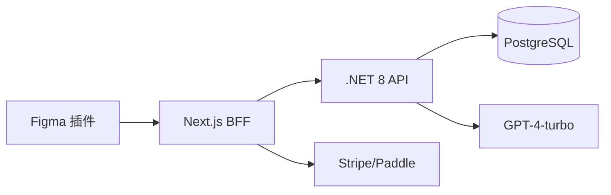

## 架构

## 接口

| 方法 | 路径 | 描述 |
| --- | --- | --- |
| POST | /api/copy/generate | 生成候选文案 |
| POST | /api/copy/ab-score | 评分与指标 |
| POST | /api/i18n/translate | 本地化 |

## 数据

| 表 | 字段 |
| --- | --- |
| templates | id, name, category, content |
| generations | id, userId, context, variants |
| experiments | id, variantA, variantB, result |